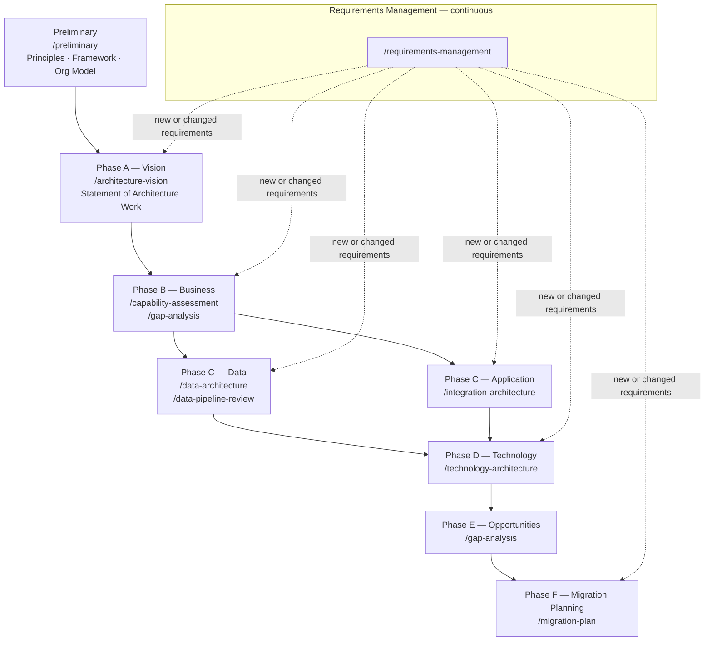
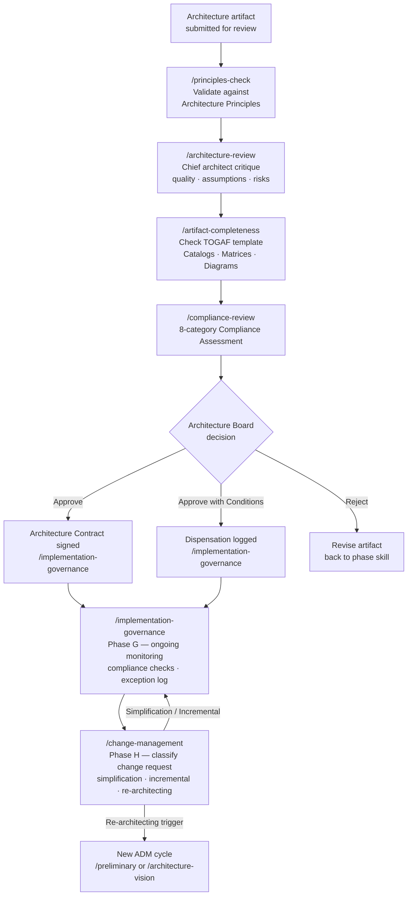
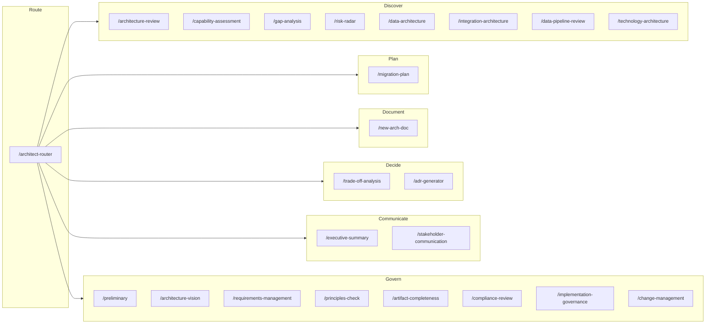

# architect-claude-plugin

[](https://opensource.org/licenses/MIT)
[](./package.json)
[](https://claude.ai/code)
[](https://www.opengroup.org/togaf)

Claude Code skills for Enterprise Architects and Solution Architects. Run a skill on any architecture document or decision context — get a structured, client-ready output in return. TOGAF-aware by default, framework-agnostic when you don't need it.

Supports the full TOGAF ADM cycle — from Preliminary through Phase H — covering **specification** (creating architecture artifacts) and **validation** (reviewing, governing, and managing change to deployed architecture).

## Requirements

**Required**

- [Claude Code](https://claude.ai/code) CLI installed and authenticated

**VS Code (recommended)**

- [Claude Code VS Code extension](https://marketplace.visualstudio.com/items?itemName=Anthropic.claude-code) — run skills directly on open files without leaving the editor

**Obsidian (optional — for vault-based architecture practices)**

- [Dataview](https://github.com/blacksmithgu/obsidian-dataview) — query generated ADRs and architecture documents as a live register
- [Templater](https://github.com/SilentVoid13/Templater) — wire `/new-arch-doc` and `/adr-generator` outputs into vault templates
- [Mermaid Tools](https://github.com/dartungar/obsidian-mermaid) — render the Mermaid diagrams produced by architecture skills

## Install

```
/plugin marketplace add nclsprsn/architect-claude-plugin
/plugin install architect-claude-plugin@architect-claude
```

Or for local development / testing:

```bash
git clone https://github.com/nclsprsn/architect-claude-plugin
claude --plugin-dir ./architect-claude-plugin
```

## Quick Start

```
# Don't know where to start? Let the router dispatch you
/architect-router I'm starting a new TOGAF engagement for a data platform

# --- Specify: ADM flow ---

# Establish Architecture Principles and EA governance model (Preliminary Phase)
/preliminary docs/organisation-context.md

# Define scope, stakeholders, and Architecture Vision (Phase A)
/architecture-vision docs/programme-brief.md

# Scaffold a TOGAF phase document (A–D) or a framework-agnostic proposal
/new-arch-doc phase-b

# Identify gaps between current and target state (Phase B–E)
/gap-analysis docs/current-state-assessment.md

# Turn a gap-analysis output into a sequenced delivery roadmap (Phase E–F)
/migration-plan docs/gap-analysis-output.md

# --- Discover & review ---

# Chief architect critique of any architecture document
/architecture-review docs/platform-design.md

# Risk heat map and RAID log before a release or migration
/risk-radar docs/platform-design.md

# --- Validate & govern ---

# Validate a document against Architecture Principles
/principles-check docs/data-architecture.md

# Check artifact completeness against TOGAF templates before board submission
/artifact-completeness docs/architecture-definition-document.md

# Run an Architecture Compliance Assessment for a live implementation (Phase G)
/implementation-governance docs/delivery-status-report.md

# Process a change request for a deployed architecture (Phase H)
/change-management CR-007: migrate from PostgreSQL to Aurora — business driver and impact

# --- Decide ---

# Compare two options and get a recommendation
/trade-off-analysis API gateway: Kong vs AWS API Gateway for our microservices migration

# Write an ADR for a decision already made
/adr-generator We chose Kafka over RabbitMQ for ordering guarantees and replay capability

# --- Communicate ---

# Rewrite a technical doc for a C-level audience
/executive-summary docs/data-platform-proposal.md

# Tailor a communication for a named stakeholder role (CTO, CFO, Board…)
/stakeholder-communication docs/data-platform-proposal.md
```

---

## Skills

### Route — entry point

| Skill | What it does |
|-------|-------------|
| `/architect-router [context]` | Detect TOGAF ADM phase and intent (specify vs validate), recommend the right skill to invoke next |

### Frame — establish the engagement

| Skill | What it does |
|-------|-------------|
| `/preliminary [context]` | Establish Architecture Principles, tailor the framework, define the Organizational Model for EA, produce Request for Architecture Work (Preliminary Phase) |
| `/architecture-vision [context]` | Statement of Architecture Work, Architecture Vision, stakeholder map, communications plan, initial capability assessment (Phase A) |
| `/requirements-management [context]` | Requirements Impact Assessments, Architecture Requirements Repository, traceability matrix — continuous across all ADM phases |

### Discover — understand the landscape

| Skill | What it does |
|-------|-------------|
| `/capability-assessment [path]` | Score a Phase B capability map: completeness, maturity evidence quality, ownership model, Phase B → Phase C traceability |
| `/gap-analysis [path]` | Baseline → target gap table, scored by domain and effort, sequenced into H1/H2/H3 roadmap |
| `/data-architecture [path]` | Data quality attributes, topology assessment, GDPR/AI Act check, governance blind spot, second-order effects |
| `/integration-architecture [path]` | Integration quality attributes, topology fitness, contract governance, reliability patterns, anti-pattern detection |
| `/data-pipeline-review [path]` | Pipeline pattern vs SLA fitness, idempotency, lineage, data quality checks, observability assessment |
| `/technology-architecture [path]` | Infrastructure topology fitness, vendor lock-in surface, DR/HA patterns, IaC coverage, observability stack, technology lifecycle, cost model |

### Decide — make and record decisions

| Skill | What it does |
|-------|-------------|
| `/trade-off-analysis [context]` | Evaluate 2–3 options → clear recommendation → ADR-ready output |
| `/adr-generator [context]` | Write a clean MADR from a decision already made — faster than trade-off-analysis |

### Communicate — land the message

| Skill | What it does |
|-------|-------------|
| `/executive-summary [path]` | Rewrite technical doc for C-level: Pyramid Principle, business implications, numbered claims |
| `/stakeholder-communication [path]` | Tailor a communication for a named role: CTO / Head of Eng / CPO / CFO / CISO / DPO / Procurement / Board |

### Plan — sequence and phase the delivery

| Skill | What it does |
|-------|-------------|
| `/migration-plan [path]` | Phase gap-analysis output into a dependency-sequenced H1/H2/H3 roadmap with critical path, quick wins, and TOGAF Transition Architectures |

### Document — create architecture artifacts

| Skill | What it does |
|-------|-------------|
| `/new-arch-doc [phase]` | Scaffold a TOGAF phase document (A–D) or framework-agnostic proposal with guiding questions |

### Validate — review before the board

The four Validate skills form a **staged pipeline**: `principles-check` → `architecture-review` → `artifact-completeness` → `compliance-review`. They are sequential gates, not parallel options. Run them in order before an Architecture Board submission.

| Skill | Gate | What it does |
|-------|------|-------------|
| `/architecture-review [path]` | Gate 1 | Chief architect critique: quality attributes, assumption stress-test, disruptive alternative, second-order effects |
| `/risk-radar [path]` | Gate 1 (parallel) | Risk heat map × RAID log × top mitigations × one systemic risk worth naming |
| `/principles-check [path]` | Gate 2 | Validate a document against Architecture Principles (Mode 1), or audit the principles themselves against TOGAF Architecture Principle quality criteria (Mode 2) |
| `/artifact-completeness [path]` | Gate 3 | Score an artifact against its canonical TOGAF template — required Catalogs, Matrices, and Diagrams per the Architecture Content Framework |
| `/compliance-review [path]` | Gate 4 | 8-category TOGAF Compliance Assessment with Architecture Board verdict: Approve / Approve with Conditions / Reject |

### Govern — implement and evolve

| Skill | What it does |
|-------|-------------|
| `/implementation-governance [context]` | Architecture Contracts, 8-category Compliance Assessments, dispensation and exception log (Phase G) |
| `/change-management [context]` | Classify change requests (Maintenance / Incremental / Major), assess impact, determine whether a new ADM cycle is required (Phase H) |

---

## When to Use What

| Situation | Use |
|-----------|-----|
| Don't know which skill to invoke | `/architect-router` |
| Starting a new TOGAF engagement — no agreed principles yet | `/preliminary` |
| Starting a new architecture cycle — define scope and vision | `/architecture-vision` |
| Defining business capabilities, value streams, and org model (Phase B) | `/new-arch-doc phase-b` + `/capability-assessment` |
| Scoring an existing capability map for completeness and maturity evidence | `/capability-assessment` |
| Reviewing a document or proposal before a governance gate | `/architecture-review` |
| Checking that an artifact has all required TOGAF components | `/artifact-completeness` |
| Validating a document against Architecture Principles | `/principles-check` |
| Running a full compliance assessment before Architecture Board submission | `/compliance-review` |
| Reviewing a data platform, data model, or data governance design | `/data-architecture` |
| Reviewing an API design, event-driven system, or integration layer | `/integration-architecture` |
| Reviewing an ETL/ELT pipeline, streaming design, or data ingestion | `/data-pipeline-review` |
| Defining infrastructure topology, DR/HA, and technology standards (Phase D) | `/new-arch-doc phase-d` + `/technology-architecture` |
| Reviewing cloud or on-prem infrastructure for an existing system | `/technology-architecture` |
| Mapping current state to target state | `/gap-analysis` |
| Comparing options before committing to a direction | `/trade-off-analysis` |
| Capturing a decision already made | `/adr-generator` |
| Governing an implementation against the approved architecture (Phase G) | `/implementation-governance` |
| Processing a change request to a deployed architecture (Phase H) | `/change-management` |
| Managing requirements that change mid-engagement | `/requirements-management` |
| Preparing a steerco or executive review deck | `/executive-summary` |
| Writing to a specific stakeholder (CTO, CFO, Board…) | `/stakeholder-communication` |
| Pre-launch, pre-release, or pre-migration risk check | `/risk-radar` |
| Sequencing gap-analysis output into a delivery roadmap | `/migration-plan` |
| Full specification flow (Preliminary → F) | See Specification Track diagram |
| Full validation flow (artifact → Architecture Board → governance) | See Validation Track diagram |
| Architecture board submission | `/principles-check` → `/architecture-review` → `/artifact-completeness` → `/compliance-review` |
| Post-deployment architecture change | `/change-management` → `/implementation-governance` |

### When NOT to Use

- **Detailed implementation planning** — use a dedicated planning tool or write the plan yourself; these skills operate at architecture level, not sprint level
- **Line-by-line code review** — these skills review architecture and design decisions, not code quality or correctness
- **Generating production code** — the skills produce architecture documentation and decision records, not deployable artefacts
- **Replacing stakeholder interviews** — the skills structure your thinking and output; they cannot substitute for domain knowledge or client context that hasn't been provided
- **Lightweight decisions** — don't run `/trade-off-analysis` or `/adr-generator` on a config parameter or a naming convention; the overhead outweighs the value

---

## Architect Workflow

The plugin covers three tracks across an architecture engagement: **specifying** (creating architecture artifacts through the ADM), **validating** (reviewing and governing against standards and governance gates), and **deciding & communicating** (options analysis, ADRs, and stakeholder outputs). The router dispatches between all tracks — see Diagram C.

---

### Diagram A — Specification Track (Full ADM)

From Preliminary through Phase F, with Requirements Management running continuously across all phases. Use `/new-arch-doc` to scaffold a blank phase document before populating it with the phase skills below.



---

### Diagram B — Validation & Governance Track

From artifact submission through Architecture Board decision, Phase G governance, and Phase H change management. Phase H feeds back to the start of a new ADM cycle.



---

### Diagram C — Routing Quick Reference

How `/architect-router` dispatches by phase and intent.

```mermaid
flowchart TD
    user["Architect: help me with this"] --> router
    router["/architect-router<br>Detect phase + intent"]
    router --> spec{Specifying?}
    router --> val{Validating?}
    router --> dec{Deciding?}
    router --> com{Communicating?}
    spec -->|Preliminary| pre["/preliminary"]
    spec -->|Phase A| va["/architecture-vision"]
    spec -->|Phase B| vb["/capability-assessment<br>/gap-analysis"]
    spec -->|Phase C Data| vcd["/data-architecture<br>/data-pipeline-review"]
    spec -->|Phase C App| vca["/integration-architecture"]
    spec -->|Phase D| vd["/technology-architecture"]
    spec -->|Phase E/F| vef["/gap-analysis<br>/migration-plan"]
    spec -->|Phase G| vg["/implementation-governance"]
    spec -->|Phase H| vh["/change-management"]
    spec -->|Ongoing RM| vrm["/requirements-management"]
    val -->|Principles| pc["/principles-check"]
    val -->|Completeness| ac["/artifact-completeness"]
    val -->|Compliance| cr["/compliance-review"]
    val -->|Deep review| ar["/architecture-review"]
    val -->|Risk| rr["/risk-radar"]
    dec -->|Compare options| toa["/trade-off-analysis"]
    dec -->|Record decision| adrg["/adr-generator"]
    com -->|C-level audience| es["/executive-summary"]
    com -->|Named stakeholder| sc["/stakeholder-communication"]
```



---

### Diagram D — Complete Skill Map

All 23 skills organised by function track. `/architect-router` dispatches to any track; run it first if you are unsure where to start.



---

### TOGAF ADM Phase Mapping

| Phase | Primary skills |
|-------|---------------|
| Preliminary | `/preliminary` |
| A — Architecture Vision | `/architecture-vision`, `/new-arch-doc phase-a`, `/stakeholder-communication` |
| B — Business Architecture | `/new-arch-doc phase-b`, `/capability-assessment`, `/gap-analysis` |
| C — Information Systems (Operational) | `/new-arch-doc phase-c`, `/integration-architecture`, `/architecture-review`, `/gap-analysis`, `/risk-radar` |
| C — Information Systems (Decisional) | `/new-arch-doc phase-c`, `/data-architecture`, `/data-pipeline-review`, `/architecture-review`, `/gap-analysis`, `/risk-radar` |
| D — Technology Architecture | `/new-arch-doc phase-d`, `/technology-architecture`, `/gap-analysis`, `/architecture-review` |
| E — Opportunities & Solutions | `/gap-analysis`, `/migration-plan` |
| F — Migration Planning | `/migration-plan` |
| G — Implementation Governance | `/implementation-governance`, `/compliance-review` |
| H — Architecture Change Management | `/change-management` |
| Requirements Management (continuous) | `/requirements-management` |
| All phases — options & decisions | `/trade-off-analysis`, `/adr-generator` |
| All phases — validation gates | `/artifact-completeness`, `/principles-check`, `/compliance-review` |
| Governance / steering committees | `/executive-summary`, `/stakeholder-communication` |

---

## Design Philosophy

### Core Posture

Every skill operates from the same architect mindset:

- **Work backwards** from the business outcome — never forward from the technology
- **Surface a disruptive alternative** that questions whether the problem was framed correctly
- **Name the horizon** — H1 optimise core / H2 scale emerging / H3 seed disruptive
- **Apply the commoditisation curve** — never custom-build a commodity
- **Anchor every claim** with a number or first-principles reasoning
- **Name second-order effects** — at least one non-obvious downstream consequence per output
- **Highest Standards** — every output closes with a client-deliverable quality check

### Output Discipline

Posture without accountability is theatre. Every skill enforces four output rules so recommendations land as decisions, not opinions:

- **Confidence marker** on every claim, score, and recommendation — `[proven]` / `[informed estimate]` / `[working hypothesis]`
- **Reversibility tag** on every decision — **one-way door** (slow, deliberate) or **two-way door** (move fast, learn fast)
- **Named owner + review trigger** on every recommendation, risk, gap, and decision — role + evidence threshold or event, not a calendar date
- **Broad Responsibility line** on every output — societal, environmental, regulatory, or customers-of-customers implication; `N/A — [reason]` only when no plausible downstream impact exists

### Skill Chaining

Each skill ends with a `## Next Step` block that recommends the downstream skill to invoke — either forward (next ADM phase) or lateral (validation gate, decision capture, or communication). The architect accepts or overrides the suggestion; Claude invokes the next skill if the intent is clear.

### TOGAF Default

TOGAF vocabulary (ADM phases, building blocks, gap analysis) is active by default. If your project does not use TOGAF, the skills degrade gracefully to framework-agnostic mode — just don't mention TOGAF in your prompts.

---

## Troubleshooting

**The skill runs but the output ignores my TOGAF context.**
Include TOGAF vocabulary in your prompt or document. The skills detect TOGAF signals (ADM phases, building blocks, gap analysis) to switch into full TOGAF mode. If none are present, they fall back to framework-agnostic output.

**The output is too generic — it doesn't reflect my specific architecture.**
Pass the actual document or decision context as input, not a description of it. `/architecture-review docs/platform-design.md` is significantly richer than `/architecture-review our platform uses microservices`.

**`/trade-off-analysis` gives me a tie with no clear winner.**
The skill is designed to produce a recommendation, not a neutral comparison. If you get an undecided output, add a tiebreaker criterion in your prompt: the business constraint, timeline pressure, or team capability that should break the tie.

**The skill doesn't detect TOGAF even though my document uses it.**
Ensure standard TOGAF terms appear in the document: "ADM", "Building Block", "Baseline", "Target Architecture", "Gap Analysis", "Phase A/B/C/D". A document that describes TOGAF intent without using the vocabulary will be treated as framework-agnostic.

**Output is missing the Broad Responsibility line.**
The skill should always emit one. If it outputs `N/A`, it must include a reason. If neither appears, re-run with an explicit reminder: append `-- ensure Broad Responsibility line is present` to your command.

**I don't know which skill to invoke.**
Run `/architect-router` with a short description of what you're trying to do. The router detects ADM phase and intent (specifying vs validating) and recommends the right skill.

---

## License

MIT
