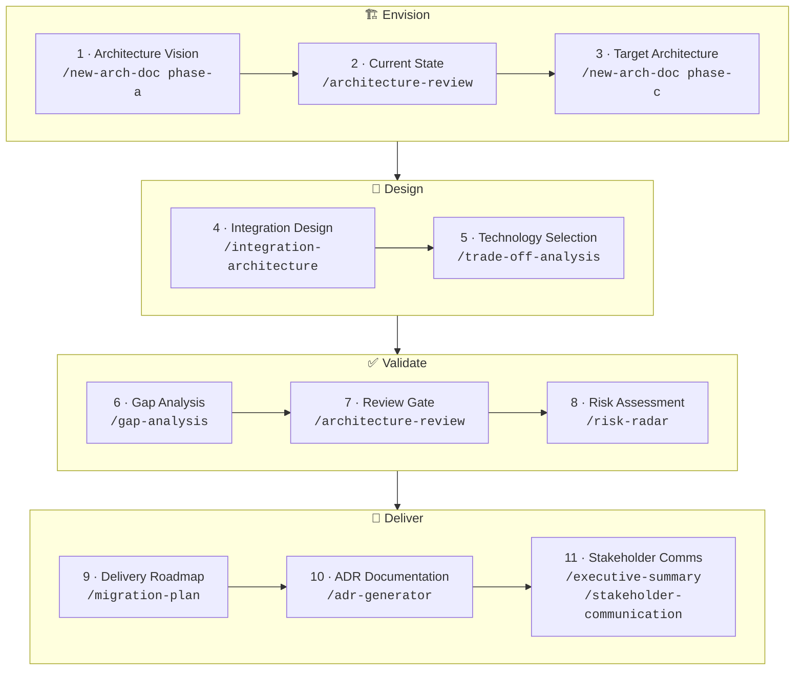
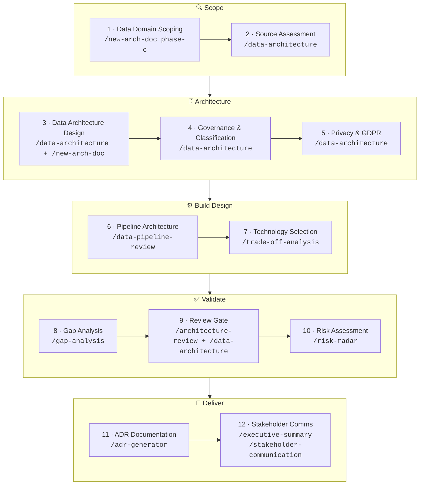

# architect-claude-plugin

[](https://opensource.org/licenses/MIT)
[](./package.json)
[](https://claude.ai/code)
[](https://www.opengroup.org/togaf)

Claude Code commands for Enterprise Architects and Solution Architects. Run a command on any architecture document or decision context — get a structured, client-ready output in return. TOGAF-aware by default, framework-agnostic when you don't need it.

## Requirements

- [Claude Code](https://claude.ai/code) CLI installed and authenticated

## Install

```bash
claude plugin install gh:nclsprsn/architect-claude-plugin
```

## Quick Start

```bash
# Review an architecture document before a governance gate
/architecture-review docs/platform-design.md

# Identify gaps between current and target state
/gap-analysis docs/current-state-assessment.md

# Pre-migration or pre-launch risk check
/risk-radar docs/migration-proposal.md

# Review a data platform or data governance design
/data-architecture docs/data-platform-design.md

# Compare two options and get a recommendation
/trade-off-analysis API gateway: Kong vs AWS API Gateway for our microservices migration

# Phase a gap analysis into a sequenced delivery roadmap
/migration-plan docs/gap-analysis-output.md

# Write an ADR for a decision already made
/adr-generator We chose Kafka over RabbitMQ for ordering guarantees and replay capability

# Rewrite a technical doc for a C-level audience
/executive-summary docs/data-platform-proposal.md
```

---

## Commands

### Discover — understand the landscape

| Command | What it does |
|---------|-------------|
| `/architecture-review [path]` | Chief architect critique: quality attributes, assumption stress-test, disruptive alternative, second-order effects |
| `/gap-analysis [path]` | Baseline → target gap table, scored by domain and effort, sequenced into H1/H2/H3 roadmap |
| `/risk-radar [path]` | Risk heat map × RAID log × top mitigations × one systemic risk worth naming |
| `/data-architecture [path]` | Data quality attributes, topology assessment, GDPR/AI Act check, governance blind spot, second-order effects |
| `/integration-architecture [path]` | Integration quality attributes, topology fitness, contract governance, reliability patterns, anti-pattern detection |
| `/data-pipeline-review [path]` | Pipeline pattern vs SLA fitness, idempotency, lineage, data quality checks, observability assessment |

### Decide — make and record decisions

| Command | What it does |
|---------|-------------|
| `/trade-off-analysis [context]` | Evaluate 2–3 options → clear recommendation → ADR-ready output |
| `/adr-generator [context]` | Write a clean MADR from a decision already made — faster than trade-off-analysis |

### Communicate — land the message

| Command | What it does |
|---------|-------------|
| `/executive-summary [path]` | Rewrite technical doc for C-level: Pyramid Principle, business implications, numbered claims |
| `/stakeholder-communication [path]` | Tailor a communication for a named role: CTO / Head of Eng / CPO / CFO / Procurement / Board |

### Plan — sequence and phase the delivery

| Command | What it does |
|---------|-------------|
| `/migration-plan [path]` | Phase gap-analysis output into a dependency-sequenced H1/H2/H3 roadmap with critical path, quick wins, and TOGAF Transition Architectures |

### Document — create architecture artifacts

| Command | What it does |
|---------|-------------|
| `/new-arch-doc [phase]` | Scaffold a TOGAF phase document (A–D) or framework-agnostic proposal with guiding questions |

---

## When to Use What

| Situation | Use |
|-----------|-----|
| Starting a new engagement or TOGAF phase | `/new-arch-doc` |
| Reviewing a document or proposal before a review gate | `/architecture-review` |
| Reviewing a data platform, data model, or data governance design | `/data-architecture` |
| Reviewing an API design, event-driven system, or integration layer | `/integration-architecture` |
| Reviewing an ETL/ELT pipeline, streaming design, or data ingestion | `/data-pipeline-review` |
| Mapping current state to target state | `/gap-analysis` |
| Comparing options before committing to a direction | `/trade-off-analysis` |
| Capturing a decision already made | `/adr-generator` |
| Preparing a steerco or executive review deck | `/executive-summary` |
| Writing to a specific stakeholder (CTO, CFO, Board…) | `/stakeholder-communication` |
| Pre-launch, pre-release, or pre-migration risk check | `/risk-radar` |
| Sequencing gap-analysis output into a delivery roadmap | `/migration-plan` |
| Phasing a migration with TOGAF Transition Architectures | `/gap-analysis` → `/migration-plan` |
| Architecture board submission | `/architecture-review` + `/risk-radar` |
| Onboarding a new team to an existing architecture | `/executive-summary` + `/stakeholder-communication` |

### When NOT to Use

- **Detailed implementation planning** — use a dedicated planning tool or write the plan yourself; these skills operate at architecture level, not sprint level
- **Line-by-line code review** — these skills review architecture and design decisions, not code quality or correctness
- **Generating production code** — the skills produce architecture documentation and decision records, not deployable artefacts
- **Replacing stakeholder interviews** — the skills structure your thinking and output; they cannot substitute for domain knowledge or client context that hasn't been provided
- **Lightweight decisions** — don't run `/trade-off-analysis` or `/adr-generator` on a config parameter or a naming convention; the overhead outweighs the value

---

## Architect Workflow

Most engagements follow one of two tracks depending on whether the system under design integrates operational business processes or builds a decisional / data platform.

---

### Track 1 — Operational SI Engagement

Applies to systems that run business operations: CRM, ERP, order management, API platform, microservices migration. The work moves from vision to delivery roadmap.



| # | Activity | What you do | Command |
|---|----------|------------|---------|
| 1 | Architecture Vision | Frame business drivers, stakeholders, scope, and constraints | `/new-arch-doc phase-a` |
| 2 | Current State | Critique quality attributes, risks, assumptions, and gaps of what exists today | `/architecture-review` |
| 3 | Target Architecture | Define components, interfaces, and behaviour of the target system | `/new-arch-doc phase-c` |
| 4 | Integration Design | Assess or design the integration layer: APIs, events, messaging, contracts | `/integration-architecture` |
| 5 | Technology Selection | Compare platform or technology options before committing | `/trade-off-analysis` |
| 6 | Gap Analysis | Map baseline → target, identify what must change, sequence the work | `/gap-analysis` |
| 7 | Review Gate | Validate the design meets the bar before delivery starts | `/architecture-review` |
| 8 | Risk Assessment | Identify what could go wrong before the build starts | `/risk-radar` |
| 9 | Delivery Roadmap | Phase gap-analysis output into a sequenced plan with dependencies | `/migration-plan` |
| 10 | Decision Documentation | Record every significant technical decision made during the engagement | `/adr-generator` |
| 11 | Stakeholder Communication | Present findings and recommendations to the right audience | `/executive-summary` + `/stakeholder-communication` |

---

### Track 2 — Decisional SI Engagement

Applies to systems built to store, process, and expose data for analysis and AI: data platform, data mesh, lakehouse, ML feature store, BI layer. Privacy and governance are first-class concerns from step one.



| # | Activity | What you do | Command |
|---|----------|------------|---------|
| 1 | Data Domain Scoping | Define data domains, producers, consumers, and the platform's scope | `/new-arch-doc phase-c` |
| 2 | Source Assessment | Assess existing sources: quality, format, ownership, classification, lineage | `/data-architecture` |
| 3 | Data Architecture Design | Design logical and physical data architecture: storage, access, topology | `/data-architecture` + `/new-arch-doc` |
| 4 | Governance & Classification | Define ownership, classification tiers, stewardship model, data contracts | `/data-architecture` |
| 5 | Privacy & GDPR | Assess privacy-by-design: consent, residency, retention, AI Act obligations | `/data-architecture` |
| 6 | Pipeline Architecture | Design or review ingestion, transformation, and serving pipelines | `/data-pipeline-review` |
| 7 | Technology Selection | Compare storage, compute, or orchestration options | `/trade-off-analysis` |
| 8 | Gap Analysis | Map current data capability to target, sequence the work | `/gap-analysis` |
| 9 | Review Gate | Validate design at a governance checkpoint before build starts | `/architecture-review` + `/data-architecture` |
| 10 | Risk Assessment | Surface data, privacy, regulatory, and delivery risks | `/risk-radar` |
| 11 | Decision Documentation | Record technology, governance, and privacy decisions | `/adr-generator` |
| 12 | Stakeholder Communication | Present findings to CDO, CISO, CTO, DPO, engineering teams | `/executive-summary` + `/stakeholder-communication` |

---

### TOGAF ADM Phase Mapping

| Phase | Primary commands |
|-------|-----------------|
| A — Architecture Vision | `/new-arch-doc phase-a`, `/stakeholder-communication` |
| B — Business Architecture | `/new-arch-doc phase-b`, `/gap-analysis` |
| C — Information Systems (Operational) | `/new-arch-doc phase-c`, `/integration-architecture`, `/gap-analysis`, `/risk-radar` |
| C — Information Systems (Decisional) | `/new-arch-doc phase-c`, `/data-architecture`, `/data-pipeline-review`, `/gap-analysis`, `/risk-radar` |
| D — Technology Architecture | `/new-arch-doc phase-d`, `/gap-analysis`, `/architecture-review` |
| All phases — options & decisions | `/trade-off-analysis`, `/adr-generator` |
| All phases — delivery sequencing | `/migration-plan` |
| Governance / review gates | `/architecture-review`, `/risk-radar` |
| Reporting / steering committees | `/executive-summary`, `/stakeholder-communication` |

---

## Design Philosophy

### Core Posture

Every skill operates from the same architect mindset:

- **Work backwards** from the business outcome — never forward from the technology
- **Surface a disruptive alternative** that questions whether the problem was framed correctly
- **Name the horizon** — H1 optimise core / H2 scale emerging / H3 seed disruptive
- **Apply the commoditisation curve** — never custom-build a commodity
- **Anchor every claim** with a number or first-principles reasoning
- **Name second-order effects** — at least one non-obvious downstream consequence per output
- **Highest Standards** — every output closes with a client-deliverable quality check

### Output Discipline

Posture without accountability is theatre. Every skill enforces four output rules so recommendations land as decisions, not opinions:

- **Confidence marker** on every claim, score, and recommendation — `[proven]` / `[informed estimate]` / `[working hypothesis]`
- **Reversibility tag** on every decision — **one-way door** (slow, deliberate) or **two-way door** (move fast, learn fast)
- **Named owner + review trigger** on every recommendation, risk, gap, and decision — role + evidence threshold or event, not a calendar date
- **Broad Responsibility line** on every output — societal, environmental, regulatory, or customers-of-customers implication; `N/A — [reason]` only when no plausible downstream impact exists

### TOGAF Default

TOGAF vocabulary (ADM phases, building blocks, gap analysis) is active by default. If your project does not use TOGAF, the skills degrade gracefully to framework-agnostic mode — just don't mention TOGAF in your prompts.

---

## Roadmap

| Skill | What it will do |
|-------|----------------|
| `capability-assessment` | Score architecture maturity across domains against a target capability level |
| `data-mesh-designer` | Generate a data mesh topology design from domain ownership and data product definitions |
| `workshop-facilitator` | Produce a structured workshop agenda + facilitation guide for architecture sessions |
| `rfp-evaluator` | Evaluate vendor RFP responses against a set of architecture requirements |
| `pattern-library` | Suggest architecture patterns and reference architectures from a problem description |

---

## Troubleshooting

**The command runs but the output ignores my TOGAF context.**
Include TOGAF vocabulary in your prompt or document. The skills detect TOGAF signals (ADM phases, building blocks, gap analysis) to switch into full TOGAF mode. If none are present, they fall back to framework-agnostic output.

**The output is too generic — it doesn't reflect my specific architecture.**
Pass the actual document or decision context as input, not a description of it. `/architecture-review docs/platform-design.md` is significantly richer than `/architecture-review our platform uses microservices`.

**`/trade-off-analysis` gives me a tie with no clear winner.**
The skill is designed to produce a recommendation, not a neutral comparison. If you get an undecided output, add a tiebreaker criterion in your prompt: the business constraint, timeline pressure, or team capability that should break the tie.

**The skill doesn't detect TOGAF even though my document uses it.**
Ensure standard TOGAF terms appear in the document: "ADM", "Building Block", "Baseline", "Target Architecture", "Gap Analysis", "Phase A/B/C/D". A document that describes TOGAF intent without using the vocabulary will be treated as framework-agnostic.

**Output is missing the Broad Responsibility line.**
The skill should always emit one. If it outputs `N/A`, it must include a reason. If neither appears, re-run with an explicit reminder: append `-- ensure Broad Responsibility line is present` to your command.

---

## License

MIT
