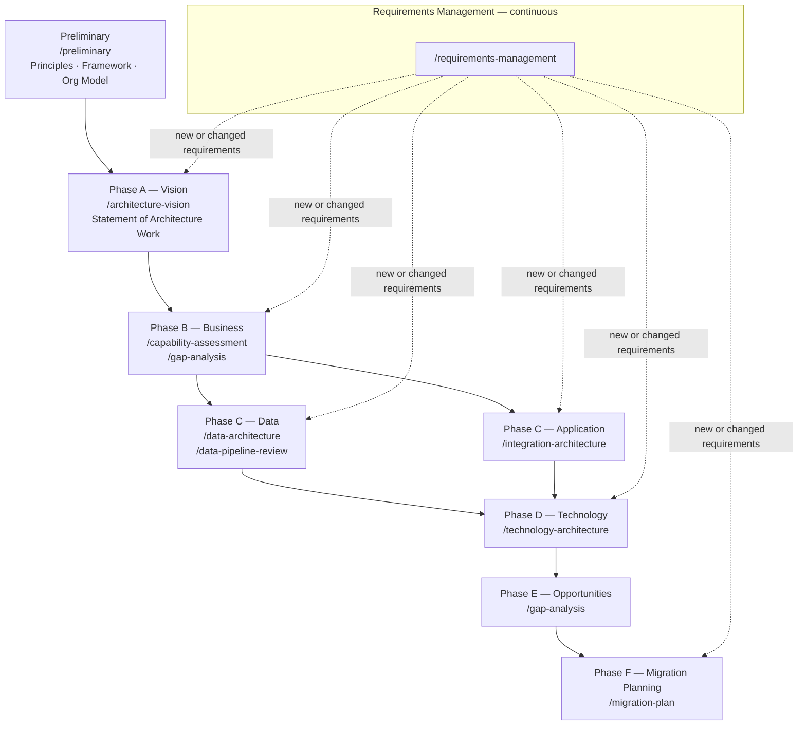
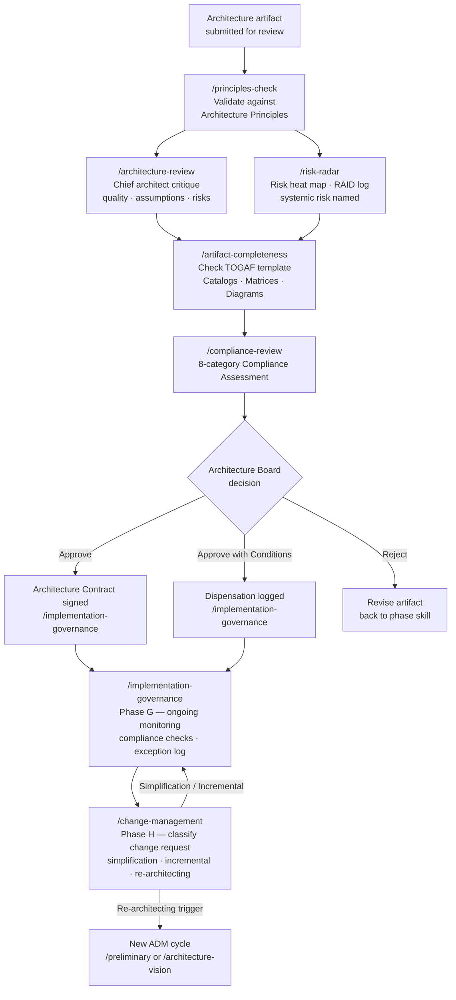

# architect

[](https://opensource.org/licenses/MIT)
[](./package.json)
[](https://claude.ai/code)
[](https://www.opengroup.org/togaf)

TOGAF-structured architecture outputs in minutes. Twenty-three skills covering the full ADM cycle — from establishing Architecture Principles to governing live implementations — each producing client-ready documents with built-in accountability markers.

---

## Why install it

Every architecture engagement carries a *scaffolding tax*: hours spent formatting a Statement of Architecture Work correctly, constructing a capability catalog with the right maturity evidence, or checking an artifact against all required Catalogs, Matrices, and Diagrams before board submission. That time displaces architectural thinking.

This plugin pays down that tax:

- **TOGAF 10-fidelity templates** — Statement of Architecture Work (§7.6, 9 clauses), Architecture Requirements Specification (§7.11, 9 sections), Architecture Contract (§7.18) — populated, not blank
- **Built-in accountability** — every output carries confidence markers, reversibility tags, named owners, and a Broad Responsibility line; no vague recommendations
- **Staged validation pipeline** — `principles-check → architecture-review → artifact-completeness → compliance-review` — each gate tells you what the next gate needs
- **Skill chaining** — every skill ends with a `## Next Step` block recommending the downstream skill to invoke next
- **Framework-agnostic fallback** — TOGAF vocabulary active by default; omit it and the skills degrade cleanly to framework-agnostic output

If you produce architecture documents, review other people's designs, or sit on an Architecture Board — this is the plugin to install.

---

## Requirements

- [Claude Code](https://claude.ai/code) — CLI or desktop app

**Optional**

- Claude Code VS Code extension — run skills on open files without leaving the editor
- Obsidian (Dataview, Mermaid Tools) — render generated diagrams, query ADRs and decisions as a live register

---

## Install

```
/plugin marketplace add nclsprsn/architect-claude
/plugin install architect@architect-claude
```

**Local development — session only** (changes apply on restart, no install step):

```bash
git clone https://github.com/nclsprsn/architect-claude
claude --plugin-dir ./architect-claude
```

**Local development — permanent install** (replaces the GitHub source):

```bash
git clone https://github.com/nclsprsn/architect-claude
claude plugin marketplace add ./architect-claude
claude plugin install architect@architect-claude
```

To pick up local edits after install:

```bash
claude plugin update architect@architect-claude
# then restart Claude Code
```

---

## Quick Start

```
# Don't know where to start? The router dispatches you to the right skill
/architect-router I'm starting a new TOGAF engagement for a data platform

# Establish Architecture Principles and EA governance model (Preliminary Phase)
/preliminary docs/organisation-context.md

# Define scope, stakeholders, and Architecture Vision (Phase A)
/architecture-vision docs/programme-brief.md

# Score a capability map for completeness and maturity evidence (Phase B)
/capability-assessment docs/capability-map.md

# Chief architect critique before a governance submission
/architecture-review docs/platform-design.md

# Full TOGAF Compliance Assessment — produces Architecture Board verdict
/compliance-review docs/architecture-definition-document.md

# Write an ADR for a decision already made
/adr-generator We chose Kafka over RabbitMQ for ordering guarantees and replay capability

# Rewrite a technical document for a C-level audience
/executive-summary docs/data-platform-proposal.md
```

---

## Skills

### Route

| Skill | What it does |
|-------|-------------|
| `/architect-router [context]` | Detect ADM phase and intent, recommend the right skill to invoke next |

### Frame — establish the engagement

| Skill | What it does |
|-------|-------------|
| `/preliminary [context]` | Architecture Principles (4-field template), tailored framework, Organizational Model for EA, Request for Architecture Work |
| `/architecture-vision [context]` | Statement of Architecture Work (§7.6, 9 clauses), Architecture Vision, stakeholder map, communications plan |
| `/requirements-management [context]` | Requirements Impact Assessments, Architecture Requirements Repository, traceability matrix — continuous across all ADM phases |

### Discover — understand the landscape

| Skill | What it does |
|-------|-------------|
| `/capability-assessment [path]` | Score a Phase B capability map — completeness, maturity evidence, ownership model, Phase B→C traceability |
| `/gap-analysis [path]` | Baseline→target gap table by domain and effort, sequenced into H1/H2/H3 roadmap |
| `/data-architecture [path]` | Data quality attributes, governance blind spots, GDPR/AI Act check, second-order effects |
| `/integration-architecture [path]` | Integration topology fitness, contract governance, reliability patterns, anti-pattern detection |
| `/data-pipeline-review [path]` | Pipeline pattern vs SLA fitness, idempotency, lineage, observability |
| `/technology-architecture [path]` | Infrastructure topology, vendor lock-in surface, DR/HA patterns, IaC coverage, technology lifecycle, cost model |

### Decide — make and record decisions

| Skill | What it does |
|-------|-------------|
| `/trade-off-analysis [context]` | 2–3 options → weighted decision matrix → clear recommendation → ADR-ready output |
| `/adr-generator [context]` | MADR from a decision already made — DACI stakeholders, force-field analysis, QA scenarios |

### Communicate — land the message

| Skill | What it does |
|-------|-------------|
| `/executive-summary [path]` | Rewrite for C-level: Pyramid Principle, business implications, numbered claims |
| `/stakeholder-communication [path]` | Tailor for a named role: CTO / Head of Eng / CPO / CFO / CISO / DPO / Board |

### Plan — sequence the delivery

| Skill | What it does |
|-------|-------------|
| `/migration-plan [path]` | Gap-analysis output → dependency-sequenced H1/H2/H3 roadmap with TOGAF Transition Architectures |
| `/new-arch-doc [phase]` | Scaffold a TOGAF phase document (A–D) or framework-agnostic proposal with guiding questions |

### Validate — review before the board

Four sequential gates before Architecture Board submission. Run them in order.

| Skill | Gate | What it does |
|-------|------|-------------|
| `/principles-check [path]` | 1 | Validate document against Architecture Principles; or audit the principles themselves |
| `/architecture-review [path]` | 2 | Chief architect critique — quality attributes, assumptions, disruptive alternative, second-order effects |
| `/risk-radar [path]` | 2 (parallel) | Risk heat map, RAID log, top mitigations, one systemic risk worth naming |
| `/artifact-completeness [path]` | 3 | Score against canonical TOGAF template — required Catalogs, Matrices, and Diagrams |
| `/compliance-review [path]` | 4 | 8-category TOGAF Compliance Assessment — Approve / Approve with Conditions / Reject |

### Govern — implement and evolve

| Skill | What it does |
|-------|-------------|
| `/implementation-governance [context]` | Architecture Contracts, 8-category Compliance Assessments, dispensation and exception log (Phase G) |
| `/change-management [context]` | Classify change requests, assess impact, determine if a new ADM cycle is required (Phase H) |

---

## ADM Workflow

### Specification Track

From Preliminary through Phase F. Requirements Management runs continuously across all phases. Use `/new-arch-doc` to scaffold a blank phase document before populating it with the phase skills below.



### Validation & Governance Track

From artifact submission through Architecture Board decision, Phase G ongoing monitoring, and Phase H change management. Phase H feeds back to the start of a new ADM cycle.



---

## Worked Examples

The `references/examples/` directory contains twenty-four fully instantiated TOGAF artefacts anchored to a single coherent engagement — ACME Corp Customer Onboarding modernisation — so you can see how artefacts accumulate across phases rather than reading disconnected templates. Each example is produced by a specific skill and follows its template exactly.

| File | Artefact | Phase | Skill |
|------|----------|-------|-------|
| `references/examples/11.01-architecture-principles.md` | 6 Architecture Principles — 4-field template | Preliminary | `/preliminary` |
| `references/examples/11.02-request-for-architecture-work.md` | Request for Architecture Work | Preliminary | `/preliminary` |
| `references/examples/12.01-statement-of-architecture-work.md` | Statement of Architecture Work (§7.6, 9 clauses) | A | `/architecture-vision` |
| `references/examples/13.01-architecture-requirements-specification.md` | Architecture Requirements Specification (§7.11, 9 sections) | B | `/requirements-management` |
| `references/examples/21.01-business-capabilities-catalog.md` | Business Capabilities Catalog — 20 capabilities, maturity 0–4 | B | `/capability-assessment` |
| `references/examples/31.01-trade-off-analysis.md` | Trade-off Analysis — orchestration pattern, 3 options, TCO comparison | B→C | `/trade-off-analysis` |
| `references/examples/22.01-data-architecture.md` | Phase C Data Architecture — 5 domains, DAMA-DMBOK, GDPR, data contracts | C | `/data-architecture` |
| `references/examples/22.02-data-pipeline-review.md` | Data Pipeline Review — document processing pipeline, idempotency, lineage, GDPR data residency finding | C | `/data-pipeline-review` |
| `references/examples/23.01-integration-architecture.md` | Phase C Application Architecture — 7 integration points, 5 EIP anti-patterns, SLO table | C | `/integration-architecture` |
| `references/examples/24.01-technology-architecture.md` | Phase D Technology Architecture — 12 components, 6 anti-patterns, cost model, Phase C→D traceability | D | `/technology-architecture` |
| `references/examples/51.01-gap-analysis.md` | Phase E Gap Analysis — 7 domains, 15 gaps, dependency DAG, TOGAF Gap Analysis Matrix, critical path | E | `/gap-analysis` |
| `references/examples/31.02-architecture-decision-record.md` | Architecture Decision Record — MADR with weighted decision matrix | E | `/adr-generator` |
| `references/examples/52.01-migration-plan.md` | Phase F Migration Plan — strangler-fig, 6Rs (7 workloads), 3 Transition Architectures, rollback playbooks | F | `/migration-plan` |
| `references/examples/71.01-architecture-contract.md` | Architecture Contract — Design & Development (§7.18) | G | `/implementation-governance` |
| `references/examples/71.02-compliance-assessment.md` | Compliance Assessment — all 8 TOGAF categories | G | `/compliance-review` |
| `references/examples/71.03-change-management.md` | Phase H Change Management — Partner API Platform CR, Major classification, RIA, Repo Update Log | H | `/change-management` |
| `references/examples/61.01-principles-check.md` | Principles Check — 6 principles validated against Phase D Technology Architecture, per-principle conformance verdicts | Validate | `/principles-check` |
| `references/examples/61.02-architecture-review.md` | Chief Architect Critique — Phase D Technology Architecture, unstated assumptions, disruptive alternative, 12-item fix list | Validate | `/architecture-review` |
| `references/examples/61.03-risk-radar.md` | Programme RAID Log — 10 risks, heat map, bow-tie analysis, risk interconnection map, systemic risk named | Validate | `/risk-radar` |
| `references/examples/61.04-artifact-completeness.md` | Artifact Completeness — Phase C Application Architecture scored against all TOGAF Catalogs, Matrices, Diagrams | Validate | `/artifact-completeness` |
| `references/examples/41.01-executive-summary.md` | Executive Summary — 15-gap analysis rewritten for CCO, Pyramid Principle, Before/After pair | Communicate | `/executive-summary` |
| `references/examples/41.02-stakeholder-communication.md` | CISO Briefing — security findings tailored for CISO, owner split, Before/After transformation | Communicate | `/stakeholder-communication` |
| `references/examples/81.01-architect-router.md` | Architect Router — two routing interactions (engagement start → Preliminary/Phase A; pre-board validation → 4-gate pipeline) | Route | `/architect-router` |
| `references/examples/82.01-new-architecture-document.md` | Phase D Technology Architecture scaffold — blank skeleton with all required sections and guiding questions | Scaffold | `/new-arch-doc` |

---

## Design Philosophy

### Architect Mindset

Every skill operates from the same posture — the same questions an experienced chief architect would ask before signing off an output:

- Work backwards from the business outcome — never forward from the technology
- Surface a disruptive alternative that questions whether the problem was framed correctly
- Name the horizon — H1 optimise core / H2 scale emerging / H3 seed disruptive; flag when an H3 problem gets H1 treatment
- Apply the commoditisation curve — never custom-build a commodity
- Anchor every claim with a number, reference architecture, or first-principles reasoning
- Name at least one second-order effect per output

### Output Accountability

Posture without accountability is theatre. Every skill enforces four output rules so recommendations land as decisions, not opinions:

| Marker | What it enforces |
|--------|-----------------|
| `[proven]` / `[informed estimate]` / `[working hypothesis]` | Calibrates confidence in every claim, score, and recommendation |
| **one-way door** / **two-way door** | Makes reversibility explicit before a decision is committed |
| Named owner + event-based review trigger | Prevents unowned recommendations; no calendar-date triggers |
| Broad Responsibility line | Surfaces societal, regulatory, or downstream impact on every output |

### Skill Chaining

Each skill ends with a `## Next Step` block recommending the downstream skill to invoke — either forward (next ADM phase) or lateral (validation gate, decision capture, or communication). Claude invokes the next skill if your intent is clear; you accept or override the suggestion.

### TOGAF Default

TOGAF vocabulary — ADM phases, building blocks, gap analysis — is active by default. If your project does not use TOGAF, omit the vocabulary in your prompts and the skills degrade to framework-agnostic mode automatically.

---

## Troubleshooting

**The skill runs but the output ignores my TOGAF context.**
Include TOGAF vocabulary in your prompt or document. The skills detect signals (ADM phases, building blocks, gap analysis) to switch into full TOGAF mode. Ensure standard terms appear: "ADM", "Building Block", "Baseline", "Target Architecture", "Phase A/B/C/D".

**The output is too generic.**
Pass the actual document as input, not a description of it. `/architecture-review docs/platform-design.md` is significantly richer than `/architecture-review our platform uses microservices`.

**`/trade-off-analysis` gives me a tie with no clear winner.**
Add a tiebreaker criterion: the business constraint, timeline pressure, or team capability that should break the tie. Append it to your prompt.

**Output is missing the Broad Responsibility line.**
If it outputs `N/A`, it must include a reason. If neither appears, re-run with an explicit reminder: append `-- ensure Broad Responsibility line is present` to your command.

**I don't know which skill to invoke.**
Run `/architect-router` with a short description of what you're trying to do. The router detects ADM phase and intent and recommends the right skill.

---

## License

MIT
