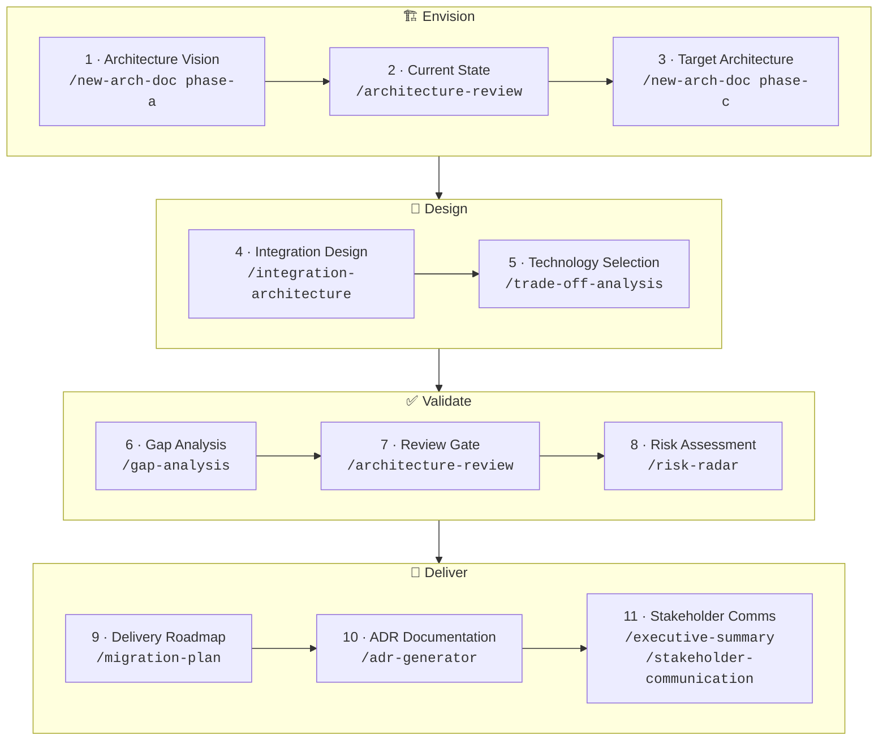
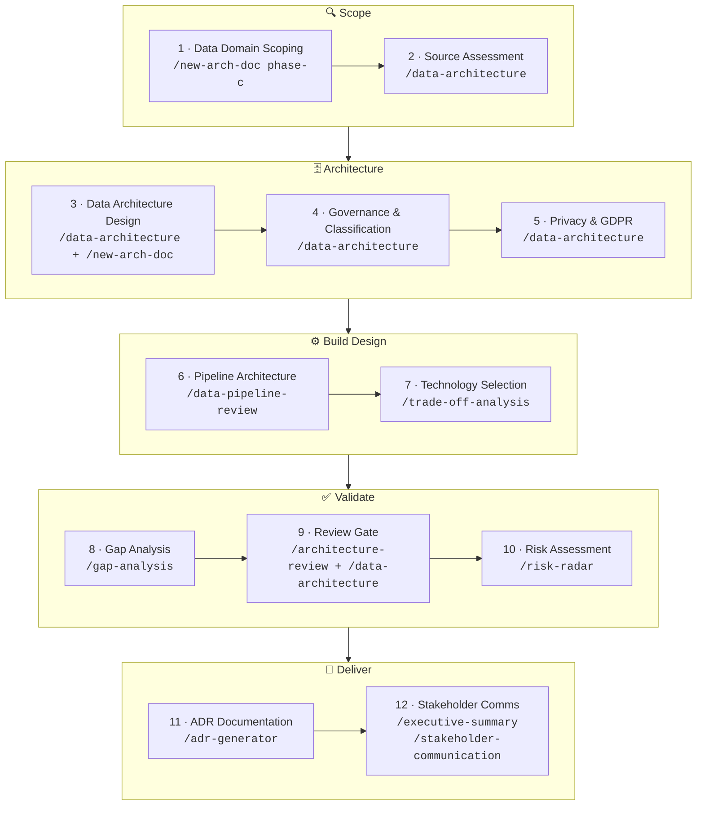

# architect-claude

A Claude Code plugin for Enterprise Architects and Solution Architects.

Twelve skills and slash commands covering architecture review, data architecture assessment, gap analysis, risk assessment, decision recording, stakeholder communication, executive reporting, and document scaffolding. TOGAF-aware by default, framework-agnostic fallback.

## Install

```bash
claude plugin install gh:nclsprsn/architect-claude
```

## Skill Taxonomy

### Discover — understand the landscape

| Command | Skill | What it does |
|---------|-------|-------------|
| `/architecture-review [path]` | `architecture-review` | Chief architect critique: quality attributes, assumption stress-test, disruptive alternative, second-order effects |
| `/gap-analysis [path]` | `gap-analysis` | Baseline → target gap table, scored by domain and effort, sequenced into H1/H2/H3 roadmap |
| `/risk-radar [path]` | `risk-radar` | Risk heat map × RAID log × top mitigations × one systemic risk worth naming |
| `/data-architecture [path]` | `data-architecture` | Data quality attributes, topology assessment, GDPR/AI Act check, governance blind spot, second-order effects |
| `/integration-architecture [path]` | `integration-architecture` | Integration quality attributes, topology fitness, contract governance, reliability patterns, anti-pattern detection |
| `/data-pipeline-review [path]` | `data-pipeline-review` | Pipeline pattern vs SLA fitness, idempotency, lineage, data quality checks, observability assessment |

### Decide — make and record decisions

| Command | Skill | What it does |
|---------|-------|-------------|
| `/trade-off-analysis [context]` | `trade-off-analysis` | Evaluate 2–3 options → clear recommendation → ADR-ready output |
| `/adr-generator [context]` | `adr-generator` | Write a clean MADR from a decision already made — faster than trade-off-analysis |

### Communicate — land the message

| Command | Skill | What it does |
|---------|-------|-------------|
| `/executive-summary [path]` | `executive-summary` | Rewrite technical doc for C-level: Pyramid Principle, business implications, numbered claims |
| `/stakeholder-communication [path]` | `stakeholder-communication` | Tailor a communication for a named role: CTO / Head of Eng / CPO / CFO / Procurement / Board |

### Plan — sequence and phase the delivery

| Command | Skill | What it does |
|---------|-------|-------------|
| `/migration-plan [path]` | `migration-plan` | Phase gap-analysis output into a dependency-sequenced H1/H2/H3 roadmap with critical path, quick wins, and TOGAF Transition Architectures |

### Document — create architecture artifacts

| Command | Skill | What it does |
|---------|-------|-------------|
| `/new-arch-doc [phase]` | `new-arch-doc` | Scaffold a TOGAF phase document (A–D) or framework-agnostic proposal with guiding questions |

---

## Architect Workflow

Most engagements follow one of two tracks depending on whether the system under design integrates operational business processes or builds a decisional / data platform. The flows below show every step of each track, what you do at that step, and which skill to reach for.

---

### Track 1 — Operational SI Engagement



An Operational SI engagement designs or reviews a system that runs business operations: CRM, ERP, order management, API platform, microservices migration. The work moves from vision to delivery roadmap.

```
Step  Activity                        Skill
──────────────────────────────────────────────────────────────────────────
 1    Architecture Vision             /new-arch-doc phase-a
      Frame the engagement: business  Scaffold Phase A — business context,
      drivers, stakeholders, scope,   key drivers, assumptions, success
      and constraints.                criteria, and stakeholder map.

 2    Current State Assessment        /architecture-review
      Critique what exists today:     Run a chief-architect review on the
      quality attributes, risks,      existing design docs or system
      assumptions, and gaps.          description.

 3    Target Architecture Design      /new-arch-doc phase-c
      Define what the system should   Scaffold Phase C (Information
      look like: components,          Systems) with guiding questions for
      interfaces, behaviour.          each architectural concern.

 4    Integration Design              /integration-architecture
      Assess or design the            Review topology, contract governance,
      integration layer: APIs,        anti-patterns, reliability patterns,
      events, messaging, contracts.   and second-order coupling effects.

 5    Technology Selection            /trade-off-analysis
      Compare platform or technology  Structured option comparison →
      options before committing.      clear recommendation → ADR-ready.

 6    Gap Analysis                    /gap-analysis
      Map baseline → target,          Scored gap table by domain and
      identify what must change,      effort, sequenced into an
      and sequence the work.          H1/H2/H3 roadmap.

 7    Architecture Review Gate        /architecture-review
      Validate the design meets       Stress-test quality attributes,
      the bar before delivery starts. surface disruptive alternatives,
                                      confirm assumptions hold.

 8    Risk Assessment                 /risk-radar
      Identify what could go wrong    Heat map × RAID log × top
      before the build starts.        mitigations × systemic risk.

 9    Delivery Roadmap                /migration-plan
      Phase the gap-analysis output   H1/H2/H3 roadmap with critical path,
      into a sequenced plan with      quick wins, and TOGAF Transition
      dependencies and milestones.    Architecture states.

10    Decision Documentation          /adr-generator
      Record every significant        Clean MADR per decision — context,
      technical decision made         choice, alternatives considered,
      during the engagement.          consequences.

11    Stakeholder Communication       /executive-summary  +  /stakeholder-communication
      Present findings and            Pyramid-Principle exec summary +
      recommendations to the          tailored message per role
      right audience.                 (CTO, CFO, Board, Head of Eng…).
──────────────────────────────────────────────────────────────────────────
```

---

### Track 2 — Decisional SI Engagement



A Decisional SI engagement designs or reviews a system built to store, process, and expose data for analysis and AI: data platform, data mesh, lakehouse, ML feature store, BI layer. Privacy and governance are first-class concerns from step one.

```
Step  Activity                        Skill
──────────────────────────────────────────────────────────────────────────
 1    Data Domain Scoping             /new-arch-doc phase-c
      Define data domains, producers, Scaffold Phase C (Information
      consumers, and the scope of     Systems — Decisional) with guiding
      the data platform.              questions for domain ownership.

 2    Source Assessment               /data-architecture
      Assess existing data sources:   Data quality attributes, topology
      quality, format, ownership,     review, GDPR/AI Act compliance
      classification, lineage.        posture, governance blind spots.

 3    Data Architecture Design        /data-architecture  +  /new-arch-doc
      Design the logical and          Quality attributes + topology
      physical data architecture:     assessment → scaffold the Phase C
      storage, access, topology.      architecture document.

 4    Governance & Classification     /data-architecture
      Define data ownership,          Governance blind-spot identification,
      classification tiers,           classification framework,
      and stewardship model.          ownership assignment, data contracts.

 5    Privacy & GDPR Review           /data-architecture
      Assess privacy-by-design        GDPR/AI Act compliance check,
      posture: consent, residency,    data subject rights coverage,
      retention, AI Act obligations.  Privacy by Design gaps.

 6    Pipeline Architecture           /data-pipeline-review
      Design or review the            Pattern vs SLA fitness, idempotency,
      ingestion, transformation,      lineage coverage, data quality
      and serving pipelines.          checks, observability assessment.

 7    Technology Selection            /trade-off-analysis
      Compare storage, compute,       Structured option comparison →
      or orchestration options.       clear recommendation → ADR-ready.

 8    Gap Analysis                    /gap-analysis
      Map current data capability     Scored gap table across data
      to target, identify what        domains and delivery effort,
      must change.                    sequenced H1/H2/H3.

 9    Architecture Review Gate        /architecture-review  +  /data-architecture
      Validate the design at a        Chief-architect critique (all
      governance checkpoint before    quality attributes) + data-specific
      build starts.                   assessment (governance, privacy).

10    Risk Assessment                 /risk-radar
      Surface data, privacy,          Heat map covering Data Protection
      regulatory, and delivery        category + RAID log + systemic
      risks.                          risk.

11    Decision Documentation          /adr-generator
      Record technology, governance,  Clean MADR per decision — faster
      and privacy decisions made      than trade-off-analysis when the
      during the engagement.          choice is already made.

12    Stakeholder Communication       /executive-summary  +  /stakeholder-communication
      Present findings to the right   Pyramid-Principle exec summary +
      audience: CDO, CISO, CTO,       tailored message per role — data
      DPO, engineering teams.         literacy varies widely here.
──────────────────────────────────────────────────────────────────────────
```

---

### TOGAF ADM Phase Mapping

| Phase | Primary skills |
|-------|---------------|
| A — Architecture Vision | `/new-arch-doc phase-a`, `/stakeholder-communication` |
| B — Business Architecture | `/new-arch-doc phase-b`, `/gap-analysis` |
| C — Information Systems (Operational) | `/new-arch-doc phase-c`, `/integration-architecture`, `/gap-analysis`, `/risk-radar` |
| C — Information Systems (Decisional) | `/new-arch-doc phase-c`, `/data-architecture`, `/data-pipeline-review`, `/gap-analysis`, `/risk-radar` |
| D — Technology Architecture | `/new-arch-doc phase-d`, `/gap-analysis`, `/architecture-review` |
| All phases — options & decisions | `/trade-off-analysis`, `/adr-generator` |
| All phases — delivery sequencing | `/migration-plan` |
| Governance / review gates | `/architecture-review`, `/risk-radar` |
| Reporting / steering committees | `/executive-summary`, `/stakeholder-communication` |

### When to Use What

| Situation | Use |
|-----------|-----|
| Starting a new engagement or TOGAF phase | `/new-arch-doc` |
| Reviewing a document or proposal before a review gate | `/architecture-review` |
| Reviewing a data platform, data model, or data governance | `/data-architecture` |
| Reviewing an API design, event-driven system, or integration layer | `/integration-architecture` |
| Reviewing an ETL/ELT pipeline, streaming design, or data ingestion | `/data-pipeline-review` |
| Mapping current state to target state | `/gap-analysis` |
| Comparing options before committing to a direction | `/trade-off-analysis` |
| Capturing a decision already made | `/adr-generator` |
| Preparing a steerco or executive review deck | `/executive-summary` |
| Writing to a specific stakeholder (CTO, CFO, Board…) | `/stakeholder-communication` |
| Pre-launch, pre-release, or pre-migration risk check | `/risk-radar` |
| Sequencing gap-analysis output into a delivery roadmap | `/migration-plan` |
| Phasing a migration with TOGAF Transition Architectures | `/gap-analysis` → `/migration-plan` |
| Architecture board submission | `/architecture-review` + `/risk-radar` |
| Onboarding a new team to an existing architecture | `/executive-summary` + `/stakeholder-communication` |

---

## Core Posture

Every skill operates from the same architect mindset:

- **Work backwards** from the business outcome — never forward from the technology
- **Surface a disruptive alternative** that questions whether the problem was framed correctly
- **Name the horizon** — H1 optimise core / H2 scale emerging / H3 seed disruptive
- **Apply the commoditisation curve** — never custom-build a commodity
- **Anchor every claim** with a number or first-principles reasoning
- **Name second-order effects** — at least one non-obvious downstream consequence per output
- **Highest Standards** — every output closes with a client-deliverable quality check

## TOGAF Default

TOGAF vocabulary (ADM phases, building blocks, gap analysis) is active by default. If your project does not use TOGAF, the skills degrade gracefully to framework-agnostic mode — just don't mention TOGAF in your prompts.

---

## Examples

```
# Discover
/architecture-review docs/platform-architecture.md
/gap-analysis docs/current-state-assessment.md
/risk-radar docs/migration-proposal.md
/data-architecture docs/data-platform-design.md
/integration-architecture docs/api-integration-design.md
/data-pipeline-review docs/etl-pipeline-spec.md

# Plan
/migration-plan docs/gap-analysis-output.md

# Decide
/trade-off-analysis API gateway selection for our microservices migration
/adr-generator We decided to adopt Kafka for event streaming over RabbitMQ because of ordering guarantees and replay capability

# Communicate
/executive-summary docs/data-platform-proposal.md
/stakeholder-communication CTO — summarise the data platform decision and investment ask

# Document
/new-arch-doc phase-b
```

---

## Roadmap

Skills planned for future versions:

| Skill | What it will do |
|-------|----------------|
| `capability-assessment` | Score architecture maturity across domains against a target capability level |
| `data-mesh-designer` | Generate a data mesh topology design from domain ownership and data product definitions |
| `workshop-facilitator` | Produce a structured workshop agenda + facilitation guide for architecture sessions |
| `rfp-evaluator` | Evaluate vendor RFP responses against a set of architecture requirements |
| `pattern-library` | Suggest architecture patterns and reference architectures from a problem description |

---

## License

MIT
