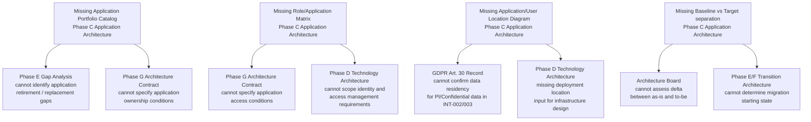

# Artifact Completeness Check — ACME Corp Phase C Application Architecture

**Artifact checked:** Phase C Application Architecture — ACME Corp Customer Onboarding (see `example-integration-architecture.md`)
**TOGAF template reference:** Phase C Application Architecture — Catalogs, Matrices, Diagrams (see `references/togaf-content-framework.md`)
**Reviewer:** Marcus Webb, Head of Enterprise Architecture
**Review date:** 2025-10-28
**Architecture Sponsor:** Sarah Chen, Chief Customer Officer

---

## Verdict: Incomplete — Conditional Pass

> [!important]
> The artifact has strong analytical content: all seven integration points are catalogued, three critical anti-patterns are identified with owners and remediation steps, and a sequence diagram accurately renders the KYC timeout mismatch. However, five canonical TOGAF Phase C Application Architecture artefacts are entirely absent: the Application Portfolio Catalog, the Application/Organization Matrix, the Role/Application Matrix, the Application/User Location Diagram, and the Enterprise Manageability Diagram. The artifact may not be submitted to the Architecture Board in its current state. Conditional pass: the analytical quality is sufficient; the structural gaps must be remediated before formal submission.

---

## Completeness Scorecard

**Artifact under review:** Phase C Application Architecture — Customer Onboarding Modernisation, v1.0 (2025-04-10)
**Completeness score:** 4 / 11 required components fully present (2 Partial, 5 Missing)

---

### Architecture Content Framework — Catalogs

Catalogs are lists of building blocks. The Phase C Application Architecture requires an Application Portfolio Catalog and an Interface Catalog.

| Catalog | Required for this phase/domain | Present | Quality | Gap finding | Priority | Owner |
|---------|-------------------------------|---------|---------|-------------|----------|-------|
| Application Portfolio Catalog | Yes | ✗ | — | No Application Portfolio Catalog exists. The artifact names seven integration endpoints (Onboarding BPM, KYC SaaS, Document AI, Customer Master CRM, Consent Store, Notification Service, Channel Layer) but does not produce a formal catalog entry per application: no lifecycle status, no decomposition to ABBs, no ownership, no version, no strategic disposition (retain / replace / retire). Without this catalog the Architecture Board cannot assess the fitness of the application landscape. `[proven]` | Critical | Head of EA (Marcus Webb) |
| Interface Catalog | Yes | ✓ | The Integration Catalog table (INT-001 through INT-007) fully satisfies the Interface Catalog requirement: style, topology, producer, consumer, data classification, SLA, lifecycle, and owner are present for all seven interfaces. This exceeds the minimum template bar. | — | Minor | Identity Architect (Priya Sharma) |

---

### Architecture Content Framework — Matrices

The Phase C Application Architecture requires five matrices: Application/Organization, Role/Application, Application/Function, Application Interaction, and Application/Data.

| Matrix | Required | Present | Quality | Gap finding | Priority | Owner |
|--------|----------|---------|---------|-------------|----------|-------|
| Application/Organization Matrix | Yes | ✗ | — | No matrix mapping applications to organizational units exists. The artifact names owners per integration point (role labels only) but does not produce a formal mapping of each application to the business unit responsible for it. The Architecture Board cannot assess accountability or funding alignment without this matrix. `[proven]` | Significant | Head of EA (Marcus Webb) |
| Role/Application Matrix | Yes | ✗ | — | No matrix mapping business roles to applications and access rights exists. Security and access control decisions cannot be validated at the Architecture Board without a Role/Application Matrix. This gap also creates a downstream risk: the Phase G Architecture Contract cannot specify application access conditions without this input. `[informed estimate]` | Significant | Identity Architect (Priya Sharma) |
| Application/Function Matrix | Yes | ✗ | — | No matrix mapping applications to business functions exists. The artifact does not connect integration points to the business capabilities they serve (e.g., Identity Verification, Customer Onboarding, Notification). Without this matrix the Phase B capability map cannot be reconciled against the Phase C application layer. `[informed estimate]` | Significant | Head of EA (Marcus Webb) |
| Application Interaction Matrix | Yes | Partial | The Integration Catalog (INT-001 through INT-007) captures the core application-to-application dependencies: producer, consumer, style, and SLA per integration point. This partially satisfies the Application Interaction Matrix requirement. What is missing: the matrix form (rows = producing applications, columns = consuming applications, cells = interaction type and dependency) has not been rendered — the current format is a flat catalog, not a matrix. The Architecture Board typically expects the matrix view. `[proven]` | Minor | Head of EA (Marcus Webb) |
| Application/Data Matrix | Yes | Partial | The Integration Catalog includes data classification per integration point (PI/Internal, PI/Confidential, PI/Restricted) and the TOGAF Context section references the Customer Master ABB and Identity Verification ABB. This partially satisfies the Application/Data Matrix requirement. What is missing: a formal CRUD mapping (which applications Create, Read, Update, Delete which data entities) is not rendered. The data classifications per integration point are a partial proxy only. `[informed estimate]` | Significant | Identity Architect (Priya Sharma) |

---

### Architecture Content Framework — Diagrams

The Phase C Application Architecture requires canonical diagrams covering application communication, user/location mapping, manageability, migration, and software engineering views.

| Diagram | Required | Present | Quality | Gap finding | Priority | Owner |
|---------|----------|---------|---------|-------------|----------|-------|
| Application Communication Diagram | Yes | ✓ | Two diagrams are present and of high quality. The flowchart renders all seven integration points with topology, protocol, data classification annotations, and reliability gap markers (⚠). The sequence diagram renders the critical KYC timeout mismatch scenario with participant roles and timing constraints. Together these exceed the minimum template requirement for an Application Communication Diagram. | — | Minor | Identity Architect (Priya Sharma) |
| Application/User Location Diagram | Yes | ✗ | — | No diagram mapping applications to deployment locations and user geographies exists. The artifact does not specify where the Onboarding BPM, Document AI, Customer Master CRM, or Consent Store are deployed (on-premises, cloud region, hybrid). For a 5,000-employee hybrid cloud organisation, the Architecture Board needs to understand application placement for latency, data residency (GDPR), and DR planning. Absence of this diagram is a GDPR data residency risk for PI/Confidential data transiting INT-002 and INT-003. `[proven]` | Critical | Head of EA (Marcus Webb) |
| Enterprise Manageability Diagram | Yes | ✗ | — | No diagram showing management-class software interactions exists. The Runbook Completeness section identifies four integration points with no runbooks, but the overall management architecture (monitoring platform, alerting, CMDB integration, observability tooling) is not rendered as a diagram. Without this, the Architecture Board cannot assess operational manageability. `[informed estimate]` | Significant | Head of EA (Marcus Webb) |
| Application Migration Diagram | Conditional | ✗ | — | No application migration sequencing diagram exists. The artifact does not describe which applications are being replaced, retired, or newly introduced as part of the Customer Onboarding Modernisation. Given the engagement context (reducing onboarding cycle from 11 days to ≤3 days), some legacy applications are almost certainly being displaced. If no applications are being retired, this diagram may be marked N/A with explicit justification — but that justification is absent. `[working hypothesis]` | Significant | Head of EA (Marcus Webb) |
| Software Engineering Diagram | Conditional | ✗ | — | No software component decomposition diagram exists. For an orchestrated BPM topology (Camunda), a software engineering diagram showing the Camunda process engine, service task adapters, and their internal component relationships would be expected at Phase C. This is conditional — it may be deferred to Phase D if technology component detail is not required at this phase — but the decision to defer must be explicit. `[working hypothesis]` | Minor | Identity Architect (Priya Sharma) |

---

### Structural Sections

| Section | Required | Present | Quality | Gap finding | Priority | Owner |
|---------|----------|---------|---------|-------------|----------|-------|
| Executive Summary / Purpose | Yes | Partial | The abstract callout summarises the verdict and three reliability gaps. This functions as an executive summary but is not labelled as such and does not state the document's purpose, scope, or intended audience. `[proven]` | Minor | Head of EA (Marcus Webb) |
| Baseline Architecture | Phase-dependent | Partial | The Integration Catalog and Anti-Pattern Inventory describe the current integration state. The SLO table and Runbook Completeness section describe existing gaps. A formal baseline architecture section (as-is application state) is not explicitly delineated. `[informed estimate]` | Minor | Head of EA (Marcus Webb) |
| Target Architecture | Yes | Partial | The Fix List and Horizon Alignment sections describe the target state implicitly. A formal target architecture section (to-be application and integration state, post-remediation) is not explicitly rendered. Architecture Board submissions typically require the baseline and target to be clearly separated. `[proven]` | Significant | Head of EA (Marcus Webb) |
| Gap Analysis | Phase B–D | ✓ | The Anti-Pattern Inventory and Fix List together constitute a detailed gap analysis: each gap is identified, located, risk-assessed, remediated, assigned an owner, and given an event-based review trigger. This meets the template requirement. | — | — | — |
| Assumptions and Constraints | Yes | Partial | Assumptions are embedded in confidence markers throughout (e.g., `[working hypothesis]` on SLO headroom). No dedicated Assumptions and Constraints section exists. The KYC SaaS constraint (10 concurrent verifications, REST-only, no event streaming) is documented inline but not formally catalogued. `[proven]` | Minor | Head of EA (Marcus Webb) |
| Dependencies | Yes | ✓ | Integration dependencies (INT-001 through INT-007) are catalogued with producers, consumers, and SLAs. Cross-phase dependencies (Phase G Architecture Contract, Phase C Application ADD sign-off) are referenced. The TOGAF Context section identifies impacted building blocks. | — | — | — |
| Risks | Yes | ✓ | Three critical reliability risks (timeout mismatch, missing DLQ, non-idempotent CRM write) and two medium risks (traceparent, API maturity) are identified with severity, remediation, owner, and review trigger. The Broad Responsibility section surfaces the GDPR data processor risk. | — | — | — |
| Open Issues | Yes | ✓ | The Fix List explicitly flags open issues with owners and event-based triggers. The TOGAF Context section notes the Application Interaction Matrix as an open artefact gap. | — | — | — |
| Architecture Principles alignment | Yes | ✗ | — | No explicit assessment of alignment to ACME Architecture Principles exists. The artifact references ADR-2025-003 (orchestrated topology selected for regulatory audit trail) but does not score the architecture against the Architecture Principles defined in the Preliminary Phase. The `principles-check` skill should be invoked to produce this assessment. `[proven]` | Significant | Head of EA (Marcus Webb) |

---

## Cascade Impact: Gaps in This Artifact and Downstream Effects

---

## Pre-Submission Checklist — Required Before Architecture Board Submission

The following items must be completed before this artifact may be submitted for Architecture Board review. All items are **two-way door** — the missing content can be added without changing existing architectural decisions.

| # | Gap | Action required | Owner | Review trigger | Confidence |
|---|-----|----------------|-------|----------------|------------|
| 1 | Application Portfolio Catalog absent | Create catalog with one row per application: name, purpose, decomposition to ABBs, owner (role), lifecycle status, strategic disposition | Head of EA (Marcus Webb) | Before Architecture Board submission | `[proven]` |
| 2 | Application/User Location Diagram absent | Produce diagram showing deployment location (on-premises / cloud region) for each application; flag any non-EU processing for PI/Confidential data | Head of EA (Marcus Webb) | Before Architecture Board submission — resolves GDPR data residency risk | `[proven]` |
| 3 | Architecture Principles alignment absent | Invoke `principles-check` skill against the 6 Architecture Principles defined in `example-architecture-principles.md`; attach output as an appendix | Head of EA (Marcus Webb) | Before Architecture Board submission | `[proven]` |
| 4 | Application/Organization Matrix absent | Produce matrix mapping each application to the organizational unit accountable for it; derive from Integration Catalog owner column | Head of EA (Marcus Webb) | Before Architecture Board submission | `[proven]` |
| 5 | Role/Application Matrix absent | Produce matrix mapping business roles to applications and access rights; coordinate with Priya Sharma for identity and access control inputs | Identity Architect (Priya Sharma) | Before Architecture Board submission | `[informed estimate]` |
| 6 | Application/Function Matrix absent | Produce matrix mapping applications to business functions; cross-reference with Phase B Business Capabilities Catalog | Head of EA (Marcus Webb) | Before Architecture Board submission | `[informed estimate]` |
| 7 | Application Interaction Matrix — matrix form missing | Reformat Integration Catalog into matrix view (rows = producers, columns = consumers, cells = interaction style and dependency); the catalog content is correct — the rendering is the gap | Head of EA (Marcus Webb) | Before Architecture Board submission | `[proven]` |
| 8 | Application/Data Matrix — CRUD mapping missing | Add CRUD mapping per application per data entity; use data classifications already in Integration Catalog as the starting point | Identity Architect (Priya Sharma) | Before Architecture Board submission | `[informed estimate]` |
| 9 | Baseline vs Target architecture not separated | Restructure the document to make the baseline (as-is) and target (to-be post-remediation) sections explicit and clearly delineated | Head of EA (Marcus Webb) | Before Architecture Board submission | `[proven]` |
| 10 | Enterprise Manageability Diagram absent | Produce diagram showing monitoring, alerting, and CMDB integration across all seven integration points; incorporate outputs from Runbook Completeness section | Head of EA (Marcus Webb) | Before Architecture Board submission | `[informed estimate]` |
| 11 | Application Migration Diagram — absent or N/A not justified | Determine whether any applications are being retired or replaced; if yes, produce sequencing diagram; if no, add explicit N/A with justification | Head of EA (Marcus Webb) | Before Architecture Board submission | `[working hypothesis]` |

---

> [!warning]
> Items 1 and 2 are Critical. The Application Portfolio Catalog absence means the Architecture Board cannot assess the fitness of the application landscape; the missing Application/User Location Diagram means GDPR data residency compliance for PI/Confidential data (KYC integration INT-002/INT-003) cannot be confirmed. Neither gap can be waived.

> [!important]
> Items 3 through 9 are Significant. The absence of an Architecture Principles alignment check (item 3) means the artifact cannot demonstrate compliance with ACME's own governance framework — this is a one-way door risk if the Architecture Board approves an architecture that later proves non-compliant with Architecture Principles, requiring re-work after decisions are locked.

> [!tip]
> The Interface Catalog (INT-001 through INT-007) and the Application Communication Diagrams (topology flowchart and KYC sequence diagram) exceed the minimum template requirement for Phase C Application Architecture. The analytical depth — anti-pattern inventory, SLO table, API maturity scoring, event catalog, runbook completeness — is a reference-quality pattern. The gaps are structural (missing catalog and matrix artefacts), not analytical.

---

## Broad Responsibility

The missing Application/User Location Diagram (item 2) is not solely an architectural completeness concern. PI/Confidential identity data transits INT-002 (BPM → KYC SaaS) and INT-003 (KYC SaaS → BPM webhook) across an unspecified network boundary to a third-party data processor. Without a location diagram, ACME cannot confirm that this data does not leave the EU — which would constitute a GDPR Chapter V violation regardless of technical security controls. The Architecture Board must not approve this artifact until the data residency question is explicitly answered. Additionally, the missing Role/Application Matrix means ACME cannot demonstrate access control adequacy to a data protection authority if an audit is triggered. These are not theoretical risks: the Customer Onboarding engagement processes the personal identity data of every new ACME customer from go-live. `[proven]`

---

## Next Steps

- **Immediate:** Marcus Webb to complete items 1, 2, and 9 (Application Portfolio Catalog, Application/User Location Diagram, baseline/target separation) — these are blocking Architecture Board submission.
- **Before next architecture working session:** Priya Sharma to complete items 5 and 8 (Role/Application Matrix, Application/Data Matrix CRUD mapping).
- **Parallel:** Invoke `principles-check` (item 3) against the 6 Architecture Principles in `example-architecture-principles.md`; attach output as an appendix to the Phase C Application Architecture document.
- **After remediation:** Re-run `artifact-completeness` to confirm all 11 required components are present before Architecture Board submission date is confirmed.
- **Post-submission:** Invoke `compliance-review` for the formal Architecture Board conformance verdict once completeness is confirmed.
