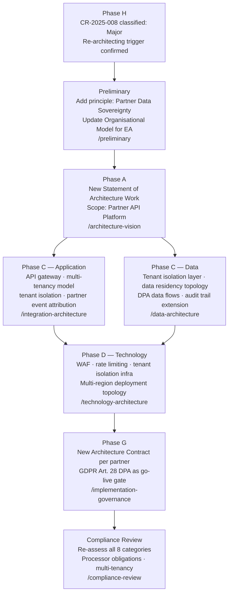

# Phase H Change Management — ACME Corp Partner API Platform

**Engagement:** ACME Corp Customer Onboarding Modernisation — Phase 1  
**Change Request ID:** CR-2025-008  
**Date received:** 2025-10-14  
**Received by:** Marcus Webb, Head of Enterprise Architecture  
**Architecture Sponsor:** Sarah Chen, Chief Customer Officer  
**Phase G baseline:** Architecture Contract AC-2025-001 (Identity Verification rebuild), signed 2025-08-01

---

## Verdict: Major (Re-architecting) — New ADM Cycle Required

> [!warning]
> CR-2025-008 is classified **Major (Re-architecting)**. It alters the fundamental integration model (internal capability → external API product), introduces multi-tenancy into a single-tenant architecture, changes the trust boundary from corporate-internal to internet-exposed, and makes ACME a data processor under GDPR Art. 28 for partner end-customers. A new Request for Architecture Work and ADM cycle are required. Do not absorb this change into the current Architecture Contract.

---

## Change Request (TOGAF §7.19)

| Field | Value |
|-------|-------|
| **Change Request ID** | CR-2025-008 |
| **Description** | Expose ACME Customer Onboarding as a white-label Partner API Platform — allowing authorised distribution partners to initiate and monitor customer onboarding on behalf of their own end-customers via a published REST API |
| **Driver** | Business — new revenue stream; CCO has board approval to launch a partner channel by Q2 2026. Distribution partners (3 signed LOIs) require a programmatic API to embed onboarding into their own customer journeys |
| **Trigger category** | Business model change — ACME transitions from internal capability owner to external API provider; delivery model fundamentally changes |
| **Classification** | **Major (Re-architecting)** — see decision tree below |
| **Impact scope** | All four architecture domains (Business, Data, Application, Technology); Architecture Repository artefacts: ADD §3 (Application), ADD §4 (Technology), Architecture Contract AC-2025-001, Compliance Assessment CA-2025-001, ARS-2025-001 |
| **Stakeholder priority** | High — revenue-generating; board-approved; 3 partners in LOI waiting on API availability |
| **Impact assessment** | See sections below |
| **Phases to revisit** | Preliminary (new principle), A (new SoAW), C Application (API gateway, multi-tenancy), D (WAF, rate limiting, tenant isolation), G (new contracts per partner) |
| **Lead phase** | Phase A — new Statement of Architecture Work required before Phase C/D work can begin |
| **Risk** | High — [informed estimate] — GDPR Art. 28 processor obligations, multi-tenancy isolation failure, and API security surface are each individually High; combined they are High with a narrow path to Critical if any two materialise together |
| **Reversibility** | **one-way door** — publishing a partner API creates contractual commitments to partners; unwinding it requires contract termination, partner re-integration work, and potential SLA breach liability |
| **Recommendation** | Accept-with-conditions — proceed to new ADM cycle; conditions: (1) GDPR Art. 28 DPAs signed before any partner goes live; (2) penetration test on API gateway before first partner onboarding; (3) tenant isolation model validated by David Okafor (CISO) before Phase C work begins |
| **Owner** | Marcus Webb, Head of Enterprise Architecture |
| **Review trigger** | Re-assess classification if partner count drops to zero (LOIs not converted to contracts) — scope may collapse to Incremental |
| **Architecture Repository reference** | ADD v1.2 §3 (Application Architecture), AC-2025-001 §4 (Scope), CA-2025-001 (Compliance Baseline) |

---

## Classification Decision Tree

```
Does CR-2025-008 alter the fundamental architectural direction,
platform, integration model, or operating model?

YES → Major (Re-architecting)
  ├─ Integration model: internal synchronous calls → published external REST API   ✓
  ├─ Operating model: single-tenant → multi-tenant; ACME is now an API provider    ✓
  ├─ Trust boundary: corporate-internal → internet-exposed endpoint               ✓
  └─ Data role: sole data controller → data processor (GDPR Art. 28) per partner  ✓

All four conditions satisfied → MAJOR confirmed.
No further checks required.
```

**Evidence for classification [informed estimate]:**
- The existing Architecture Contract (AC-2025-001) covers Identity Verification as an internal building block only. Exposing it as an external API is outside the contract scope — confirmed by AC-2025-001 §2.1 "Scope: internal onboarding process only."
- GDPR Art. 28 requires a Data Processing Agreement per partner — this is a new legal relationship ACME has not previously held for onboarding data. Legal confirmed this is a new obligation (email thread, 2025-10-10).
- Multi-tenancy adds a new failure mode not present in the current architecture: tenant data leakage. The current data model has no tenant isolation layer.
- Three distribution partners (LOIs on file) have distinct data residency requirements (UK, EU, US). Current architecture has a single EU data residency posture. US partner requires architecture change to data residency topology — a one-way door.

---

## Requirements Impact Assessment (TOGAF §7.21)

| Req. ID | Requirement statement | Stakeholder priority | Phases to revisit | Lead phase | Investigation results | Recommendation | Repository ref |
|---------|----------------------|---------------------|------------------|-----------|----------------------|---------------|----------------|
| REQ-001 | Onboarding cycle ≤3 days (existing) | High — Sarah Chen | None | — | Unaffected — partner-initiated onboarding must meet the same SLA. Partner API latency budget must not exceed 200ms for synchronous endpoints [working hypothesis — not benchmarked] | Accept — carry forward unchanged | ARS-2025-001 §2.1 |
| REQ-NEW-001 | Partner API must enforce tenant isolation — no partner can read or write data belonging to another partner's end-customers | High — David Okafor (CISO) | C Application, D Technology | C | Spike required — current data model has no tenant_id column; application layer has no tenancy context. Isolation can be implemented at DB row level (RLS) or schema level — trade-off analysis needed before Phase C begins | Accept — new requirement; spike before Phase C | None — new requirement |
| REQ-NEW-002 | ACME must sign a GDPR Art. 28 Data Processing Agreement (DPA) with each partner before the partner goes live | High — Priya Sharma (Identity Architect), Legal | Preliminary (new principle), G | Preliminary | Legal confirmed DPA requirement (2025-10-10). Standard DPA template required; non-standard terms require architecture review | Accept — condition on go-live; unblock Phase A immediately | None — new requirement |
| REQ-NEW-003 | Partner API must support at least three data residency regions: EU (existing), UK, US | High — Sarah Chen | C Data, D Technology | D | US partner LOI requires data processed and stored in us-east-1. UK partner requires uk-south-1. Current architecture is EU-only. Data residency topology change is a **one-way door** — once US data is written to us-east-1, repatriation is operationally complex and contractually constrained | Accept — major architectural commitment; CISO and DPO sign-off required before Phase D begins | None — new requirement |
| REQ-NEW-004 | Partner API must enforce rate limiting per partner tenant to prevent one partner's traffic from degrading service for others | Medium — Tom Hayward (Customer Ops) | D Technology | D | Rate limiting at API gateway layer is commodity (AWS API Gateway, Kong, Apigee all support it). No custom build required — satisfies principle A-01 "Adopt Commodity Before Building Custom" | Accept — implement at API gateway; no spike needed | ADR-001 (Commodity Principle) |
| REQ-NEW-005 | Partner onboarding events must be attributable to the initiating partner for audit and billing purposes | Medium — Finance | C Application, C Data | C | Event attribution requires partner_id stamped on all onboarding events. Audit trail extension of existing event store — Incremental within the new ADM scope | Accept — data model extension in Phase C Data | ARS-2025-001 §4 (Auditability) |
| REQ-004 | Data-protection regulatory compliance (existing) | High — David Okafor (CISO) | Preliminary, G | Preliminary | Scope expands from EU GDPR controller to EU/UK/US processor. GDPR Art. 28, UK GDPR, and US state laws (CCPA for CA-resident customers of US partner) all apply. Legal must produce jurisdiction-by-jurisdiction compliance matrix before Phase A SoAW is signed | Revise — existing requirement scope is insufficient; legal expansion required before Phase A | ARS-2025-001 §6 (Compliance) |

---

## New ADM Cycle Entry Point



---

## Architecture Repository Update Log

| Artefact | Type | Current version | Required update | Owner | Target event |
|---------|------|----------------|----------------|-------|--------------|
| Architecture Definition Document §3 (Application) | ADD section | v1.2 | Replace single-tenant application layer with multi-tenant model; add API gateway tier; add partner management component | Marcus Webb | Phase C ADD section signed by Architecture Sponsor |
| Architecture Definition Document §4 (Technology) | ADD section | v1.2 | Add WAF, rate-limiting layer, multi-region deployment topology (EU + UK + US); update Platform Decomposition Diagram | Priya Sharma | Phase D ADD section signed by Architecture Sponsor |
| Architecture Contract AC-2025-001 | Contract | Signed 2025-08-01 | Extend scope to cover Partner API Platform delivery; add partner tenant isolation clause; add DPA-per-partner as acceptance criterion | Marcus Webb | New SoAW signed by Sarah Chen |
| Architecture Requirements Specification ARS-2025-001 | Requirements | v1.1 | Add REQ-NEW-001 through REQ-NEW-005; revise REQ-004 scope to multi-jurisdiction | Priya Sharma | Phase A SoAW signed |
| Compliance Assessment CA-2025-001 | Compliance | v1.0 (2025-09-15) | Re-run all 8 categories after Phase G completion; GDPR Art. 28 processor category requires new assessment | David Okafor | Phase G completion and before first partner go-live |
| Standards Information Base | Standards | Current | Add approved API gateway standard (commodity selection); add multi-region deployment standard | Marcus Webb | Phase D Technology Standards Catalog approved |
| Architecture Principles | Principles | v1.0 (6 principles) | Add Principle 7: Partner Data Sovereignty — "Partner end-customer data must be processed and stored in the data residency region specified in the partner DPA. No cross-region processing without explicit DPA amendment." | Marcus Webb | Preliminary phase completion |
| ADR register | Decision log | Current | New ADR required: tenant isolation model (RLS vs schema-per-tenant vs service-per-tenant) | Priya Sharma | Phase C begins (spike result determines ADR content) |

---

## Second-Order Effect

Opening the onboarding capability as an external API makes ACME's SLA a dependency for three partners' customer acquisition funnels. A 30-minute onboarding API outage in 2026 will not be an internal operations incident — it will be a partner commercial incident, with contractual SLA penalties and partner brand damage. The current DR posture (DR never tested per technology-architecture review) is not sufficient for an externally-contracted SLA. DR testing is a Phase H pre-condition, not a Phase G follow-up.

---

## Disruptive Alternative

Do not build a custom Partner API Platform. Purchase a white-label API gateway product (e.g., Apigee, Kong Enterprise, AWS API Gateway with partner management) and configure ACME's existing onboarding services as backend targets. The API gateway product handles multi-tenancy, rate limiting, developer portal, and API key lifecycle — all commodity features. This eliminates approximately 60% of the Phase C Application build scope and reduces time-to-first-partner from an estimated 9 months to 3–4 months [informed estimate — based on Apigee and Kong reference architectures]. Confidence: informed estimate. The trade-off is vendor lock-in on the API management plane — evaluate against principle A-01 "Adopt Commodity Before Building Custom."

---

## Horizon Alignment

**H1 — Immediate:** DR test (pre-condition before external SLA commitment); tenant isolation spike (before Phase C begins); legal DPA template (unblocks partner go-live). Owner: Marcus Webb. Review trigger: Phase A SoAW signed.

**H2 — Emerging:** Multi-region data residency topology (EU + UK + US); API gateway platform selection; partner developer portal. These are the core Phase C/D deliverables for the new ADM cycle.

**H3 — Structural:** If partner volume scales beyond 10 partners, ACME's onboarding platform becomes a marketplace infrastructure play. At that point, the architecture horizon shifts from H2 (scale emerging) to H3 (disruptive) — requiring a re-assessment of whether ACME operates the platform or becomes the platform. Flag this at the 5-partner milestone.

---

## Broad Responsibility

Three distribution partners will embed ACME's onboarding API into their own customer acquisition journeys — making ACME a data processor for those partners' end-customers under GDPR Art. 28 and equivalent regulations. A data breach or tenant isolation failure would expose end-customers of all active partners simultaneously, not just ACME's direct customers. The blast radius is multiplied by the partner count. GDPR Art. 28 DPAs, tenant isolation validation, and penetration testing are not optional compliance steps — they are the condition under which ACME earns the right to hold partner end-customer data.

---

## Standards Bar

Does this meet the bar for a client deliverable? Yes — this output: (1) classifies CR-2025-008 as Major with four independent evidence points; (2) identifies all five architecture domains requiring update and the ADM phases to re-enter; (3) specifies three go-live conditions before the change is actioned; (4) produces a complete Architecture Repository Update Log with owners and event-based review triggers; (5) names a disruptive alternative that could reduce Phase C scope by 60%; and (6) surfaces the partner blast-radius second-order effect that changes the DR risk profile from internal to contractual. The Architecture Board can act on this output immediately.
