# Data Pipeline Review — ACME Corp Document Processing Pipeline

**Pipeline reviewed:** Customer Document Processing Pipeline — identity document ingestion, classification, extraction, and KYC handoff
**Engagement:** ACME Corp Customer Onboarding Modernisation — Phase 1
**Reviewer:** Priya Sharma, Identity Architect
**Review date:** 2025-10-28
**Architecture Sponsor:** Sarah Chen, Chief Customer Officer

---

> [!abstract]
> **Needs Work.** The near-real-time event-driven pattern (S3 → SQS → Lambda) is the correct choice for the onboarding cycle-time target (11 days → ≤3 days); the pipeline stage design is sound. However, five operational defects make this pipeline production-unsafe: no idempotency guard (S3 duplicate events create duplicate identity extraction rows), no end-to-end SLO metric, API key stored in Lambda environment variable (not Secrets Manager), no data lineage capturing which Document AI API version processed which document, and GDPR data residency of the Document AI SaaS is unconfirmed contractually. None require a pipeline redesign — all are remediable within the current Phase G governance window.

---

## Pipeline Architecture Verdict: Needs Work

---

## Pipeline Topology

```mermaid
flowchart LR
    subgraph Sources["Source Systems"]
        web["Web Portal<br>document upload"]
        mob["Mobile App<br>document upload"]
    end
    subgraph Ingestion["Ingestion<br>S3 + SQS"]
        s3["S3 documents-incoming/<br>object store · near-real-time"]
        sqs_in["SQS pipeline-queue<br>event trigger · at-least-once"]
    end
    subgraph Transform["Classification & Extraction<br>Lambda"]
        classify["Classify Lambda<br>Rekognition custom classifier<br>SLA target: < 10s"]
        extract["Extract Lambda<br>Document AI SaaS API<br>SLA target: < 30s"]
        validate["Validate Lambda<br>regex + confidence ≥ 85%<br>SLA target: < 5s"]
    end
    subgraph Serving["Serving / Handoff"]
        pgdb["Customer Identity DB<br>PostgreSQL identity_extractions<br>[PI][C]"]
        sqs_kyc["SQS kyc-ready<br>KYC Service consumer"]
        dlq["SQS documents-dlq<br>⚠ no alerting"]
    end
    subgraph Consumers["Consumers"]
        kyc["KYC Service<br>identity verification"]
        camunda["Camunda BPM<br>onboarding orchestrator"]
    end

    web -->|"HTTPS multipart"| s3
    mob -->|"HTTPS multipart"| s3
    s3 -->|"S3 event notification<br>at-least-once ⚠"| sqs_in
    sqs_in --> classify
    classify -->|"document type"| extract
    extract -->|"structured fields<br>+ confidence score"| validate
    validate -->|"validated extraction"| pgdb
    validate -->|"status event"| sqs_kyc
    classify -.->|"failure"| dlq
    extract -.->|"failure"| dlq
    validate -.->|"failure"| dlq
    sqs_kyc --> kyc
    kyc --> camunda
```

*⚠ marks known reliability and compliance gaps. Async failure edges (dashed) route to DLQ. All S3 and SQS resources confirmed EU-resident (eu-west-1). Document AI SaaS API data residency — contractually unconfirmed.*

---

## Pipeline Quality Attribute Assessment

| Attribute | Finding | Confidence | Severity | Owner (role) | Review trigger |
|-----------|---------|------------|----------|--------------|----------------|
| Idempotency (upsert strategy / deduplication / key design) | S3 event notifications are at-least-once — a single document upload can generate two SQS messages. No deduplication check exists before writing to `identity_extractions`. A duplicate S3 event causes two rows in `identity_extractions` for the same document, corrupting the KYC service's view of identity verification state. The PostgreSQL table has no unique constraint on `(case_id, document_ref)` — duplicates accumulate silently. | [proven] | Critical | Identity Architect (Priya Sharma) | Before pipeline integration test sign-off |
| Fault Tolerance (error handling / retry with jitter / DLQ / recovery runbook last tested) | SQS default retry (3 attempts, no jitter) before DLQ routing. DLQ `documents-dlq` exists but has no CloudWatch alarm on `ApproximateNumberOfMessagesVisible` — failed documents are silently abandoned. No reprocessing capability documented. No runbook exists for any failure mode. Last runbook test: never. | [proven] | High | Identity Architect (Priya Sharma) | When the first DLQ alert is configured and a reprocessing runbook is authored and drill-tested |
| Freshness (pattern vs SLA match / measured p99 latency / source delay handling) | Pipeline pattern (S3 → SQS → Lambda chain) is appropriate for near-real-time processing. Target: document processed within 2 minutes of upload. Actual end-to-end p99: unknown — no CloudWatch metric captures pipeline duration from S3 `PutObject` event to `identity_extractions` write. Without measurement, the 2-minute target cannot be verified or governed. | [informed estimate — pattern fitness; working hypothesis — latency figure] | High | Identity Architect (Priya Sharma) | When end-to-end pipeline latency metric is instrumented and first 7-day p99 baseline is available |
| Lineage (source-to-destination traceability / automatic vs manual / field-level vs table-level) | No lineage is captured. `identity_extractions` table stores extracted fields but does not record: S3 object key, S3 object version, Document AI API version, extraction request ID, or Rekognition classifier version. If the Document AI SaaS releases a breaking model update, ACME cannot determine which historical extractions used the old model — a material risk for KYC audit traceability and AI Act obligations. | [proven] | High | Identity Architect (Priya Sharma) | Before the Document AI SaaS API version is incremented in production |
| Data Quality (embedded tests / schema registry / null rates / referential integrity monitoring) | Confidence score threshold (85%) is hardcoded in Lambda source code — not externally configurable. Threshold change requires a Lambda deployment, introducing deployment risk for a tuning operation. No monitoring of null rates, field completeness, or distribution drift in extracted fields. Regex validation exists but is not logged — validation failure rates are invisible. | [proven] | Medium | Identity Architect (Priya Sharma) | When the first extraction quality report is produced from CloudWatch Logs Insights |
| Observability (run monitoring / SLA alerting / volume anomaly / incident response p50 time) | No end-to-end pipeline duration metric. No alert on DLQ depth. No alert on Lambda error rate. No alert on extraction volume anomaly (e.g., zero documents processed in 30 minutes during onboarding hours). Incident response time for a pipeline failure: undefined — no on-call runbook. Classification: dark pipeline — fails silently. | [proven] | Critical | Identity Architect (Priya Sharma) | When CloudWatch dashboard covering the four key metrics (duration p99, DLQ depth, Lambda error rate, hourly volume) is deployed and thresholds are set |

---

## Pattern Assessment

**Chosen pattern:** Near-real-time event-triggered (S3 event → SQS → Lambda chain)

**Freshness SLA:** Document processed and KYC handoff published within 2 minutes of customer upload. This SLA is derived from the engagement target of reducing onboarding cycle time from 11 days to ≤3 days — document processing latency must not be the bottleneck.

**Assessment:** The pattern is the correct choice for this SLA. Batch ETL would be inappropriate — even hourly batch would add up to 60 minutes of pipeline latency to each onboarding case, making the ≤3-day cycle target difficult to achieve at peak volume. A full streaming approach (Kinesis / Kafka) would provide sub-second latency but at significantly higher operational complexity and cost for a pipeline processing ≤500 documents per day in H2. The S3 → SQS → Lambda chain is fit-for-purpose at current volume and SLA. The pattern does not foreclose H3 evolution: if onboarding volume exceeds 5,000/day or SLA tightens to <30 seconds, the Lambda stages can be refactored as Kinesis consumers without changing the upstream S3 ingestion boundary. [informed estimate]

**Reversibility:** two-way door — the Lambda functions are stateless; the only stateful boundary is the `identity_extractions` PostgreSQL schema. Schema migration to add lineage columns (S3 key, API version, request ID) is a non-breaking additive change. [informed estimate]

---

## Data Contract Boundary Register

| Contract ID | Producer | Consumer(s) | Schema format | Schema registry | Freshness SLA | Availability SLA | Breaking change policy | Contract owner (role) | Review trigger |
|-------------|---------|-------------|--------------|----------------|--------------|-----------------|----------------------|----------------------|----------------|
| DC-P01 | Document AI SaaS API (external) | Extract Lambda | JSON (vendor-defined) | None — gap | Extraction response < 30s | 99.5% (vendor SLA — not confirmed in contract) | Vendor-defined — not communicated to ACME | Identity Architect (Priya Sharma) | When Document AI SaaS API version is incremented or vendor issues a deprecation notice |
| DC-P02 | Validate Lambda | Customer Identity DB (`identity_extractions`) | Internal (no schema registry) | None — gap | Write < 5s of validation completion | 99.9% (PostgreSQL target) | No formal policy — gap | Identity Architect (Priya Sharma) | Before a new field is added to or removed from `identity_extractions` |
| DC-P03 | Validate Lambda | SQS `kyc-ready` (KYC Service consumer) | JSON (undocumented) | None — gap | Event published < 5s of DB write | 99.5% | None — gap | Identity Architect (Priya Sharma) | Before KYC Service schema or contract changes |

> [!important]
> DC-P01 is the highest-risk boundary: the Document AI SaaS API sends raw passport images from ACME customers across a network boundary. The payload includes personal data classified as Confidential under ACME's data classification scheme. No schema contract governs this boundary — if the vendor changes the response schema (e.g., renames `confidence_score` to `score`), the Validate Lambda will silently misread the confidence value, potentially accepting low-quality extractions as valid and forwarding corrupt identity data to the KYC service. DC-P01 must be formalised and schema-validated in the Lambda before the pipeline goes live.

---

## Test Coverage Inventory

| Model / transformation | Unit tests | Integration tests | Contract tests | Coverage verdict | Missing tests |
|-----------------------|-----------|------------------|----------------|-----------------|---------------|
| Classify Lambda (Rekognition classifier call) | None | None | None | None | Unit: mock Rekognition response, assert document type label; integration: test with real Rekognition endpoint using sample fixtures; contract: assert classifier model version in response header |
| Extract Lambda (Document AI API call) | None | None | None | None | Unit: mock Document AI response, assert field extraction to schema; integration: test with Document AI sandbox; contract: assert response schema version matches expected contract version |
| Validate Lambda (regex + confidence threshold) | Partial — regex patterns have unit tests | None | None | Partial | Integration: test full validate→write→publish chain with fixture payload; contract: assert `identity_extractions` schema version in DB write; add test asserting confidence threshold is read from config (not hardcoded) |
| `identity_extractions` DB write | None | None | None | None | Unit: unique constraint test on `(case_id, document_ref)` — currently absent; null checks on required fields (name, DOB, document_number) |
| SQS `kyc-ready` event publish | None | None | None | None | Unit: assert event schema matches DC-P03 definition; integration: assert KYC service can deserialise event without error |

> [!warning]
> The Extract Lambda and `identity_extractions` DB write have zero test coverage. The Extract Lambda is the most critical transformation — it produces the identity fields that downstream KYC verification acts on. A schema change in the Document AI SaaS response will silently produce null or malformed extraction results with no test to catch it before production. Add unit tests against a mocked Document AI response as the minimum acceptable baseline before go-live.

---

## SLA Breach Runbook Register

| Failure mode | Trigger criteria | Diagnostic commands | Rollback / recovery steps | Escalation path | Owner (role) | Last tested |
|-------------|-----------------|--------------------|--------------------------|-----------------|--------------|-----------| 
| DLQ depth spike — documents failing classification | `documents-dlq ApproximateNumberOfMessagesVisible > 0` for 5 minutes | `aws sqs receive-message --queue-url <dlq-url> --max-number-of-messages 10` — inspect failure reason; check CloudWatch Logs for Classify Lambda errors at time of spike | Re-drive DLQ messages after root cause is fixed: `aws sqs start-message-move-task --source-arn <dlq-arn> --destination-arn <source-queue-arn>`. Do not re-drive without confirming root cause — re-drive under ongoing failure will exhaust retry budget. | Identity Architect (Priya Sharma) → Head of EA (Marcus Webb) if unresolved in 30 minutes | Identity Architect (Priya Sharma) | Never — gap |
| Pipeline latency breach — document not processed within 2 minutes | CloudWatch metric `DocumentPipelineE2EDuration p99 > 120s` — metric does not yet exist (gap) | Check Lambda concurrency limit in CloudWatch; check SQS `ApproximateAgeOfOldestMessage` on pipeline-queue; check Document AI SaaS API response time via Lambda logs | If Document AI SaaS is the bottleneck: throttle new uploads at the Channel Layer (return HTTP 429 with Retry-After header) to protect queue depth. If Lambda concurrency is the bottleneck: increase reserved concurrency. | Identity Architect (Priya Sharma) → CISO (David Okafor) if GDPR data residency is implicated | Identity Architect (Priya Sharma) | Never — metric does not exist (gap) |
| Duplicate rows in `identity_extractions` | Manual detection via `SELECT case_id, document_ref, COUNT(*) FROM identity_extractions GROUP BY 1, 2 HAVING COUNT(*) > 1` — no automated alert exists (gap) | Query above identifies affected cases. Check S3 event delivery logs for duplicate notification to SQS pipeline-queue. Cross-reference with onboarding case ID. | Delete duplicate rows manually after confirming the row with the later `created_at` timestamp is the duplicate. Notify KYC Service team that affected case IDs should be re-evaluated. | Identity Architect (Priya Sharma) → Head of EA (Marcus Webb) | Identity Architect (Priya Sharma) | Never — gap |
| Document AI SaaS API unavailable | Extract Lambda DLQ depth > 0 + Lambda error rate > 5% within 5-minute window | Check Document AI SaaS vendor status page; check Lambda CloudWatch Logs for 5xx HTTP response codes from vendor API | New document uploads stall at Extract stage. Camunda BPM onboarding cases enter a wait state — acceptable for up to 30 minutes before customer communication is triggered. If vendor outage exceeds 30 minutes, activate the manual review fallback (Customer Operations team performs identity check via offline process). | Identity Architect (Priya Sharma) → Customer Operations Director (Tom Hayward) for manual fallback activation | Identity Architect (Priya Sharma) | Never — gap |

> [!warning]
> All four runbooks have Last tested = "never". The pipeline latency runbook cannot be tested because the end-to-end duration metric does not exist — the metric is a prerequisite for the runbook, not a deliverable after go-live. Instrument the metric before Phase G go-live gate; test all four runbooks within 30 days of first production traffic.

---

## Lineage Coverage Map

| Source table / field | Transformation steps | Target table / field | Lineage captured by | Field-level? | Owner (role) |
|---------------------|---------------------|---------------------|--------------------|-----------|-----------| 
| S3 `documents-incoming/<case_id>/<doc_ref>.pdf` | Classify Lambda (Rekognition) | None — classification result is transient in Lambda memory only, not persisted | None | No | Identity Architect (Priya Sharma) |
| S3 object → Document AI API response `name` | Extract Lambda → Validate Lambda | `identity_extractions.full_name` | None — no lineage record of S3 object key, Document AI API version, or extraction request ID | No | Identity Architect (Priya Sharma) |
| S3 object → Document AI API response `date_of_birth` | Extract Lambda → Validate Lambda | `identity_extractions.date_of_birth` | None | No | Identity Architect (Priya Sharma) |
| S3 object → Document AI API response `document_number` | Extract Lambda → Validate Lambda | `identity_extractions.document_number` | None | No | Identity Architect (Priya Sharma) |
| S3 object → Document AI API response `expiry_date` | Extract Lambda → Validate Lambda | `identity_extractions.expiry_date` | None | No | Identity Architect (Priya Sharma) |
| S3 object → Document AI API response `address` | Extract Lambda → Validate Lambda | `identity_extractions.address` | None | No | Identity Architect (Priya Sharma) |
| `identity_extractions` rows | No transformation — direct read | SQS `kyc-ready` event payload | None | No | Identity Architect (Priya Sharma) |

---

## Lineage & Quality Blind Spot

The `identity_extractions` table has no record of which Document AI API version produced each row. Document AI SaaS providers routinely update their extraction models — accuracy and field formats can change between versions. If the vendor silently upgrades the API model between ACME's Phase G go-live and first audit review, ACME cannot answer the question "which model version produced the identity extraction for customer X?" for a regulator or an internal KYC dispute. This is not a hypothetical risk: the AI Act (Art. 13, transparency; Art. 12, record-keeping for limited-risk AI systems) requires that automated decisions affecting individuals are explainable. If the Document AI authenticity score is used as a determinative input to KYC pass/fail, ACME must be able to reconstruct which model version produced the score for any given document. Without lineage, this obligation cannot be met. [informed estimate]

---

## Commoditisation Check

| Component | Current approach | Commodity alternative | Exit trigger | Reversibility |
|-----------|-----------------|----------------------|--------------|---------------|
| Pipeline orchestration | SQS retry + Lambda chain — no explicit orchestration; failure routing is implicit (Lambda errors → DLQ) | AWS Step Functions (native state machine with explicit retry, catch, and lineage per execution) or Airflow on MWAA for multi-pipeline orchestration | When DLQ reprocessing or failure investigation requires >2 engineer-hours per incident, or when a second Lambda pipeline is added to the document processing flow | two-way door — Step Functions wraps existing Lambda functions without code changes |
| Confidence threshold configuration | Hardcoded constant in Lambda source (`CONFIDENCE_THRESHOLD = 0.85`) | AWS Systems Manager Parameter Store or AWS AppConfig — externalise threshold as a managed parameter with change history and rollback | Before the threshold needs to be adjusted for the first time in production (adjust without a deployment) | two-way door — read from SSM at Lambda cold start; no schema change required |
| Data quality monitoring | None — no monitoring of null rates, distribution drift, or extraction field completeness | AWS Glue Data Quality (native, no-code rule definition) or Great Expectations on the `identity_extractions` table | When the first data quality incident is detected that would have been caught by automated monitoring | two-way door — additive; does not change the pipeline |
| Secrets management | Document AI API key in Lambda environment variable (plaintext) | AWS Secrets Manager with automatic rotation | Immediate — this is a Critical security defect, not a roadmap item | two-way door — Lambda SDK call to Secrets Manager replaces `os.environ` read |

---

## Disruptive Alternative

Replace the Lambda chain with **AWS Step Functions Express Workflows** — one state machine per document, with each pipeline stage (classify, extract, validate, store, publish) as an explicit state. Step Functions provides: built-in retry with jitter per state, execution history (lineage at execution level), parallel state support, and CloudWatch integration for per-state duration metrics. This eliminates four of the five Critical/High findings in this review: the observability gap (execution history is built-in), the lineage gap (execution ARN is traceable), the retry configuration gap (per-state retry policy replaces SQS default), and the DLQ alerting gap (Step Functions surfaces task failures explicitly). Cost at ≤500 documents/day: Step Functions Express Workflows at $0.00001 per state transition ≈ $0.00005 per document (5 states) — negligible. Adoption risk: low — existing Lambda functions are reused as state tasks with no code changes. This is a working hypothesis pending a 2-day PoC to validate Step Functions execution latency meets the 2-minute SLA. [working hypothesis — validate with PoC before committing]

---

## Second-Order Effect

The Validate Lambda discards documents where Document AI confidence score is below 85% and routes them to `documents-dlq`. In the current design, there is no automated path from the DLQ back to a human reviewer or back to the Camunda BPM onboarding case — the document simply stops. The onboarding case in Camunda is left waiting for a `kyc-ready` event that never arrives. This means every low-confidence document creates a stalled onboarding case that a Customer Operations team member must detect and resolve manually. At the current rejection rate of an assumed 5–10% of uploads (quality of customer-submitted documents varies significantly — utility bills, older passports, poor lighting), this translates to 25–50 manual interventions per 500 daily onboardings. This is an unplanned operational burden that will not show up in the €12M capex budget — it lands in Customer Operations headcount. The remediation is a compensating event: when a document fails validation, publish a `DocumentValidationFailed` event to Camunda so the onboarding case can trigger a re-upload request to the customer automatically. [informed estimate]

---

## Horizon Alignment

**H1 — Immediate:** Five Critical/High defects require remediation before Phase G go-live: (1) add idempotency guard on `identity_extractions` write (`ON CONFLICT DO NOTHING` with unique constraint on `(case_id, document_ref)`); (2) move Document AI API key from Lambda environment variable to Secrets Manager; (3) add DLQ depth alert on `documents-dlq`; (4) instrument end-to-end pipeline duration metric (CloudWatch custom metric from S3 PutObject timestamp to DB write timestamp); (5) add `s3_object_key`, `s3_object_version`, `docai_api_version`, and `extraction_request_id` columns to `identity_extractions` to establish minimum lineage. These are not technical debt — they are go-live gates.

**H2 — Emerging:** Formalise DC-P01 (Document AI SaaS contract) and DC-P03 (KYC Service consumer contract) with schema registry. Add unit and integration test coverage for Extract Lambda and `identity_extractions` write. Evaluate Step Functions adoption to replace the implicit SQS retry chain. Externalise confidence threshold to SSM Parameter Store. Implement `DocumentValidationFailed` event to close the stalled-case gap in Camunda. Confirm Document AI SaaS GDPR data residency contractually.

**H3 — Structural:** If onboarding volume exceeds 5,000 documents/day, evaluate Kinesis Data Streams as the ingestion backbone (replacing SQS) to support parallel shard processing and sub-second trigger latency. If Document AI SaaS is replaced with an ACME-trained model (AWS Textract + fine-tuning), the classification and extraction stages merge and field-level lineage becomes tractable using AWS Textract's built-in confidence and block-level output. If the AI Act regulatory scope is confirmed (Document AI score is determinative for KYC pass/fail), field-level lineage and model version tracking become mandatory rather than best-practice.

---

## TOGAF Context *(TOGAF mode)*

**ADM phase:** Phase G — Implementation Governance (pipeline is in delivery; this review is a governance check against the Phase C Information Systems Architecture)

**Impacted building blocks:**
- Document Management ABB — in delivery; this review covers the ingestion and extraction pipeline implementation
- Customer Identity ABB — consumer of pipeline output (`identity_extractions`); idempotency defect directly impacts identity data integrity
- KYC Integration ABB — blocked by the missing `kyc-ready` event when validation fails; timeout behaviour inherited from integration architecture gaps (INT-004 BPM→Document AI)
- Onboarding Process State ABB — Camunda onboarding cases stall when `DocumentValidationFailed` event is not published; creates invisible stuck cases

**Gap traceability:** GAP-DA05 (example-data-architecture.md) — "Document AI → Document Store: no schema contract" — is directly instantiated by the absence of DC-P01 in this pipeline review. The pipeline review closes the loop on that data architecture gap with specific remediation steps.

---

## Fix List

| # | Severity | Finding | Fix | Owner (role) | Reversibility | Review trigger |
|---|----------|---------|-----|--------------|---------------|----------------|
| 1 | Critical | No idempotency guard — duplicate S3 events create duplicate `identity_extractions` rows | Add `UNIQUE (case_id, document_ref)` constraint to `identity_extractions`; change Lambda write to `INSERT ... ON CONFLICT (case_id, document_ref) DO NOTHING` | Identity Architect (Priya Sharma) | two-way door | Before pipeline integration test sign-off |
| 2 | Critical | Document AI API key in Lambda environment variable (plaintext) | Move API key to AWS Secrets Manager; update Lambda to call `secretsmanager:GetSecretValue` at cold start; enable automatic rotation | Identity Architect (Priya Sharma) | two-way door | Before Phase G go-live gate |
| 3 | Critical | No observability — DLQ depth not alerted, no end-to-end duration metric | Create CloudWatch alarm on `documents-dlq ApproximateNumberOfMessagesVisible > 0`; instrument custom metric `DocumentPipelineE2EDuration` from S3 event timestamp to DB write; create CloudWatch dashboard | Identity Architect (Priya Sharma) | two-way door | Before Phase G go-live gate |
| 4 | High | No lineage — `identity_extractions` does not record source S3 key, object version, Document AI API version, or extraction request ID | Add columns `s3_object_key`, `s3_object_version`, `docai_api_version`, `docai_request_id` to `identity_extractions`; populate in Extract Lambda from API response headers | Identity Architect (Priya Sharma) | two-way door | Before Document AI SaaS API version is incremented in production |
| 5 | High | GDPR data residency of Document AI SaaS unconfirmed contractually | Obtain and review Document AI SaaS vendor DPA; confirm EU data residency; if unconfirmed, suspend integration until contractual confirmation received | CISO (David Okafor) | one-way door — go-live must not proceed without confirmation | Before Phase G go-live gate; CISO confirms in writing |
| 6 | High | No SLA defined or measured for end-to-end pipeline duration | Define SLO: p99 ≤ 120s from S3 PutObject to `kyc-ready` event published; instrument metric (fix 3 above); set CloudWatch alarm at 90s warning / 120s critical | Identity Architect (Priya Sharma) | two-way door | When first 7-day p99 baseline is available after Phase G go-live |
| 7 | Medium | Confidence threshold hardcoded in Lambda source | Externalise threshold to AWS Systems Manager Parameter Store; update Lambda to read at cold start; document change procedure | Identity Architect (Priya Sharma) | two-way door | Before the first production threshold adjustment is required |
| 8 | Medium | No automated path from document validation failure back to Camunda BPM | Publish `DocumentValidationFailed` event (SQS or EventBridge) when Validate Lambda rejects a document; Camunda BPM process definition to consume event and trigger customer re-upload task | Identity Architect (Priya Sharma) | two-way door | Before go-live — stalled cases are a customer experience failure from day 1 |
| 9 | Medium | No runbooks for any failure mode | Author runbooks for: DLQ depth spike, pipeline latency breach, duplicate rows, Document AI SaaS unavailability; include trigger, diagnostic commands, rollback, escalation; drill-test within 30 days of first production traffic | Identity Architect (Priya Sharma) | two-way door | When runbooks are authored and first drill is completed |
| 10 | Medium | Extract Lambda and `identity_extractions` write have zero test coverage | Add unit tests (mocked Document AI response, assert field extraction schema); integration test (end-to-end with fixture document, assert DB row + `kyc-ready` event); unique constraint test | Identity Architect (Priya Sharma) | two-way door | Before pipeline integration test sign-off |

---

## Broad Responsibility

The Document AI SaaS API receives raw images of government-issued identity documents (passports, driving licences) from ACME customers — the most sensitive personal data category in this architecture. These documents transit the ACME network boundary to a third-party SaaS provider whose data residency is contractually unconfirmed (fix 5 above). If the vendor processes or caches document images outside the EU without a Standard Contractual Clause mechanism, every document uploaded since integration go-live constitutes a GDPR Chapter V transfer violation — requiring notification to the supervisory authority under Art. 33. Additionally, if the Document AI confidence score is used as a determinative (not advisory) input to KYC pass/fail decisions, this pipeline is in scope for the EU AI Act as a Limited-risk AI system (Art. 50 — transparency obligation to inform individuals that an automated system has assessed their document). The Architecture Contract acceptance criteria must address both: (a) Data Processing Agreement confirming EU residency for the Document AI SaaS, and (b) a recorded decision on whether the confidence score is determinative or advisory, with corresponding AI Act transparency measures if determinative.
