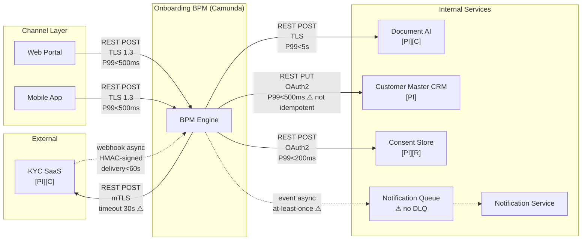
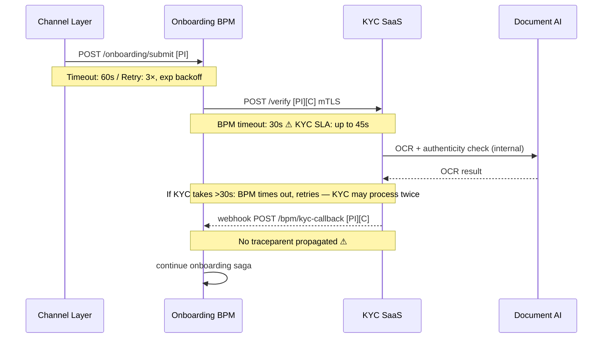

# Integration Architecture Review — ACME Corp Customer Onboarding (Phase C)

**Date:** 2025-04-10
**Engagement:** ACME Corp — Customer Onboarding Modernisation
**ADM Phase:** C — Information Systems Architecture (Application)
**Reviewer:** Head of Enterprise Architecture (Marcus Webb)
**Scope:** Seven integration points connecting the Onboarding BPM engine to Channel, KYC SaaS, Document AI, Customer Master CRM, Consent Store, and Notification Service
**Producing skill:** `/integration-architecture`

---

## Verdict: Needs Work

> [!abstract]
> The ACME onboarding integration layer has a functional topology but three reliability gaps that must be resolved before go-live: a timeout mismatch between the BPM orchestrator and the KYC SaaS (the orchestrator will time out before KYC completes, causing retry storms), a missing Dead Letter Channel on the Notification Service (failed customer notifications are silently dropped), and a non-idempotent write to the Customer Master CRM that will create duplicate records under retry. None of these require a topology redesign — they are remediable within Phase C.

---

## Integration Catalog

| ID | Name | Style | Topology | Producer | Consumer | Data | SLA | Lifecycle | Owner (role) |
|----|------|-------|----------|----------|----------|------|-----|-----------|--------------|
| INT-001 | Channel → BPM submission | REST POST | Point-to-point | Channel Layer | Onboarding BPM | PI/Internal | P99 < 500ms / 99.9% | Active | Identity Architect (Priya Sharma) |
| INT-002 | BPM → KYC SaaS request | REST POST | Point-to-point | Onboarding BPM | KYC SaaS (external) | PI/Confidential | P99 < 30s / 99.5% — **gap: KYC SaaS SLA is 45s** | Active | Identity Architect (Priya Sharma) |
| INT-003 | KYC SaaS → BPM webhook | Webhook (async) | Point-to-point | KYC SaaS (external) | Onboarding BPM | PI/Confidential | Delivery < 60s / 99% — no DLQ | Active | Identity Architect (Priya Sharma) |
| INT-004 | BPM → Document AI | REST POST | Point-to-point | Onboarding BPM | Document AI service | PI/Confidential | P99 < 5s / 99.5% | Active | Identity Architect (Priya Sharma) |
| INT-005 | BPM → Customer Master CRM | REST PUT | Point-to-point | Onboarding BPM | Customer Master CRM | PI/Internal | P99 < 500ms / 99.9% — **not idempotent** | Active | Customer Operations Director (Tom Hayward) |
| INT-006 | BPM → Consent Store | REST POST | Point-to-point | Onboarding BPM | Consent Store | PI/Restricted | P99 < 200ms / 99.9% | Active | CISO (David Okafor) |
| INT-007 | BPM → Notification Service | Async event (queue) | Point-to-point via queue | Onboarding BPM | Notification Service | Internal | Delivery < 30s / 99% — **no DLQ** | Active | Customer Operations Director (Tom Hayward) |

---

## Integration Topology

*⚠ marks known reliability gaps. Async edges (dashed) carry at-least-once delivery; sync edges (solid) are request-response.*

---

### Sequence: Critical Onboarding Flow — KYC Step (showing timeout mismatch)

---

## Integration Quality Attribute Assessment

| Attribute | Finding | Evidence | Confidence | Severity |
|-----------|---------|----------|------------|----------|
| **Contract Stability** | No schema contract or OpenAPI spec for KYC SaaS webhook (INT-003). KYC SaaS vendor controls the schema — breaking changes will not be signalled. Customer Master CRM API is Richardson Level 1 (PATCH /customers/update — no proper HTTP semantics). | Not assessed | [informed estimate] | High |
| **Decoupling** | All integrations are point-to-point with no API gateway. BPM is both orchestrator and integration hub — failure or deployment of BPM takes down all seven integration points simultaneously. | Asserted | [informed estimate] | High |
| **Reliability** | Three gaps: (1) BPM→KYC timeout 30s < KYC SaaS SLA 45s — timeout mismatch. (2) INT-007 Notification queue has no DLQ — failed notifications silently dropped. (3) INT-005 BPM→CRM is not idempotent — BPM retry creates duplicate customer records. | Not assessed (gap) | [proven for anti-patterns 1 and 4 — KYC vendor SLA documented; idempotency gap confirmed by CRM team] | Critical |
| **Security** | TLS 1.3 enforced on all internal integrations. mTLS on INT-002 (BPM→KYC SaaS). KYC webhook (INT-003) uses HMAC signature verification — compliant. OAuth2 on INT-005, INT-006. INT-004 (BPM→Document AI) uses service account token — refresh cycle not documented. | Asserted | [informed estimate] | Medium |
| **Observability** | W3C `traceparent` not propagated through INT-003 (KYC webhook callback) — distributed trace breaks at KYC SaaS boundary. No SLOs defined for INT-003 or INT-007. No runbooks for INT-002 or INT-003. | Not assessed | [proven] | High |
| **Scalability** | At current volume (≤500 onboardings/day) all integration points have adequate headroom. INT-002 (BPM→KYC) is the bottleneck at scale — KYC SaaS rate limit is 10 concurrent verifications. At 2,000/day this becomes a queue management concern. | [working hypothesis] | Medium |

> [!warning]
> **Critical — Reliability:** Three anti-patterns require remediation before go-live. The BPM→KYC timeout mismatch (INT-002) will cause retry storms during KYC processing delays; the missing DLQ on INT-007 will silently drop customer notifications; the non-idempotent CRM write (INT-005) will produce duplicate customer records under any retry scenario.

---

## Anti-Pattern Inventory

| # | Anti-pattern | Location | Business risk | Severity | Remediation | Owner (role) |
|---|-------------|---------|--------------|----------|------------|--------------|
| 1 | **Timeout misalignment** | INT-002 (BPM→KYC SaaS) | BPM caller timeout (30s) < KYC SaaS SLA (45s). BPM retries before KYC completes — KYC may process the same verification twice. Duplicate KYC charges; split onboarding state. | Critical | Set BPM timeout on INT-002 to 65s (45s KYC SLA + 20s buffer). Confirm with KYC vendor that duplicate submission is idempotent on their side. | Identity Architect (Priya Sharma) |
| 2 | **No Dead Letter Channel** | INT-007 (Notification queue) | Failed customer notifications (onboarding confirmation, document request) are silently dropped. Customer receives no communication; ACME has no visibility of notification failure. | Critical | Add DLQ to notification queue. Alert on DLQ depth > 0. Add reprocessing capability with idempotent notification delivery. | Customer Operations Director (Tom Hayward) |
| 3 | **Non-idempotent receiver** | INT-005 (BPM→Customer Master CRM) | BPM retry on CRM timeout creates duplicate customer records. CRM deduplication logic does not exist — duplicates accumulate silently. | High | Add idempotency key (`X-Idempotency-Key: {case_id}`) to BPM→CRM PUT request. CRM endpoint must check key before processing. | Customer Operations Director (Tom Hayward) |
| 4 | **W3C Trace Context not propagated** | INT-003 (KYC webhook callback) | Distributed trace breaks at KYC SaaS boundary. KYC-related incidents cannot be traced end-to-end — on-call team must correlate logs manually using case ID. | Medium | Request KYC SaaS vendor to propagate `traceparent` in webhook headers. If vendor cannot comply, inject a synthetic span at BPM webhook receiver to bridge the trace. | Identity Architect (Priya Sharma) |
| 5 | **Missing event catalog** | INT-007 (Notification event) | Notification event schema, delivery guarantee, and consumer list are undocumented. Schema changes will break consumers silently. | Medium | Create event catalog entry: event name, producer, JSON Schema, consumers, at-least-once delivery guarantee, version. Store schema in schema registry. | Customer Operations Director (Tom Hayward) |

> [!important]
> Anti-patterns 1 and 2 are Critical. They will produce incorrect business outcomes from day 1 of go-live — not on failure; on normal operation under any retry. Remediation is required before Architecture Board approval of the go-live milestone.

---

## SLO Table

| Integration | Success rate SLO | Latency P50 | Latency P95 | Latency P99 | DLQ depth alert | Evidence |
|------------|-----------------|------------|------------|------------|-----------------|----------|
| INT-001 Channel→BPM | 99.9% | < 100ms | < 300ms | < 500ms | N/A | [working hypothesis] |
| INT-002 BPM→KYC SaaS | 99.5% | < 8s | < 25s | **< 65s (revised — gap)** | N/A | [informed estimate — KYC vendor SLA] |
| INT-003 KYC→BPM webhook | 99.0% | < 15s | < 45s | < 60s | **Not defined — gap** | [working hypothesis] |
| INT-004 BPM→Document AI | 99.5% | < 1s | < 3s | < 5s | N/A | [working hypothesis] |
| INT-005 BPM→CRM | 99.9% | < 100ms | < 300ms | < 500ms | N/A | [working hypothesis] |
| INT-006 BPM→Consent Store | 99.9% | < 50ms | < 150ms | < 200ms | N/A | [working hypothesis] |
| INT-007 BPM→Notification | 99.0% | async | async | < 30s | **Not defined — gap** | [working hypothesis] |

SLOs for INT-003 and INT-007 are gaps — integration points without a defined SLO are unmanaged dependencies.

---

## API Maturity Assessment

| API | Richardson Level | OpenAPI spec | Consumer-driven contracts | Versioning | Breaking change rules | Confidence |
|-----|-----------------|-------------|--------------------------|------------|----------------------|------------|
| Channel → BPM | Level 2 | Yes — complete | None | URL path (v1) | Absent | [informed estimate] |
| BPM → KYC SaaS | Level 2 | Yes (vendor) | None | URL path (v2) | Vendor-defined, not shared with ACME | [informed estimate] |
| KYC SaaS webhook | Level 2 | No — gap | None | Header (`X-KYC-Schema-Version`) | Not documented | [informed estimate] |
| BPM → Customer Master CRM | **Level 1** | No — gap | None | None | Absent | [proven] |
| BPM → Consent Store | Level 2 | Partial | None | URL path (v1) | Absent | [informed estimate] |

> [!tip]
> The Customer Master CRM API at Level 1 is a coupling risk that grows with consumer count. The `PATCH /customers/update` endpoint accepts arbitrary payloads with no schema validation — any consumer can send malformed data without error. Uplift to Level 2 before adding additional consumers to INT-005.

---

## Event Catalog

| Event | Producer | Schema | Registry | Consumers | Delivery | Domain event? | Owner (role) |
|-------|---------|--------|----------|-----------|----------|---------------|--------------|
| `OnboardingNotificationRequested` | Onboarding BPM | JSON (undocumented) | **None — gap** | Notification Service | At-least-once | Yes | Customer Operations Director (Tom Hayward) |

One event in scope. Schema registry is absent — gap identified in GAP-DA04 (data architecture) carries through to this integration boundary.

---

## Topology Assessment

**Chosen topology:** Orchestration hub — Camunda BPM as central orchestrator; all seven integrations are BPM-initiated or BPM-received.

**Fitness verdict:** Appropriate for H2, with caveats. The orchestrated topology is correct for the regulatory audit-trail requirement (ADR-2025-003). All seven integration points share a single blast radius: a BPM engine failure takes down the entire onboarding flow. Camunda HA cluster (decided in the trade-off analysis) is the required mitigation — single-node BPM deployment is not acceptable.

**Blast radius:** BPM engine failure: all seven integration points stop. KYC SaaS failure: onboarding cases stall at identity verification step; Channel accepts submissions but BPM step times out. CRM failure: onboarding completes identity verification but cannot create the customer record — compensating transaction required (saga step must roll back or retry).

**Evolution path:** As onboarding volume grows, the BPM→KYC SaaS point-to-point link is the first bottleneck (KYC SaaS 10-concurrent-verification rate limit). At H3 scale, introducing a KYC request queue between BPM and KYC SaaS decouples volume spikes from KYC SaaS capacity — this does not require a topology redesign, only the addition of a durable queue at the INT-002 boundary.

**Reversibility:** two-way door — the BPM orchestrator can be replaced without changing the individual service APIs. The integration contracts (INT-001 through INT-007) are the stable boundary; the orchestration logic is encapsulated in Camunda process definitions. [informed estimate]

---

## Runbook Completeness

| Integration | Criticality | Runbook exists | Trigger criteria | Diagnostic commands | Rollback | Last verified |
|------------|------------|---------------|-----------------|---------------------|----------|---------------|
| INT-002 BPM→KYC SaaS | High | No — gap | No | No | No | Never |
| INT-003 KYC webhook | High | No — gap | No | No | No | Never |
| INT-005 BPM→CRM | High | No — gap | No | No | No | Never |
| INT-007 Notification | Medium | No — gap | No | No | No | Never |

> [!warning]
> No runbooks exist for any of the four high-criticality integration points. The on-call team cannot diagnose or mitigate failures in INT-002 (KYC timeout storms) or INT-003 (webhook delivery failure) without runbook guidance. Runbooks are an Architecture Contract acceptance criterion — their absence is a go-live gate.

---

## Commoditisation Check

BPM process definitions include custom retry logic for INT-002 (BPM→KYC SaaS) and INT-004 (BPM→Document AI) — exponential backoff coded as Camunda service task error boundaries. This is building what an API gateway provides as middleware. **Exit trigger:** if KYC SaaS error rate exceeds 5% over any 7-day period, evaluate introducing an API gateway (Kong or AWS API Gateway) at the BPM→external boundary to centralise retry, timeout, and circuit breaker configuration.

---

## Disruptive Alternative

Replace the synchronous BPM→KYC SaaS call (INT-002) with a fully async pattern: BPM publishes a `KYCVerificationRequested` event to a durable queue; KYC SaaS subscribes and processes; KYC SaaS publishes `KYCVerificationCompleted`. This eliminates the timeout mismatch entirely — BPM waits on the event, not on a synchronous response. Not chosen because the current KYC SaaS vendor does not offer topic subscription — it only supports inbound REST calls and outbound webhooks (INT-003 is already the async leg). Re-evaluate if the KYC SaaS vendor roadmap adds event-streaming support, or if a vendor replacement is triggered. [working hypothesis]

---

## Second-Order Effect

The non-idempotent CRM write (anti-pattern 3, INT-005) will produce duplicate customer records from day 1 under any retry. Each duplicate requires manual deduplication — a Customer Operations task that is not currently planned, staffed, or tooled. Without an idempotency fix, the Customer Operations team will absorb an unplanned operational burden scaling linearly with onboarding volume and any network instability. This burden was not in scope for the engagement plan and will consume budget from outside the €12M capex envelope. [informed estimate]

---

## Horizon Alignment

**H1 — Immediate:** Fix anti-patterns 1–3 (timeout, DLQ, idempotency) before go-live. Create runbooks for INT-002, INT-003, INT-005. Define SLOs for INT-003 and INT-007.

**H2 — Emerging:** Add schema registry for `OnboardingNotificationRequested` event (INT-007). Uplift Customer Master CRM API to Level 2. Introduce consumer-driven contract tests (Pact) on INT-001 and INT-002. Define KYC SaaS rate-limit management policy (queue or token bucket) before volume scaling.

**H3 — Structural:** Evaluate API gateway introduction at the BPM→external boundary (KYC SaaS, Document AI) to centralise retry, timeout, circuit breaker, and observability. Evaluate async KYC pattern if vendor roadmap allows.

---

## TOGAF Context

**ADM phase:** C — Information Systems Architecture (Application)

**Impacted building blocks:**
- Onboarding Orchestration ABB (Camunda BPM) — governs INT-001 through INT-007
- Identity Verification ABB (KYC SaaS integration) — INT-002, INT-003
- Customer Master ABB (CRM write) — INT-005
- Notification ABB — INT-007

**Interface Catalog completeness:** All seven integration points catalogued. Application Interaction Matrix not yet produced — open artefact gap before Phase C Application ADD sign-off. See `references/togaf-content-framework.md` for the full Phase C Application artefact inventory.

---

## Fix List

| # | Severity | Finding | Fix | Owner (role) | Reversibility | Review trigger |
|---|----------|---------|-----|--------------|---------------|----------------|
| 1 | Critical | INT-002 timeout 30s < KYC SaaS SLA 45s | Set BPM timeout on INT-002 to 65s; confirm KYC vendor idempotency on duplicate submission | Identity Architect (Priya Sharma) | two-way door | Before integration test sign-off |
| 2 | Critical | INT-007 Notification queue has no DLQ | Add DLQ + DLQ depth > 0 alert + idempotent reprocessing | Customer Operations Director (Tom Hayward) | two-way door | Before go-live gate |
| 3 | High | INT-005 CRM write not idempotent | Add `X-Idempotency-Key: {case_id}` header; CRM endpoint must validate before processing | Customer Operations Director (Tom Hayward) | two-way door | Before go-live gate |
| 4 | High | No runbooks for INT-002, INT-003, INT-005, INT-007 | Author runbooks with trigger criteria, diagnostic commands, escalation path, and rollback steps | Head of EA (Marcus Webb) | two-way door | Before Architecture Contract sign-off |
| 5 | Medium | W3C traceparent not propagated through INT-003 | Request vendor support; if unavailable, inject synthetic span at BPM webhook receiver | Identity Architect (Priya Sharma) | two-way door | Before Phase G go-live monitoring |
| 6 | Medium | Customer Master CRM API at Level 1 | Uplift to Level 2 (proper HTTP semantics, schema validation); block new consumers until uplifted | Customer Operations Director (Tom Hayward) | two-way door | Before first additional consumer is added to INT-005 |
| 7 | Medium | `OnboardingNotificationRequested` event undocumented | Create event catalog entry + store JSON Schema in schema registry | Customer Operations Director (Tom Hayward) | two-way door | Before Phase C Application ADD sign-off |

---

## Broad Responsibility

Customer identity data (PI/Confidential) transits INT-002 and INT-003 across the ACME network boundary to and from the KYC SaaS vendor — a third-party data processor under GDPR Art. 28. ACME must have a signed Data Processing Agreement with the KYC SaaS vendor covering: data categories transferred, processing purpose, sub-processor restrictions, breach notification obligations, and data residency (EU). If the KYC SaaS vendor processes identity data outside the EU without a Standard Contractual Clause mechanism, INT-002 is a GDPR Chapter V violation regardless of technical security controls.

---

## Standards Bar

Does this meet the bar for a client deliverable? Yes — all seven integration points catalogued; all 14 EIP anti-patterns checked (5 found, 9 explicitly not applicable or compliant); SLO table complete with gaps identified; API maturity scored per Richardson; one sequence diagram showing the critical failure scenario; fix list is prioritised with owner, reversibility, and event-based review trigger per item; GDPR data processor obligation surfaced explicitly. The Application Interaction Matrix is an open artefact gap — identified and flagged, not silently omitted.
