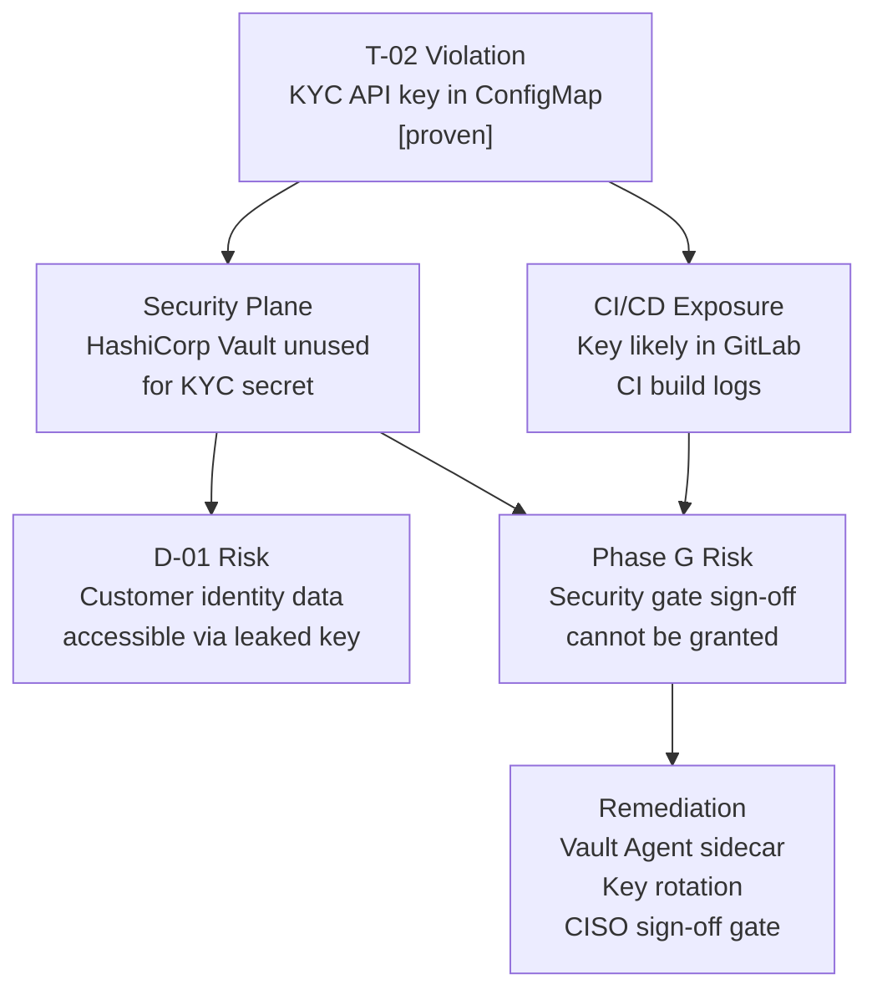

# Architecture Principles Check — ACME Corp Phase D Technology Architecture

**Document validated:** Phase D Technology Architecture — ACME Corp Customer Onboarding (see `example-technology-architecture.md`)
**Principles validated against:** Architecture Principles v1.0 — 6 principles (see `example-architecture-principles.md`)
**Reviewer:** Marcus Webb, Head of Enterprise Architecture
**Review date:** 2025-10-28
**Architecture Sponsor:** Sarah Chen, Chief Customer Officer

> [!info]
> This check runs Mode 1 (Document against Principles). Six principles are assessed: B-01, D-01, D-02, A-01, T-01, T-02. Each principle is evaluated against specific evidence drawn from the Phase D Technology Architecture document. The check feeds into `compliance-review` (ACME-COMP-2025-001) and must be resolved before Architecture Board Phase D sign-off.

---

## Compliance Matrix

| Principle | Domain | Document section | Compliant | Finding | Severity | Confidence | Remediation | Owner | Reversibility |
|-----------|--------|-----------------|-----------|---------|----------|------------|-------------|-------|---------------|
| B-01 — Customer Outcome Before Technology Feature | Business | Phase C → Phase D Traceability; Technology Component Inventory | Partial | All 7 Phase C Building Blocks trace to Phase D components. However, no Phase D component is annotated with the Phase A success metric it advances (onboarding cycle ≤3 days). The Platform Decomposition Diagram contains no customer-outcome traceability notation, violating B-01's requirement that Phase D components cannot be approved without a traceable link to a Phase A success metric. | Significant | `[informed estimate]` | Annotate each Phase D component in the Platform Decomposition Diagram and Technology Component Inventory with the Phase A success metric it enables. Re-submit with traceability annotations before Phase D sign-off. | Head of EA (Marcus Webb) | two-way door |
| D-01 — Single Source of Truth for Customer Identity | Data | Technology Component Inventory; Infrastructure Quality Attribute Assessment — Security | Conformant | RDS PostgreSQL (TECH-002) is designated the authoritative store for Identity, Process State, and Consent. No application-local PII persistence identified. Entra ID Proxy (TECH-010) mediates identity access via API. Phase C → Phase D traceability confirms the Customer Master ABB maps exclusively to TECH-002 and TECH-012 (legacy, in retirement scope). | None | `[proven]` | No remediation required. Confirm TECH-012 retirement is completed on the go-live date as documented in the Phase C → Phase D Traceability table. | Identity Architect (Priya Sharma) | two-way door |
| D-02 — Data Residency Anchored to Regulatory Regime | Data | Platform Decomposition Diagram; Technology Component Inventory; Broad Responsibility | Partial | All primary data components (TECH-002 RDS, TECH-003 S3) are in eu-west-1, satisfying the GDPR Art. 44 data residency requirement documented in the Broad Responsibility section. However, the Platform Decomposition Diagram shows no residency annotations for personal data entities, and the document does not record a data transfer agreement for the KYC SaaS Vendor cross-border data flow (partners → BPM via mTLS webhook). D-02 explicitly requires cross-border transfer mechanisms to be logged in the Architecture Repository. | Significant | `[informed estimate]` | (1) Add residency annotations to the Platform Decomposition Diagram for TECH-002 and TECH-003. (2) Document the KYC SaaS Vendor data transfer mechanism (legal basis, signed DPA, data categories) as a formal architecture decision in the Architecture Repository before Phase D sign-off. | CISO (David Okafor) | two-way door |
| A-01 — Adopt Commodity Before Building Custom | Application | Technology Component Inventory; Phase C → Phase D Traceability; Technology Anti-Pattern Inventory | Non-conformant | The document confirms that a custom KYC service build has not been commissioned and that a SaaS KYC provider is used — this satisfies the spirit of A-01 for the identity verification capability. However, the Phase D document does not record a buy/build/partner evaluation ADR for the KYC SaaS selection as required by A-01's Implications ("Any 'build' decision requires a documented ADR… Phase E opportunity identification must include a buy/partner/build evaluation"). The Technology Anti-Pattern Inventory (Anti-pattern 1) and Fix List (Fix 1) both identify the KYC API key in a Kubernetes ConfigMap — but no ADR governing the SaaS selection appears in the document or is referenced. Additionally, the self-managed Camunda BPM, GitLab CE, Prometheus, and Jaeger deployments (TECH-006, TECH-007, TECH-008) were not evaluated against managed service equivalents in the document; the Disruptive Alternative section raises this concern post-hoc for observability, confirming no proactive buy evaluation was conducted. | Significant | `[informed estimate]` | (1) File a retrospective ADR (or reference an existing ADR) for the KYC SaaS provider selection, including the buy/partner/build evaluation and Architecture Board sign-off. (2) Conduct and document a managed-service evaluation for Camunda, GitLab, and the observability stack before next Architecture Board session; if self-managed is retained, file ADRs with quantified justification. | Head of EA (Marcus Webb) | two-way door |
| T-01 — API-First Integration | Technology | Platform Decomposition Diagram; Observability Stack; Phase C → Phase D Traceability | Conformant | All inter-service communication in the Platform Decomposition Diagram uses API-mediated patterns: Channel Service → Camunda BPM via internal call; KYC SaaS via mTLS webhook; Entra ID Proxy mediating identity. No direct database-level integration identified between application components. RDS is accessed only by named services (BPM). The Phase C → Phase D traceability table confirms all integrations are API-mediated. One gap noted: the trace signal at INT-003 KYC webhook boundary is incomplete (Observability Stack table), but this is an observability gap, not an integration pattern violation. | None | `[proven]` | No remediation required for T-01 conformance. The INT-003 trace gap is a separate finding in the integration review (FIX-4) and does not constitute a T-01 violation. | Identity Architect (Priya Sharma) | two-way door |
| T-02 — Security by Design, Not Retrofit | Technology | Infrastructure Quality Attribute Assessment — Security; Technology Anti-Pattern Inventory; IaC Coverage | Non-conformant | **Critical finding:** The KYC SaaS API key is stored in a Kubernetes ConfigMap (Anti-pattern 1; Fix List Fix 1; Infrastructure Quality Attribute Assessment, Security row). T-02 requires that all identity verification services implement encryption controls and that secrets management is designed in at inception — not addressed post-launch. The Kubernetes ConfigMap stores the KYC API key in plaintext, readable by any pod in the same namespace and exposed in GitLab CI build logs (confirmed by engineering team — `[proven]`). HashiCorp Vault (TECH-005) is deployed and operational, making this a failure of process, not of capability. Additionally, the IaC Coverage table shows HashiCorp Vault configuration is manually managed with no IaC and no drift detection — the security plane itself has no reproducible, auditable configuration. Secrets rotation policy is documented as absent. | Critical | `[proven]` | (1) **Immediately:** Migrate KYC SaaS API key from ConfigMap to HashiCorp Vault; inject via Vault Agent sidecar in the BPM pod; rotate the exposed key before any staging deployment. (2) Define Vault configuration as Terraform (Vault provider) and bring under GitLab CI pipeline. (3) Document secrets rotation policy and schedule. (4) CISO must conduct a Security Architecture sign-off gate review before Phase D sign-off — T-02 requires this gate as an acceptance criterion. | CISO (David Okafor) | two-way door |

---

## Callouts

> [!warning]
> **T-02 — Critical violation:** The KYC SaaS API key in a Kubernetes ConfigMap is a proven credential leak. Any pod in the same namespace can read it; it is likely present in GitLab CI build logs. This document cannot proceed to Phase D sign-off until Fix 1 (migrate to Vault, rotate key) is complete and the CISO has signed off the Security Architecture gate. `[proven]` — confirmed by engineering team.

> [!warning]
> **D-02 — Significant violation:** The KYC SaaS Vendor cross-border data flow (partners → BPM webhook) has no documented data transfer mechanism in the Architecture Repository. This is a GDPR Art. 44 compliance gap. A signed DPA and logged architecture decision are required before Phase D sign-off. `[informed estimate]`

> [!important]
> **A-01 / B-01 — Governance gap:** The absence of buy/partner/build evaluation ADRs for the SaaS and self-managed tooling choices is a recurring pattern. A single ADR filing process issue has produced compliance gaps across two principles simultaneously. The Architecture Board should address the ADR filing discipline as a systemic concern, not a one-off remediation item.

> [!tip]
> **T-01 — API-First Integration is fully conformant.** The Platform Decomposition Diagram shows no database-level integration between application components. This is a positive departure from the pre-modernisation baseline (7 undocumented database-level integrations cited in the T-01 principle rationale). Document as positive evidence in the Architecture Repository.

---

## Prioritised Violations Requiring Remediation

| Priority | Principle | Severity | Finding summary | Fix | Owner | Reversibility | Review trigger |
|----------|-----------|----------|----------------|-----|-------|---------------|----------------|
| 1 | T-02 — Security by Design | Critical | KYC SaaS API key in Kubernetes ConfigMap — plaintext, namespace-readable, CI log-exposed | Migrate to Vault; rotate key; conduct CISO Security Architecture gate review | CISO (David Okafor) | two-way door | Before any staging deployment |
| 2 | D-02 — Data Residency | Significant | No data transfer mechanism documented for KYC SaaS cross-border data flow | File DPA and architecture decision in Architecture Repository | CISO (David Okafor) | two-way door | Before Phase D sign-off |
| 3 | A-01 — Adopt Commodity | Significant | No buy/partner/build evaluation ADR for KYC SaaS selection or for self-managed tooling (Camunda, GitLab, observability stack) | File retrospective ADR for KYC SaaS; conduct and document evaluations for remaining tooling | Head of EA (Marcus Webb) | two-way door | Before Architecture Board Phase D sign-off |
| 4 | B-01 — Customer Outcome | Significant | Phase D components not annotated with Phase A success metrics — traceability incomplete | Add success metric annotations to Platform Decomposition Diagram and Technology Component Inventory | Head of EA (Marcus Webb) | two-way door | Before Phase D sign-off |

---

## Overall Conformance Verdict

> **Non-Compliant — Critical violations present; the document cannot proceed to Phase D sign-off without structural revision.**
>
> One Critical violation (T-02) and three Significant violations (D-02, A-01, B-01) require remediation. Two principles (D-01, T-01) are fully conformant. The Critical T-02 violation — a plaintext API key in a ConfigMap where HashiCorp Vault is already deployed and operational — is a process failure, not a capability gap, and is remediable without structural architectural change. The document may resubmit for principles-check after Priorities 1–4 are resolved. Re-run this check before the Architecture Board Phase D sign-off meeting.

---

## Principles Cascade

The T-02 violation (KYC API key in ConfigMap) has second-order effects across two additional domains:

*A T-02 violation in Phase D propagates to D-01 risk (leaked key enables access to identity data) and blocks Phase G sign-off. The cascade resolves only when the key is moved to Vault, rotated, and the CISO gate is passed.*

---

## Broad Responsibility

The T-02 Critical violation — a KYC SaaS API key readable by any pod in the namespace and likely present in CI build logs — creates a direct societal exposure risk. The KYC integration processes regulated personal data (identity documents, date of birth, legal name) for ACME's entire onboarding population. A credential leak enables an attacker to submit fraudulent identity verification requests against ACME's KYC SaaS provider, potentially producing false identity approvals that cascade to ACME's downstream customers (customers-of-customers). The D-02 gap (undocumented KYC SaaS cross-border data flow) additionally creates a regulatory notification obligation under GDPR Art. 33 if data is transferred without a valid legal basis. Both gaps must be resolved before any deployment to a shared environment, including staging. `[proven]` — engineering team confirmed the ConfigMap gap; GDPR Art. 33 obligation is a regulatory requirement, not an estimate.

---

## Next Steps

1. **Immediately:** CISO (David Okafor) to migrate KYC API key to HashiCorp Vault and rotate the exposed credential — before any staging deployment.
2. **Before Phase D sign-off:** Head of EA (Marcus Webb) to file ADRs for KYC SaaS selection and self-managed tooling evaluations; annotate Phase D components with Phase A success metrics.
3. **Before Phase D sign-off:** CISO (David Okafor) to document KYC SaaS DPA and cross-border transfer mechanism in the Architecture Repository; conduct formal Security Architecture sign-off gate.
4. **Re-run principles-check** after Priorities 1–4 are resolved. If all violations are remediated, proceed to `compliance-review` for the Architecture Board submission.
5. **Invoke `adr-generator`** to produce ADRs for the KYC SaaS selection and each self-managed tooling decision where no ADR currently exists.
