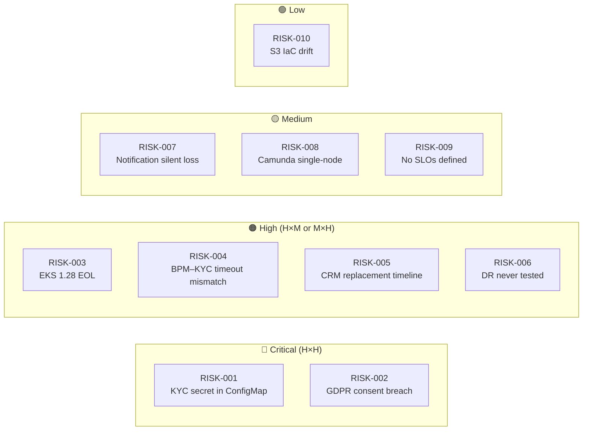
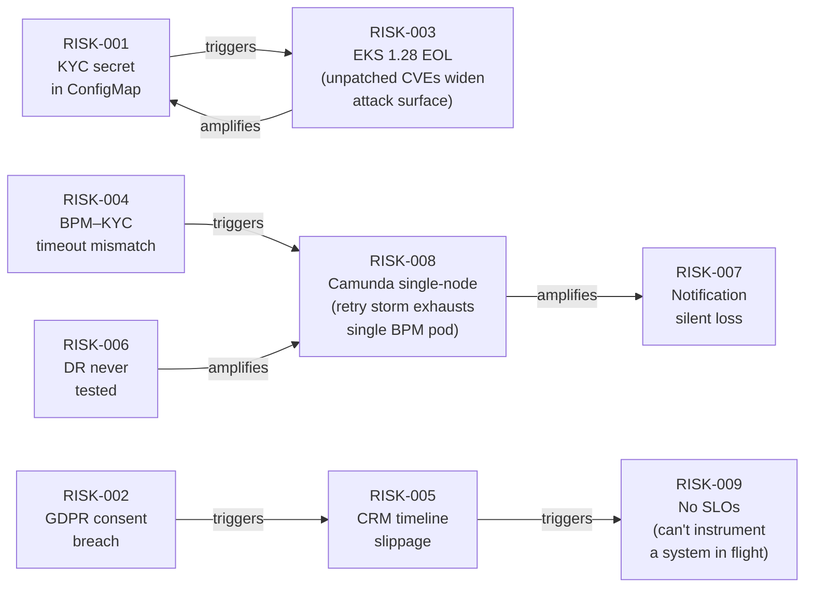
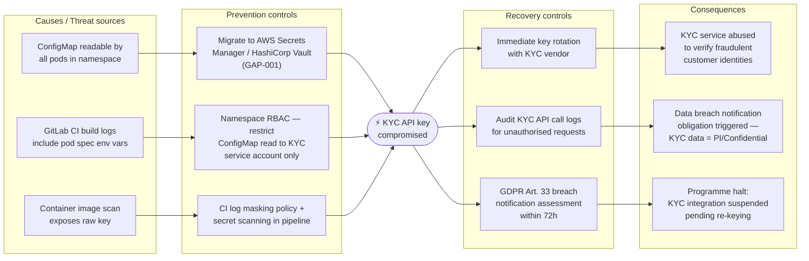

# Risk Radar — ACME Corp Customer Onboarding Modernisation

**Engagement:** ACME Corp Customer Onboarding Modernisation — Phase 1
**Assessment point:** Phase E/F — gap analysis complete, H1 delivery beginning
**Lead Architect:** Marcus Webb, Head of Enterprise Architecture
**Architecture Sponsor:** Sarah Chen, Chief Customer Officer
**Programme horizon:** H1–H2 (24 months to ≤3-day cycle target)

---

> [!abstract]
> The ACME Customer Onboarding Modernisation programme carries an aggregate **High** risk posture at Phase E/F entry: two Critical risks (KYC API key credential exposure and GDPR consent breach) and four High risks require owner assignment and named mitigations before H1 delivery begins. The single risk that must be resolved before any new onboarding volume is added is **RISK-002 — GDPR consent co-mingling**: it is an active regulatory breach with Rapid velocity that cannot be deferred to H2. Aggregate risk exceeds ACME's stated Medium appetite in two categories (Security, Data Protection) and must be accepted by David Okafor (CISO) and Sarah Chen (CCO) at the Phase E gate review before H1 work proceeds.

---

## Risk Heat Map

| Risk | Category | Probability | Impact | Score | Velocity | Horizon | Confidence | Owner (role) | Review trigger |
|------|----------|-------------|--------|-------|----------|---------|------------|--------------|----------------|
| RISK-001 — KYC API key in Kubernetes ConfigMap | Security | H | H | Critical | Rapid | H1 | proven | David Okafor (CISO) | Before any staging deployment; immediately if log-scraping evidence found |
| RISK-002 — GDPR consent records co-mingled in Customer Master DB | Data Protection | H | H | Critical | Rapid | H1 | proven | David Okafor (CISO) | Before H1 volume increase; re-assess if DPO flags additional subjects at risk |
| RISK-003 — EKS 1.28 past end-of-support (March 2025) | Technical | H | M | High | Moderate | H1 | proven | Marcus Webb (Head EA) | Before go-live gate; upgrade if any subsequent EKS version reaches 6-month-to-EOL threshold |
| RISK-004 — BPM–KYC timeout mismatch causes retry storms | Technical | H | M | High | Moderate | H1 | informed estimate | Priya Sharma (Identity Architect) | Before integration test sign-off; re-assess if KYC vendor changes SLA |
| RISK-005 — CRM replacement timeline slippage blocks ≤3-day cycle | Organisational | M | H | High | Slow | H1–H2 | informed estimate | Tom Hayward (Customer Ops Director) | When vendor selection extends beyond H1 Month 3; re-assess if CRM market consolidates |
| RISK-006 — DR procedure never tested; RTO/RPO unvalidated | Operational | M | H | High | Slow | H1 | informed estimate | Marcus Webb (Head EA) | Before Architecture Contract go-live gate; re-run after any infrastructure topology change |
| RISK-007 — Notification queue has no DLQ; failures silently dropped | Operational | M | M | Medium | Moderate | H1 | proven | Tom Hayward (Customer Ops Director) | Before go-live gate; re-assess if notification volume grows >10× current baseline |
| RISK-008 — Camunda BPM single-node; pod restart halts all in-flight cases | Technical | M | M | Medium | Rapid | H1 | informed estimate | Priya Sharma (Identity Architect) | Before integration test sign-off; re-assess when concurrent cases exceed 500 |
| RISK-009 — No SLOs defined for any onboarding service | Operational | H | L | Medium | Slow | H1–H2 | informed estimate | Marcus Webb (Head EA) | Before H2 gate review; re-assess when error-budget policy is approved by Architecture Board |
| RISK-010 — S3 document store provisioned manually; no IaC | Technical | L | L | Low | Slow | H2 | informed estimate | Marcus Webb (Head EA) | Before Phase D IaC coverage target is confirmed in H2 |

> [!warning]
> RISK-001 and RISK-002 are Critical with Rapid velocity. RISK-001 (KYC API key) can materialise in under 24 hours via log scraping or a container image scan — any pipeline artifact that includes the pod spec already contains the secret. RISK-002 (GDPR consent breach) is an active state, not a future risk: every onboarding record written today compounds the liability. Both require named owner assignment and a mitigation start date before Phase E gate approval, not a backlog item.

---

## Risk Interconnection Map

*Three-node cascade chain: RISK-004 → RISK-008 → RISK-007. A KYC processing delay triggers a BPM retry storm (RISK-004); the single Camunda pod becomes overloaded and restarts (RISK-008); in-flight cases lose their notification events, which have no DLQ (RISK-007). All three materialise simultaneously under a single KYC vendor latency spike.*

---

## Bow-Tie Analysis — Primary Risk

*Primary risk: RISK-001 — KYC API key stored in Kubernetes ConfigMap*

---

## Risk Treatment Register

| Risk | Score | Treatment | Rationale | Named control | Owner (role) | Review trigger |
|------|-------|-----------|-----------|--------------|--------------|----------------|
| RISK-001 — KYC secret in ConfigMap | Critical | Treat | Risk exceeds appetite; credential migration is L effort, two-way; cost of treatment (1 day) << expected loss (breach notification + KYC vendor dispute) | Migrate API key to AWS Secrets Manager; inject at pod startup via External Secrets Operator; rotate existing key immediately | David Okafor (CISO) | Before any staging deployment |
| RISK-002 — GDPR consent breach | Critical | Treat | Active regulatory breach — Terminate the activity would halt onboarding; Treat by isolating consent schema before any volume increase; DPO sign-off required | Migrate consent records to dedicated schema with independent backup and retention policy (GAP-006); DPO sign-off before H2 begins | David Okafor (CISO) | Before H1 onboarding volume increase; DPO review triggered by any subject access request |
| RISK-003 — EKS 1.28 EOL | High | Treat | Unpatched Kubernetes CVEs accumulate daily; penetration test required by Architecture Contract will fail on EKS version — blocks go-live regardless of other controls | Upgrade to EKS 1.30 via managed node group rolling update before go-live gate | Marcus Webb (Head EA) | Before go-live gate |
| RISK-004 — BPM–KYC timeout mismatch | High | Treat | Retry storm is deterministic under KYC latency spikes; L effort config change eliminates root cause | Set BPM timeout on INT-002 to 65s (45s KYC SLA + 20s buffer); confirm KYC vendor idempotency | Priya Sharma (Identity Architect) | Before integration test sign-off |
| RISK-005 — CRM timeline slippage | High | Treat | CRM replacement is the critical path to ≤3-day cycle; no substitute path exists; tolerance would mean accepting H3 delivery of the primary business outcome | Vendor selection decision required by H1 Month 3; parallel run must begin in H1; weekly programme board tracking | Tom Hayward (Customer Ops Director) | When vendor selection extends beyond H1 Month 3 |
| RISK-006 — DR never tested | High | Treat | Untested DR is not DR; Architecture Contract acceptance criteria must include a documented DR test result | Execute DR runbook: RDS failover test + EKS node failure simulation; document actual RTO; sign-off by Marcus Webb | Marcus Webb (Head EA) | Before Architecture Contract go-live gate |
| RISK-007 — Notification silent loss | Medium | Treat | Silent loss is invisible to ops and customers; L effort DLQ addition eliminates the failure mode with no code change | Add DLQ to SQS notification queue; configure CloudWatch alarm on DLQ depth > 0 | Tom Hayward (Customer Ops Director) | Before go-live gate |
| RISK-008 — Camunda single-node | Medium | Treat | Single pod is incompatible with H1 onboarding volume targets; HA cluster required by ADR-2025-003 | Deploy Camunda active-passive cluster (≥2 replicas) with shared RDS PostgreSQL session store | Priya Sharma (Identity Architect) | Before integration test sign-off |
| RISK-009 — No SLOs defined | Medium | Treat | Without SLOs, incidents are diagnosed by guesswork; H2 SLA commitment requires baseline data from H1 | Define SLOs for BPM, KYC, CRM, Notification; configure burn-rate alerts in Grafana | Marcus Webb (Head EA) | Before H2 gate review |
| RISK-010 — S3 IaC drift | Low | Tolerate (interim) / Treat (H2) | Configuration drift risk is real but non-critical at current data volume; tolerate during H1 when Critical and High risks consume team capacity; treat in H2 | Import S3 bucket into Terraform state; enforce IaC-only changes via GitLab CI pipeline in H2 | Marcus Webb (Head EA) | H2 planning gate; or immediately if an S3 configuration incident occurs |

> [!important]
> RISK-002 (GDPR consent co-mingling) is treated as **Treat**, not Tolerate, because the exposure is a live regulatory breach — not a future risk. Treating it as Tolerate would require explicit risk appetite sign-off from David Okafor (CISO) and Sarah Chen (CCO) with a written acknowledgment that ACME is knowingly operating outside GDPR Art. 7 compliance during the remediation window. That sign-off must be documented in the Architecture Board minutes before H1 delivery begins.

---

## RAID Log

**Risks:**

| ID | Summary | Score | Horizon |
|----|---------|-------|---------|
| RISK-001 | KYC API key in Kubernetes ConfigMap — credential exposure via log scraping or pod inspection | Critical | H1 |
| RISK-002 | GDPR consent records co-mingled with Customer Master DB — active Art. 7 breach | Critical | H1 |
| RISK-003 | EKS 1.28 past EOL — unpatched CVEs; Architecture Contract pen-test will fail on version alone | High | H1 |
| RISK-004 | BPM timeout (30s) shorter than KYC SLA (45s) — deterministic retry storm under KYC latency | High | H1 |
| RISK-005 | CRM replacement timeline slippage — vendor selection is the critical path to ≤3-day cycle; every month of slip pushes delivery target from H2 toward H3 | High | H1–H2 |
| RISK-006 | DR procedure never tested — RTO/RPO are unvalidated hypotheses; runbook may be broken | High | H1 |
| RISK-007 | Notification queue has no DLQ — failed onboarding confirmations silently dropped | Medium | H1 |
| RISK-008 | Camunda BPM single-node — pod restart halts all in-flight onboarding cases with no failover | Medium | H1 |
| RISK-009 | No SLOs defined for any service — incidents diagnosed by guesswork; H2 SLA commitment has no baseline | Medium | H1–H2 |
| RISK-010 | S3 document store provisioned manually — configuration drift undetectable; cannot reproduce bucket state | Low | H2 |

**Assumptions:**

| # | Assumption | Owner (role) | Risk if wrong | Horizon |
|---|-----------|--------------|---------------|---------|
| A-001 | CRM vendor selection completes within H1 Month 3 — this is the longest-lead item on the critical path to ≤3-day cycle | Tom Hayward (Customer Ops Director) | If selection slips to H1 Month 4+, CRM parallel run cannot complete within H2 and the ≤3-day cycle target shifts to H3; RISK-005 elevates to Critical | H1 |
| A-002 | KYC vendor will accept the revised timeout buffer (BPM 65s) without requiring a contract renegotiation | Priya Sharma (Identity Architect) | If vendor requires contract amendment, GAP-003 and GAP-008 slip 4–6 weeks while procurement completes; retry storm risk (RISK-004) persists during that window | H1 |
| A-003 | Consent record isolation (GAP-006) can be achieved by extracting consent fields to a dedicated schema without a full Customer Master DB migration | David Okafor (CISO) | If the Customer Master DB schema requires a full migration to separate consent records, effort escalates from High to Extra-Large and RISK-002 remediation slips into H2 — extending the live regulatory exposure | H1 |

**Issues** (already-materialised problems requiring immediate action):

| # | Issue | Severity | Owner (role) | Action required | Review trigger |
|---|-------|----------|--------------|-----------------|----------------|
| I-001 | EKS 1.28 is operating in production past its end-of-support date (2025-03-26). AWS is no longer publishing security patches for this version. Kubernetes CVEs discovered after March 2025 are unmitigated on the ACME cluster. | Critical | Marcus Webb (Head EA) | Upgrade to EKS 1.30 via managed node group rolling update — this is not deferred risk, it is current state. Block any new deployments to production until upgrade is confirmed. | Immediately; hard stop before go-live gate |
| I-002 | GDPR Art. 7 consent co-mingling is an active compliance breach, not a future risk. Every new onboarding record written today adds a data subject to the pool of potentially affected individuals. The DPO has flagged this finding. | Critical | David Okafor (CISO) | Halt any planned onboarding volume increase until consent schema isolation (GAP-006) is in place. DPO must assess whether a retrospective Art. 13 notification is required for data subjects already onboarded during the co-mingling period. | Before any increase in onboarding volume; DPO review triggered by any subject access request |

**Dependencies:**

| # | Dependency | Owner (role) | Controlled by ACME? | Impact if delayed | Review trigger |
|---|-----------|--------------|---------------------|------------------|----------------|
| D-001 | KYC SaaS vendor confirms that duplicate submission within the same session is idempotent on their side — required before BPM timeout fix (GAP-003) is safe to deploy | Priya Sharma (Identity Architect) | No — vendor decision | Without idempotency confirmation, fixing the BPM timeout may cause KYC to charge for duplicate verifications and create split onboarding state | Before integration test sign-off; escalate to KYC vendor account manager within 5 business days of Phase E start |
| D-002 | CRM replacement vendor selected and data migration plan agreed — gate for the H2 ≤3-day cycle delivery | Tom Hayward (Customer Ops Director) | Partially — ACME drives selection; vendor availability and contract negotiation are external | Slip beyond H1 Month 3 pushes the ≤3-day cycle target to H3 (RISK-005 elevates to Critical) | Weekly programme board; escalate to Sarah Chen (CCO) if selection has not commenced by H1 Month 2 |
| D-003 | DPO sign-off on consent record isolation design (GAP-006) — required before H2 gate review and before any increase in onboarding volume | David Okafor (CISO) | Partially — DPO review timeline is outside EA team control | H2 gate cannot open without DPO sign-off; if DPO requests redesign, GAP-006 effort may increase materially | DPO review requested within 2 weeks of Phase E start; re-assess if DPO raises objections to proposed isolation approach |

---

## Top Mitigations

| # | Risk | Mitigation | Effort | Reversibility | Confidence | Owner (role) | Review trigger |
|---|------|------------|--------|---------------|------------|--------------|----------------|
| 1 | RISK-001 — KYC secret in ConfigMap | Migrate KYC API key to AWS Secrets Manager; inject at pod startup via External Secrets Operator; rotate existing key immediately (the existing key should be treated as compromised from this point) | L | two-way door | informed estimate | David Okafor (CISO) | Before any staging deployment — this is a day-1 action, not a sprint item |
| 2 | RISK-002 — GDPR consent breach | Create dedicated Consent Store schema with independent backup, retention policy, and access controls; DPO sign-off required; DPO to assess retrospective Art. 13 notification obligation for previously onboarded subjects | H | one-way door | working hypothesis | David Okafor (CISO) | Before H1 onboarding volume increase; DPO review to begin immediately |
| 3 | RISK-004 + RISK-008 — BPM–KYC timeout + single-node Camunda | Set BPM timeout to 65s (fixes retry storm root cause); then deploy Camunda active-passive HA cluster — do in this order, as HA without timeout fix still generates retry-driven pod exhaustion | L then M | two-way door | informed estimate | Priya Sharma (Identity Architect) | Before integration test sign-off; both fixes must land in the same sprint to close the cascade chain (RISK-004 → RISK-008 → RISK-007) |
| 4 | RISK-006 — DR never tested | Execute DR runbook end-to-end: RDS automated failover test, EKS node failure simulation, HashiCorp Vault recovery; document actual RTO achieved; sign off by Marcus Webb before go-live gate | M | two-way door | informed estimate | Marcus Webb (Head EA) | Before Architecture Contract go-live gate; re-run after any infrastructure topology change |
| 5 | RISK-005 — CRM timeline slippage | Initiate CRM vendor selection immediately; timebox to H1 Month 3; run CRM idempotency fix (GAP-005) in parallel as a holding control — this buys stability during migration but does not substitute for the replacement | M (vendor selection) + L (GAP-005) | one-way door (decommission) / two-way door (GAP-005 fix) | informed estimate | Tom Hayward (Customer Ops Director) | When selection has not commenced by H1 Month 2 — escalate to Sarah Chen (CCO) |

> [!tip]
> RISK-001 (KYC API key in ConfigMap) is eliminated by a single L-effort control — moving one secret to AWS Secrets Manager and rotating the key. This takes one engineer one day and requires no architectural change. It eliminates a Critical risk with Rapid velocity. Execute it on the first day of H1 delivery — before any other sprint work begins. It is the highest return-on-effort action in this register.

---

## Risk Worth Naming

**Systemic risk: Programme safety window collapse under concurrent H1 fixes**

Each individual H1 risk (RISK-001 through RISK-008) has a named owner, a mitigation, and an effort estimate. What is not visible in a flat risk register is the **combination effect**: if the team attempts to close RISK-001 (secrets migration), RISK-003 (EKS upgrade), RISK-004 + RISK-008 (timeout + Camunda HA), and RISK-002 (consent isolation) in the same sprint window, the team simultaneously operates multiple one-in-flight infrastructure changes on the same production cluster with no tested DR fallback (RISK-006 is still open). A failure during any one of these changes — a botched EKS node group rolling update, a Vault injection misconfiguration, a Camunda failover that loses in-flight cases — occurs on a platform where DR has never been demonstrated to work.

ISO 31000 calls this **risk aggregation**: two Medium risks that together produce a Critical outcome. Here, RISK-003 (EKS EOL) + RISK-006 (DR untested) together mean that if the EKS upgrade goes wrong, recovery time is unknown and unvalidated. The combination is a Critical risk that does not appear in any single row of the register.

**Mitigation:** Establish a fixed sequencing constraint before H1 delivery begins:
1. RISK-006 — execute DR test first, on the current cluster, before any other infrastructure change
2. RISK-001 — rotate KYC secret (no cluster impact)
3. RISK-003 — upgrade EKS (now with a validated DR fallback)
4. RISK-004 + RISK-008 — timeout fix and Camunda HA (on a known-good cluster)
5. RISK-002 — consent isolation (highest sustained effort; benefits from a stable platform)

This sequencing constraint reduces the aggregate risk from Critical to High [informed estimate]. Owner: Marcus Webb (Head EA). Review trigger: before the first H1 sprint is committed. Door: **two-way door** — the sequence can be adjusted if new information changes the relative urgency.

---

## Horizon Summary

**H1 — Act now:**

- RISK-001: KYC API key rotation to AWS Secrets Manager — day 1, no sprint allocation needed
- RISK-002: GDPR consent isolation — begin immediately; DPO engaged in parallel; highest sustained effort in H1
- RISK-003: EKS 1.28 upgrade — before go-live gate; schedule after DR test (see systemic risk above)
- RISK-004: BPM–KYC timeout alignment — first integration sprint; L effort
- RISK-006: DR test execution — first action before any infrastructure change (systemic risk constraint)
- RISK-007: Notification DLQ — first integration sprint; L effort, no code change
- RISK-008: Camunda HA cluster — after timeout fix; M effort

**H2 — Monitor:**

- RISK-005: CRM timeline slippage — weekly programme board tracking; escalation trigger at H1 Month 3 if vendor not selected
- RISK-009: SLO definition — target before H2 gate; H1 observability work creates the baseline
- I-001: EKS upgrade complete — monitor for subsequent EOL thresholds quarterly

**H3 — Structural:**

- At H3 onboarding volume (>5,000/day), the BPM→KYC point-to-point link becomes a rate-limit bottleneck (KYC SaaS: 10 concurrent verifications). This is a structural architectural constraint, not a remediation action: at that scale, a durable queue between BPM and KYC SaaS decouples volume spikes from KYC capacity. Design constraint to be carried into the next ADM cycle as a non-functional requirement.
- S3 unintentional lock-in (RISK-010 background) becomes a structural risk at H3 data volume (estimated 30TB+ document store). Evaluate S3-compatible abstraction layer (MinIO or Cloudflare R2) at H2 gate before volume makes egress cost prohibitive.

---

## TOGAF Context

| Risk | ADM Phase | Impacted Building Block | Architecture Contract impact |
|------|-----------|------------------------|------------------------------|
| RISK-001 — KYC secret in ConfigMap | D — Technology | Infrastructure Building Block: Secrets Management | Required — EKS workload spec must be updated; Architecture Contract acceptance criterion: no raw secrets in ConfigMaps or environment variables before go-live |
| RISK-002 — GDPR consent breach | C — Data | Data Building Block: Consent Store | Required — new ABB (Consent Store isolated schema); Architecture Contract must include DPO sign-off as a go-live gate criterion |
| RISK-003 — EKS 1.28 EOL | D — Technology | Infrastructure Building Block: Container Orchestration | Required — Technology Standards Catalog must list EKS 1.30 as the minimum supported version; Architecture Contract: EKS upgrade confirmed before go-live |
| RISK-004 — BPM–KYC timeout | C — Application | Integration Building Block: Onboarding Orchestration ↔ Identity Verification | Required — Interface Catalog must reflect revised INT-002 timeout (65s); Architecture Contract: integration test suite must pass with KYC response at 42s |
| RISK-005 — CRM timeline slippage | E/F — Migration | Application Building Block: Customer Master CRM | Required — CRM replacement milestone must appear in Architecture Contract with named vendor and data migration plan before H2 gate |
| RISK-006 — DR never tested | D — Technology | Infrastructure Building Block: Resilience and Recovery | Required — Architecture Contract acceptance criterion: DR test executed, RTO ≤4h documented, and signed by Marcus Webb before go-live |

---

## Broad Responsibility

RISK-002 (GDPR consent co-mingling) has a direct obligation to data subjects beyond the organisation boundary: customers who completed onboarding during the co-mingling period may have had their consent data processed under an incorrect legal basis (GDPR Art. 7). The DPO must assess whether a retrospective Art. 13 notification is required — this is a legal obligation to ACME's own customers (customers-of-ACME), not an internal remediation matter. Separately, RISK-001 (KYC credential exposure) involves PI/Confidential identity data transiting to the KYC SaaS vendor under a GDPR Art. 28 Data Processing Agreement: a KYC API key compromise triggers an Art. 33 breach notification obligation to the supervisory authority within 72 hours. Both obligations fall outside the programme's current risk response plan and must be added to the Architecture Contract's incident response section before H1 delivery begins.
