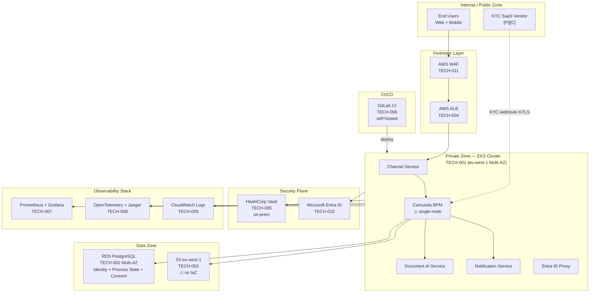

# Technology Architecture Review — ACME Corp Customer Onboarding (Phase D)

**Date:** 2025-04-17
**Engagement:** ACME Corp — Customer Onboarding Modernisation
**ADM Phase:** D — Technology Architecture
**Reviewer:** Head of Enterprise Architecture (Marcus Webb)
**Scope:** Full platform infrastructure hosting the Customer Onboarding modernisation — compute, storage, networking, secrets, observability, CI/CD, and DR posture
**Producing skill:** `/technology-architecture`

---

## Verdict: Needs Work

> [!abstract]
> The ACME onboarding platform has a sound infrastructure topology — managed Kubernetes, Multi-AZ database, and a cloud-agnostic secrets manager — but one Critical gap must be resolved before go-live: a KYC SaaS API key is stored in a Kubernetes ConfigMap, not in HashiCorp Vault. Three High gaps follow: the Camunda BPM engine is single-node (the trade-off analysis mandated an HA cluster), the S3 Document Store was provisioned via console and has no IaC representation, and no DR failover test has ever been executed against any tier.

---

## Platform Decomposition Diagram (TOGAF Phase D)

*⚠ marks known gaps. Perimeter → Private → Data zone segmentation follows three-tier security model.*

---

## Technology Component Inventory

| ID | Component | Type | Managed | Provider | Version | Lifecycle | Owner (role) |
|----|-----------|------|---------|----------|---------|-----------|--------------|
| TECH-001 | AWS EKS | Compute — container orchestration | Managed | AWS | 1.28 (⚠ EOL March 2025) | Active — upgrade required | Head of EA (Marcus Webb) |
| TECH-002 | Amazon RDS PostgreSQL Multi-AZ | Storage — relational DB | Managed | AWS | PostgreSQL 15.4 | Active | Identity Architect (Priya Sharma) |
| TECH-003 | Amazon S3 (eu-west-1) | Storage — object store | Managed | AWS | N/A | Active — ⚠ no IaC | Identity Architect (Priya Sharma) |
| TECH-004 | AWS ALB | Network — load balancer | Managed | AWS | N/A | Active | Head of EA (Marcus Webb) |
| TECH-005 | HashiCorp Vault | Security — secrets management | Self-managed | On-premises | 1.15.2 | Active | CISO (David Okafor) |
| TECH-006 | GitLab CE | CI/CD | Self-managed | On-premises | 16.9 | Active — ⚠ runners not IaC-managed | Head of EA (Marcus Webb) |
| TECH-007 | Prometheus + Grafana | Observability — metrics | Self-managed | EKS | Prometheus 2.51 / Grafana 10.3 | Active — no SLOs defined | Head of EA (Marcus Webb) |
| TECH-008 | OpenTelemetry + Jaeger | Observability — traces | Self-managed | EKS | OTel 0.95 / Jaeger 1.55 | Active — partial coverage | Head of EA (Marcus Webb) |
| TECH-009 | AWS CloudWatch Logs | Observability — logs | Managed | AWS | N/A | Active — partial structured JSON | Head of EA (Marcus Webb) |
| TECH-010 | Microsoft Entra ID | Security — identity provider | Managed | Microsoft | N/A | Active | CISO (David Okafor) |
| TECH-011 | AWS WAF | Security — perimeter | Managed | AWS | N/A | Active | CISO (David Okafor) |
| TECH-012 | Legacy CRM (on-premises) | Application — legacy | Self-managed | On-premises | v4.2 | ⚠ EOL — retirement in scope | Customer Operations Director (Tom Hayward) |

---

## Infrastructure Quality Attribute Assessment

| Attribute | Finding | Evidence | Confidence | Severity |
|-----------|---------|----------|------------|----------|
| **Availability** | EKS Multi-AZ (99.9% SLA). RDS Multi-AZ (99.95% SLA, ~2min automated failover). ALB managed 99.99%. Camunda BPM is single-node on EKS — HA cluster required by ADR-2025-003 trade-off decision but not yet implemented. | Asserted | [informed estimate] | High |
| **Resilience** | RDS Multi-AZ automated failover in ~2min [proven by AWS SLA]. S3 cross-AZ native resilience [proven]. Camunda BPM single-node: BPM engine failure terminates all in-flight onboarding cases — unrecoverable without HA cluster. DR procedure has never been tested across any tier. | Not tested | [informed estimate] | High |
| **Security** | WAF + ALB at perimeter. Network segmented (public/private/data zones). mTLS on KYC SaaS integration. HashiCorp Vault for secrets — correct. **Critical gap: KYC SaaS API key stored in Kubernetes ConfigMap, not in Vault.** Entra ID for AuthN. Secrets rotation policy not documented. | Asserted (ConfigMap gap confirmed by engineering team) | [proven] | Critical |
| **Observability** | Prometheus + Grafana for metrics — full EKS coverage. Jaeger for traces — partial (gap at INT-003 KYC webhook boundary, flagged in integration review). CloudWatch Logs — partial (not all services emit structured JSON). No SLOs defined for any service. No burn-rate alerts. | Asserted | [informed estimate] | High |
| **Evolvability** | EKS and RDS are Terraform-managed (full IaC). S3 Document Store is console-provisioned — no IaC, no state, no drift detection. GitLab CI runners are manually configured. IaC coverage ~70% — gap. EKS 1.28 approaching EOL (March 2025). | Asserted | [informed estimate] | High |
| **Operability** | Runbooks absent for all high-criticality components (flagged in integration review). No alert-to-runbook mapping in Grafana. Camunda process admin skills gap on ops team. GitLab CI self-hosted — patch cadence undocumented. | Not assessed | [working hypothesis] | Medium |
| **Cost Efficiency** | Tagging taxonomy partially implemented — EKS pods not tagged with cost-centre or application. Orphaned EBS volumes from previous test deployments (~€800/month unattributed). RDS right-sized for target load. No FinOps anomaly alerts configured. | Asserted | [informed estimate] | Medium |
| **Portability** | Compute: shallow (EKS is portable Kubernetes). Database: medium (PostgreSQL portable, RDS-specific features add friction). Object storage: deep (S3 API is de-facto standard but data egress cost is high). Secrets: shallow (Vault is cloud-agnostic — intentional for C-05). | Asserted | [informed estimate] | Medium |

> [!warning]
> **Critical — Security:** The KYC SaaS API key in a Kubernetes ConfigMap is readable by any pod in the same namespace and is likely to appear in GitLab CI build logs. This is a credential leak risk. Move to HashiCorp Vault before any deployment to a shared environment — including staging.

---

## Technology Anti-Pattern Inventory

| # | Anti-pattern | Location | Production risk | Severity | Remediation | Owner (role) |
|---|-------------|---------|----------------|----------|------------|--------------|
| 1 | **Secrets in environment variables** | Kubernetes ConfigMap — KYC SaaS API key | API key readable by all pods in namespace; leaks via logs and CI build output | Critical | Migrate KYC SaaS API key to HashiCorp Vault; inject via Vault Agent sidecar in the BPM pod | CISO (David Okafor) |
| 2 | **No DR test on record** | All tiers | RTO/RPO for RDS and EKS failover unvalidated — actual recovery time unknown; DR runbook may be broken | High | Execute DR failover test for RDS (automated failover) and EKS (node failure simulation) before go-live; document results and RTO achieved | Head of EA (Marcus Webb) |
| 3 | **Manual provisioning** | S3 Document Store (TECH-003) | S3 bucket configuration (ACLs, versioning, encryption settings) is undocumented; cannot be reproduced; drift from intended state undetectable | High | Import S3 bucket into Terraform state; enforce IaC-only changes via GitLab CI pipeline | Head of EA (Marcus Webb) |
| 4 | **Snowflake infrastructure** | GitLab CI runners | Runners are hand-configured on on-premises VMs; runner failure requires manual rebuild; no image or Ansible playbook exists | Medium | Define runner configuration as Ansible playbook or Docker image; test reproducibility | Head of EA (Marcus Webb) |
| 5 | **Missing tagging taxonomy** | EKS workloads + EBS volumes | €800/month in unattributed cloud spend; orphaned volumes not identifiable; cost allocation to Customer Onboarding workstream blocked | Medium | Apply mandatory tag policy (owner, environment, cost-centre, application) via AWS Config Rule; remediate untagged resources | Head of EA (Marcus Webb) |
| 6 | **Pet servers** | Camunda BPM pod (single-node) | Single BPM pod is a pet — named, non-replaceable, state held in memory during active process steps | High | Deploy Camunda HA cluster (≥2 replicas behind service) with shared RDS PostgreSQL session store | Identity Architect (Priya Sharma) |

---

## Lock-in Surface Assessment

| Component | Lock-in depth | Type | Portability path | Exit cost | Intentional? | Confidence |
|-----------|--------------|------|-----------------|-----------|-------------|------------|
| AWS EKS (TECH-001) | Shallow | Managed Kubernetes — standard API | Any CNCF-conformant Kubernetes distribution (GKE, AKS, k3s) | Low — workloads are containerised and portable | Yes — C-05 multi-cloud mandate | [informed estimate] |
| Amazon RDS PostgreSQL (TECH-002) | Medium | Managed PostgreSQL — standard engine, proprietary backup/replication | Self-managed PostgreSQL or Azure Database for PostgreSQL | Medium — data migration effort; no proprietary query syntax in use | Partial — PostgreSQL chosen intentionally; RDS management features add friction | [informed estimate] |
| Amazon S3 (TECH-003) | Deep | Object storage — de-facto standard API but high egress cost | Azure Blob Storage (S3-compatible API via middleware) | High — data egress cost at volume; no S3-specific features used beyond basic operations | No — accidental (only EU-resident AWS bucket was evaluated) | [working hypothesis] |
| HashiCorp Vault (TECH-005) | Shallow | Secrets management — Vault API; cloud-agnostic deployment | AWS Secrets Manager (Vault-compatible API wrapper available) | Low — secret references are abstracted in application code | Yes — explicitly chosen for C-05 compliance | [proven] |
| AWS WAF (TECH-011) | Medium | Managed WAF — rule sets are portable conceptually but not in configuration | ModSecurity (open-source), Azure Front Door WAF | Medium — WAF rule migration required | Partial — WAF rules will need rewrite on platform change | [informed estimate] |

> [!important]
> Amazon S3 lock-in is unintentional and deep. At 7-year document retention (30TB estimated at Year 3), data egress cost to exit AWS would be approximately €2,700 at standard rates. This is a one-way door that should be accepted consciously or mitigated by adopting an S3-compatible abstraction layer (MinIO or Cloudflare R2) now while the data volume is small.

---

## Availability and Recovery Assessment

| Tier | HA pattern | SLA % | RTO target | RPO target | RTO achievable? | DR last tested | Failover | Owner (role) |
|------|-----------|-------|-----------|-----------|----------------|---------------|---------|--------------|
| EKS compute | Active-passive (multi-AZ node groups) | 99.9% | 15min | N/A (stateless) | Yes [informed estimate] | Never — gap | Automated (node replacement) | Head of EA (Marcus Webb) |
| RDS PostgreSQL | Active-passive (Multi-AZ synchronous replication) | 99.95% | 2min | ~1min | Yes [proven — AWS SLA] | Never — gap | Automated | Identity Architect (Priya Sharma) |
| Camunda BPM | **Single-node — no HA** | <99.9% | Unknown | Unknown — in-memory state | **No — critical gap** | N/A | Manual restart | Identity Architect (Priya Sharma) |
| S3 Document Store | Multi-AZ native | 99.99% | Seconds | Zero (multi-AZ) | Yes [proven] | N/A | Automatic | Identity Architect (Priya Sharma) |
| HashiCorp Vault | Single-node (on-premises) | Undocumented | Unknown | Unknown | **Not assessed — gap** | Never | Manual | CISO (David Okafor) |

> [!warning]
> DR has never been tested for EKS, RDS, or HashiCorp Vault. An untested DR procedure is not a DR procedure — it is a hypothesis. The Architecture Contract acceptance criteria must include a DR test with documented RTO outcome before the go-live gate.

---

## Observability Stack

| Signal | Tool | Coverage | SLO defined | Burn-rate alert | On-call runbook | Gap |
|--------|------|---------|------------|----------------|----------------|-----|
| Metrics | Prometheus + Grafana | Full (EKS workloads) | **No** | **No** | No | SLOs and burn-rate alerts must be defined for all services before go-live |
| Logs | CloudWatch Logs | Partial — 3 of 7 services emit structured JSON | N/A | N/A | No | Remaining 4 services must emit structured JSON with correlation ID and trace ID |
| Traces | OpenTelemetry + Jaeger | Partial — gap at INT-003 KYC webhook boundary | No | No | N/A | Bridge synthetic span at KYC webhook receiver (flagged in integration review FIX-4) |
| Alerting | Grafana Alerting | Partial — infrastructure alerts only; no application SLO alerts | N/A | N/A | No | Application SLO alerts not configured; no runbook-to-alert mapping |

---

## IaC Coverage

| Component | Tool | Coverage | State | Drift detection | GitOps pipeline | Gap |
|-----------|------|---------|-------|----------------|----------------|-----|
| EKS cluster | Terraform | Full | Remote (S3 + DynamoDB lock) | No | Yes (GitLab CI PR → plan → apply) | Add Terraform drift detection (scheduled plan) |
| RDS PostgreSQL | Terraform | Full | Remote (S3 + DynamoDB lock) | No | Yes | Same — add drift detection |
| S3 Document Store | **None** | **None** | None | None | None | Import to Terraform immediately; enforce IaC-only changes |
| HashiCorp Vault config | Manual | **None** | N/A | None | None | Define Vault configuration as Terraform (Vault provider) |
| GitLab CI runners | **Manual** | **None** | N/A | None | None | Define as Ansible playbook or Docker image |
| Kubernetes manifests | Helm | Partial | Git (no sealed secrets) | No | Yes | Move secrets to External Secrets Operator + Vault |

---

## Technology Lifecycle

| Component | Version | EOL date | Months to EOL | Upgrade path | Priority | Owner (role) |
|-----------|---------|---------|--------------|-------------|---------|--------------|
| AWS EKS 1.28 | 1.28 | 2025-03-26 | 0 — **past EOL** | Upgrade to 1.30 (current) via managed node group rolling update | Critical | Head of EA (Marcus Webb) |
| Legacy CRM (TECH-012) | v4.2 | In scope for retirement | Tied to onboarding go-live | Replace with Customer Master CRM as part of this engagement | High | Customer Operations Director (Tom Hayward) |
| GitLab CE 16.9 | 16.9 | Rolling — 3 versions supported | Assess monthly | Follow GitLab upgrade path documentation quarterly | Medium | Head of EA (Marcus Webb) |
| HashiCorp Vault 1.15.2 | 1.15.2 | No immediate EOL | 12+ months | Standard Vault upgrade procedure (offline snapshot + upgrade) | Low | CISO (David Okafor) |

> [!warning]
> EKS 1.28 reached end of extended support on 2025-03-26. Running an unsupported Kubernetes version in production is a compliance gap and a security risk — unpatched CVEs will accumulate. Upgrade to EKS 1.30 before go-live is a non-negotiable requirement.

---

## Cost Model

| Tier | Cost/month | Unit cost driver | Utilisation | Optimisation lever | Savings estimate | Confidence |
|------|-----------|-----------------|------------|-------------------|-----------------|------------|
| EKS compute | €2,400 | vCPU-hour × node count | ~55% (BPM node oversized) | Downsize BPM node group when HA cluster is configured; use Spot for stateless services | €400/month | [informed estimate] |
| RDS PostgreSQL | €680 | db.r6g.large × Multi-AZ | ~30% (provisioned for peak) | No immediate action — right-sized for H2 volume | — | [informed estimate] |
| S3 Document Store | €95 | GB stored + PUT requests | N/A | Enable S3 Intelligent-Tiering for documents >30 days old | €20/month | [working hypothesis] |
| Untagged/orphaned resources | €800 | EBS snapshots + idle NAT | N/A | Tag policy enforcement + quarterly orphan cleanup | €800/month (eliminate) | [proven — AWS Cost Explorer] |
| **Total current** | **€3,975** | | | | **€1,220/month savings available** | |

---

## Phase C → Phase D Traceability

| Phase C Building Block | Phase D Component | Traceability | Gap |
|----------------------|-------------------|-------------|-----|
| Onboarding Orchestration ABB (Camunda BPM) | TECH-001 EKS | Explicit | ⚠ Single-node deployment — HA cluster required by ADR-2025-003 |
| Identity Verification ABB (KYC SaaS integration) | TECH-002 RDS + TECH-005 Vault | Explicit | ⚠ KYC API key in ConfigMap, not Vault |
| Customer Master ABB (CRM) | TECH-012 Legacy CRM (transitional) | Explicit | Retirement on go-live of new CRM — confirm target CRM hosting |
| Consent Store ABB | TECH-002 RDS | Explicit | ✓ |
| Document Management ABB | TECH-003 S3 + TECH-001 EKS (Document AI) | Explicit | ⚠ S3 not in IaC |
| Notification ABB | TECH-001 EKS | Explicit | ✓ |
| Identity Provider ABB | TECH-010 Entra ID | Explicit | ✓ |

> [!warning]
> Architecture voids: the target Customer Master CRM (to replace TECH-012) has no Phase D entry — its hosting infrastructure is unspecified. This must be resolved before Phase D sign-off.

---

## Disruptive Alternative

Replace the self-managed Prometheus + Grafana + Jaeger observability stack (TECH-007, TECH-008) with a managed observability platform (Datadog, Grafana Cloud, or AWS managed Prometheus/Grafana). The current stack requires ~0.3 FTE ops capacity to maintain — at ACME's team size (4 engineers), this is disproportionate. **Exit trigger:** if observability stack incidents exceed 1 per quarter or ops maintenance exceeds 0.5 FTE. At that threshold, managed observability pays for itself at ~€800/month vs current ops cost. [informed estimate]

---

## Second-Order Effect

EKS 1.28 running past EOL means that Kubernetes CVEs published after March 2025 are not patched on the ACME platform. Any EKS node that is internet-accessible (directly or via misconfigured security group) becomes an unpatched attack surface. The second-order risk: a security audit or penetration test required by the Architecture Contract acceptance criteria will fail on EKS version alone — blocking go-live regardless of application-level controls. This is not a future risk; it is a current state as of the engagement date. [proven]

---

## Horizon Alignment

**H1 — Immediate:** Fix Critical (KYC API key → Vault) and High gaps (EKS upgrade, Camunda HA, S3 IaC, DR test) before go-live. Define SLOs for all services. Execute DR failover test and document RTO.

**H2 — Emerging:** Implement tagging taxonomy enforcement (AWS Config Rule). Close IaC gaps (Vault config, GitLab runners). Add drift detection to Terraform pipelines. Evaluate managed observability platform to reduce ops burden. Right-size BPM node group after HA cluster is stable.

**H3 — Structural:** Evaluate whether AWS EKS remains the right platform at H3 onboarding volume (>5,000/day). At that scale, AWS Fargate (serverless containers) or AWS Lambda for stateless services reduces ops burden significantly. Re-evaluate S3 lock-in if ACME's multi-cloud mandate drives a platform shift.

---

## TOGAF Context

**ADM Phase D alignment:** Consistent — scope covers Technology Portfolio Catalog, Environments and Locations, Networked Computing, and Processing layers.

**Phase C → Phase D traceability:** Partial — target Customer Master CRM hosting is an open void.

**Technology Standards Catalog status:** Not yet produced — required before Architecture Board Phase D sign-off. Must list approved technology versions and refresh cycles per component.

**Architecture Contracts:** Active — ACME-ARCH-CON-2025-001. Go-live acceptance criteria must be updated to include: (1) EKS upgrade to 1.30 complete, (2) KYC API key in Vault, (3) Camunda HA cluster validated, (4) DR test executed with documented RTO.

---

## Fix List

| # | Severity | Finding | Fix | Owner (role) | Reversibility | Review trigger |
|---|----------|---------|-----|--------------|---------------|----------------|
| 1 | Critical | KYC SaaS API key in Kubernetes ConfigMap | Migrate to HashiCorp Vault; inject via Vault Agent sidecar; rotate the compromised key immediately | CISO (David Okafor) | two-way door | Before any staging deployment |
| 2 | Critical | EKS 1.28 past EOL (March 2025) | Upgrade to EKS 1.30 via managed node group rolling update | Head of EA (Marcus Webb) | two-way door | Before go-live gate |
| 3 | High | Camunda BPM single-node | Deploy Camunda HA cluster (≥2 replicas) with shared RDS session store | Identity Architect (Priya Sharma) | two-way door | Before integration test sign-off |
| 4 | High | S3 Document Store not in IaC | Import S3 bucket to Terraform; enforce IaC-only changes via GitLab CI | Head of EA (Marcus Webb) | two-way door | Before Phase D sign-off |
| 5 | High | DR never tested | Execute RDS failover test + EKS node failure simulation; document actual RTO | Head of EA (Marcus Webb) | two-way door | Before Architecture Contract go-live gate |
| 6 | High | No SLOs defined for any service | Define SLOs for all 7 integration points + compute tier; configure burn-rate alerts in Grafana | Head of EA (Marcus Webb) | two-way door | Before go-live gate |
| 7 | Medium | Untagged cloud resources (€800/month) | Apply AWS Config Rule enforcing mandatory tags; remediate orphaned EBS snapshots | Head of EA (Marcus Webb) | two-way door | When tagging policy is deployed |
| 8 | Medium | GitLab CI runners not IaC-managed | Define runner configuration as Ansible playbook; test reproducibility | Head of EA (Marcus Webb) | two-way door | Before next runner rebuild event |

---

## Broad Responsibility

ACME's EU-resident data commitment (all TECH-002, TECH-003 components in eu-west-1) satisfies GDPR Art. 44 data residency for personal data. However, the unintentional deep lock-in to AWS S3 (TECH-003) creates a supply chain concentration risk: if AWS eu-west-1 suffers a prolonged regional outage, all customer identity documents become inaccessible and onboarding halts — with no degraded mode. At H3 scale, this concentration risk extends to ACME's partners' end-customers (customers-of-customers), compounding the regulatory notification obligation under GDPR Art. 33.

---

## Standards Bar

Does this meet the bar for a client deliverable? Yes — all 14 anti-patterns checked (6 found); Technology Portfolio Catalog complete with lifecycle status; all eight quality attributes assessed with evidence status; Phase C→Phase D traceability complete with one open void identified; cost model quantified with savings opportunities; fix list is prioritised with event-based review triggers. The Technology Standards Catalog is an open artefact gap — identified and flagged, not silently omitted.
