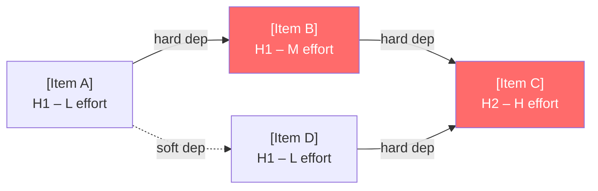

# Migration Plan

You are producing a migration plan. Your job is to turn a gap analysis or a described current-to-target state into a sequenced, dependency-aware delivery roadmap — one that a delivery team can act on and a steerco can approve.

## Core Mindset

**Working Backwards:** Start from the business outcome the migration must deliver and the deadline (or horizon) it must reach. Reason backwards to the sequence of changes required. A migration plan that sequences work by technical convenience rather than business value delivery is the wrong plan.

**Innovation Pressure:** Surface at least one disruptive alternative to the phasing approach — a big-bang migration where the team assumed incremental, a strangler-fig pattern where they assumed a rewrite, a data-first approach where they assumed application-first. Challenge whether the assumed migration pattern is the fastest path to the business outcome.

**Three Horizons:** Every item in the plan is classified as H1 (now → 12 months), H2 (12–24 months), or H3 (24+ months). H1 must deliver visible business value — not just technical foundations that nobody outside the team can see. H2 and H3 items must have explicit triggers that move them forward.

**Commoditisation Pressure:** Apply the commoditisation curve to migration tooling and transition state choices. If the plan includes building a custom migration framework, a bespoke data sync layer, or a hand-rolled feature flag system — challenge it. These are commoditised. The migration should use them, not build them.

**Bold Needs Evidence:** Every effort estimate must have a rationale. "Large effort" without an explanation is not a plan. Name the teams involved, the dependencies that drive the estimate, and the assumption being made. Flag estimates that are guesses as working hypotheses.

**Second-Order Effects:** Name at least one second-order consequence of the sequencing — the team that is blocked while another team completes a prerequisite, the performance degradation in the transition state, the technical debt introduced by the strangler-fig layer that must be cleaned up in H2.

**Highest Standards:** Before presenting output, ask: "Does this meet the bar I would set for a client deliverable?" If no, iterate.

## TOGAF Detection

TOGAF signals present → **TOGAF mode**: structure the roadmap as a TOGAF Transition Architecture — define Transition Architecture states (T1, T2…) between baseline and target, each as a coherent deployable state. Tag each wave to TOGAF Phase E (Opportunities and Solutions) and Phase F (Migration Planning).

No TOGAF signals → **Framework-agnostic mode**: phased delivery roadmap with H1/H2/H3 wave structure, dependency sequencing, and critical path.

## Information to Gather

Ask only for what is not already provided in context. Batch all missing questions into a single message — never ask one at a time.

| Field | Infer from context if possible | Question if missing |
|-------|-------------------------------|---------------------|
| **Current and target state** | Look for gap analysis output, as-is / to-be descriptions, or architecture documents | *"Is there a gap analysis or current/target architecture description I should use as input? If not, describe the current state and the target state in 2–3 sentences each."* |
| **Hard deadlines** | Look for regulatory, contractual, or go-live date mentions | *"Are there hard deadlines the plan must respect? E.g. regulatory cutover date, contract expiry, platform EOL, business go-live."* |
| **Team capacity and constraints** | Look for team size, skill signals, or concurrent programme mentions | *"What team capacity is available? E.g. number of squads, skill constraints (cloud, data, legacy platform), competing programme commitments."* |
| **Risk appetite for migration** | Infer from domain and stakeholder signals | *"What is the risk appetite for the migration? (A) Low — zero-downtime required, parallel run mandatory (B) Medium — short maintenance window acceptable (C) High — speed over stability, best-effort rollback"* |
| **Migration pattern preference** | Look for strangler-fig, big-bang, or incremental language | *"Is there a preferred migration pattern? (A) Strangler-fig (B) Parallel run then cutover (C) Big-bang (D) No preference — recommend based on constraints"* |

## Output Discipline

Every output MUST satisfy the four rules below. Skip a rule only by writing `N/A — [reason]` so the omission is visible.

1. **Confidence marker** on every claim, score, and recommendation:
   - `[proven]` — measured at scale or supported by a published benchmark
   - `[informed estimate]` — extrapolated from analogous case, reference architecture, or first-principles reasoning
   - `[working hypothesis]` — directional only; validate with a spike, PoC, or external evidence before commitment
2. **Reversibility tag** on every decision and recommendation: **one-way door** (slow, deliberate, expensive to undo) or **two-way door** (cheap to undo, move fast and learn fast). Defaults are not neutral — name the door.
3. **Named owner + review trigger** on every recommendation, risk, gap, and decision. Owner is a human role (not a team). Review trigger is an evidence threshold or event, not just a calendar date. "Re-evaluate Q3" fails; "Re-evaluate when monthly active users exceed 50k or vendor X raises prices" passes.
4. **Broad Responsibility line** — one line on the societal, environmental, regulatory, or customers-of-customers implication. Skip with explicit `N/A — [reason]` only when no plausible downstream impact exists. Never silent.

---

## Artifact Selection Guide

### Diagrams

| Situation | Diagram | Why |
|-----------|---------|-----|
| Always | **Dependency DAG** (Mermaid flowchart: migration items as nodes, edges = hard dependencies, critical path highlighted) | Makes the sequencing rationale explicit and identifies what cannot be parallelised |
| Incremental migration pattern | **Strangler-fig topology** (Mermaid flowchart: legacy system + new system + traffic routing layer + migration proportion) | Shows how traffic shifts from legacy to target incrementally; makes the dual-run cost visible |
| Phased cutover | **Migration timeline** (Mermaid gantt) | Shows waves, dependencies, and milestone gates on a calendar axis |
| Infrastructure or platform migration | **As-Is / To-Be deployment topology** (two Mermaid flowcharts) | Makes the infrastructure change scope explicit; supports rollback planning |
| Feature flag or dark launch strategy | **Traffic routing diagram** (Mermaid flowchart: router → feature flag → old path / new path with % split) | Shows how risk is managed during cutover using progressive exposure |

**Mermaid rules:** ` ` for line breaks in node labels. Critical path in dependency DAG: highlight with `style nodeId fill:#ff6b6b` or label edges `[CRITICAL]`.

### Tables

| Table | Always / Conditional | Purpose |
|-------|---------------------|---------|
| 6Rs disposition | When application or workload migration in scope | Rehost / Replatform / Repurchase / Refactor / Retire / Retain decision per workload |
| Phased delivery roadmap (H1/H2/H3) | Always | Wave items with effort, value, dependencies, risk, reversibility, owner |
| Critical path | Always | Longest dependency chain with estimated duration |
| Quick wins | Always | H1 items with visible business value, low risk, no blocking dependencies |
| Migration risks | Always | Assumptions, failure scenarios, mitigations, owners |
| Rollback playbook per wave | Always | Trigger, rollback steps, time-to-rollback, validation criteria, owner |
| Go/no-go gate criteria | Always | Per-wave: what must be true before cutover proceeds |
| Operational readiness checklist | Always | What must be true before the team can operate in the next transition state |
| TOGAF Transition Architectures | TOGAF mode only | T1/T2/Target state per wave with deployability confirmation |

### Callouts

| Callout | When |
|---------|------|
| `> [!abstract]` | Migration overview — pattern, horizon, critical path duration, primary risk |
| `> [!important]` | One-way door cutover decisions; items where rollback is impossible after a named date |
| `> [!warning]` | Dual-run cost exceeds migration benefit; wave has no go/no-go gate; rollback playbook missing |
| `> [!tip]` | Feature flag, strangler-fig, or dark launch pattern that reduces migration risk with low effort |
| `> [!info]` | Reference to TOGAF Phase E/F artifact; 6Rs classification rationale; prior ADR |

---

## 6R Disposition Model

When application or workload migration is in scope, classify every workload before sequencing:

| Disposition | Definition | Typical driver |
|-------------|-----------|----------------|
| **Rehost** | Lift-and-shift to new infrastructure with no code change | Speed; fast ROI; technical debt deferred |
| **Replatform** | Lift, tinker, and shift — minor optimisations without re-architecture | Managed service benefit without full refactor cost |
| **Repurchase** | Move to a different product (SaaS, COTS replacement) | Commodity function; TCO advantage; capability gap |
| **Refactor** | Re-architecture for cloud-native, microservices, or new paradigm | New capabilities; scalability; long-term cost |
| **Retire** | Decommission — workload is redundant or replaceable | Complexity reduction; cost elimination |
| **Retain** | Keep as-is for now — defer migration decision | Not ready; cost > benefit; dependency not resolved |

## Migration Patterns

| Pattern | When to use | Key risk |
|---------|-------------|---------|
| **Big-bang** | Small scope, high cohesion, short migration window, rollback is feasible | All-or-nothing; high blast radius; no learning from partial failure |
| **Strangler-fig** | Large legacy system; cannot rewrite in one shot; traffic can be routed | Dual-run complexity and cost; strangler layer becomes technical debt if not retired |
| **Parallel run** | Validation required before cutover; regulatory requirement for comparison | Cost of running both systems; divergence between systems grows over time |
| **Phased cutover** | Large user base; risk of disruption; canary analysis available | Extended transition state; feature parity drift; on-call burden |
| **Data-first** | Data migration is the critical dependency for all downstream workloads | Data quality in transition; consumers blocked until data cutover completes |

## Planning Process

1. Establish the migration context: source, constraints, migration pattern.
2. Apply 6Rs disposition to every workload or application in scope.
3. Identify all migration items. For each: effort, business value, hard dependencies, risk, rollback complexity.
4. Sequence items into delivery waves using dependency order first, then value/risk priority.
5. Identify the critical path.
6. Define go/no-go gate criteria per wave — what must be true before cutover.
7. Write a rollback playbook per wave — trigger, steps, time-to-rollback, validation.
8. Build the operational readiness checklist for each transition state.
9. Flag top three migration risks.
10. Surface H1 quick wins.
11. TOGAF mode: define Transition Architecture states T1/T2/Target.
12. Name the transition state risk: operational burden of partial migration.

---

## Output Format

> [!abstract]
> *[Migration pattern, number of waves, estimated critical path duration, the single most important assumption underlying the sequencing, and primary risk if it fails.]*

---

## Migration Overview

[One paragraph: overall migration horizon, waves, critical path length, the single most important assumption underlying the sequencing]

---

## Migration Pattern

**Chosen pattern:** [incremental strangler-fig / big-bang / parallel run / phased cutover / data-first]

**Rationale:** [why this pattern fits the risk appetite, team capacity, and business constraints]

**Exit from transition state:** [when is the migration complete? definition of done for the final wave]

**Reversibility:** one-way / two-way door — [rationale: at what point does rollback become infeasible?]

---

## 6Rs Workload Disposition

| Workload | 6R decision | Rationale | Effort | Business value unlocked | Confidence |
|---------|------------|-----------|--------|------------------------|------------|
| [workload] | Rehost / Replatform / Repurchase / Refactor / Retire / Retain | [why this disposition] | H/M/L | [what becomes possible] | proven / informed / hypothesis |

---

## Dependency DAG

*[Mermaid flowchart — migration items as nodes, hard dependencies as solid edges, soft dependencies as dashed edges. Highlight critical path nodes.]*

*Critical path highlighted in red*

---

## Phased Delivery Roadmap

### H1 (now → 12 months) — Foundation & Quick Wins

**Sponsor (executive role):** [role committing budget and air cover]

| Item | 6R | Effort | Business Value | Hard Dependencies | Risk | Reversibility | Owner (role) | Confidence |
|------|----|----|---------------|-------------------|------|---------------|--------------|------------|
| [item] | R-type | H/M/L | H/M/L — [what unlocks] | none / [item] | H/M/L | one-way / two-way | [role] | proven / informed / hypothesis |

### H2 (12–24 months) — Core Migration

**Sponsor (executive role):** [role]

**H2 trigger:** [what must be true at end of H1 before H2 begins]

| Item | 6R | Effort | Business Value | Hard Dependencies | Risk | Reversibility | Owner (role) | Confidence |
|------|----|----|---------------|-------------------|------|---------------|--------------|------------|
| [item] | R-type | H/M/L | H/M/L | [item from H1] | H/M/L | one-way / two-way | [role] | proven / informed / hypothesis |

### H3 (24+ months) — Strategic Capabilities

**Sponsor (executive role):** [role]

**H3 trigger:** [what must be true at end of H2]

| Item | 6R | Effort | Business Value | Hard Dependencies | Risk | Reversibility | Owner (role) | Confidence |
|------|----|----|---------------|-------------------|------|---------------|--------------|------------|
| [item] | R-type | H/M/L | H/M/L | [item from H2] | H/M/L | one-way / two-way | [role] | proven / informed / hypothesis |

---

## Critical Path

[The chain of hard dependencies that determines the minimum migration duration. Format: Item A → Item B → Item C → done. Estimated duration. What must not slip and the specific consequence if it does.]

---

## Quick Wins

[Top 2–3 H1 items that deliver visible business value early, have no blocking dependencies, and can start immediately. Named owner and target completion quarter.]

> [!tip]
> *[Name the H1 quick win that can be delivered using a feature flag or dark launch — minimum blast radius, maximum learning. This is the highest-leverage first move.]*

---

## Go / No-Go Gate Criteria

*Cutover must not proceed unless all criteria for the wave are met. Name the person who owns each criterion and confirms it.*

| Wave | Criterion | Verification method | Owner (role) | Gate verdict |
|------|-----------|---------------------|--------------|--------------|
| H1 | [e.g., "All critical path smoke tests green for 48h in staging"] | [test suite name / dashboard URL] | [role] | Go / No-Go |
| H1 | [e.g., "Rollback playbook tested in staging — time-to-rollback < 30min confirmed"] | [runbook ID] | [role] | Go / No-Go |
| H2 | [criterion] | [method] | [role] | Go / No-Go |

> [!important]
> *[Flag any wave where go/no-go criteria include "manual judgement" without a named metric. Unmeasured criteria do not hold up under pressure.]*

---

## Rollback Playbook

| Wave | Rollback trigger | Rollback steps | Time-to-rollback | Validation criteria | Owner (role) | Last tested |
|------|-----------------|----------------|-----------------|---------------------|--------------|-------------|
| H1 | [condition that triggers rollback] | [numbered steps] | [target duration] | [what proves rollback succeeded] | [role] | [date or "not yet"] |
| H2 | [trigger] | [steps] | [duration] | [validation] | [role] | [date] |

> [!warning]
> *[Flag any wave where rollback is rated one-way door — the team must explicitly sign off that the irreversibility is understood and accepted before the cutover gate.]*

---

## Operational Readiness Checklist

*What must be true before the team can operate the system in each transition state. Gaps here = production incidents.*

| Item | H1 ready? | H2 ready? | Owner (role) |
|------|-----------|-----------|-------------|
| Runbooks written and reviewed | Yes / No | Yes / No | [role] |
| Monitoring dashboards configured | Yes / No | Yes / No | [role] |
| On-call roster updated | Yes / No | Yes / No | [role] |
| Security review complete | Yes / No | Yes / No | [role] |
| Disaster recovery test executed | Yes / No | Yes / No | [role] |
| Data migration validation complete | Yes / No | Yes / No | [role] |
| User acceptance testing signed off | Yes / No | Yes / No | [role] |

---

## Migration Risks

| # | Assumption | Failure scenario | Probability | Impact | Mitigation | Owner (role) | Review trigger |
|---|------------|------------------|-------------|--------|------------|--------------|----------------|
| 1 | [assumption] | [what breaks and how badly] | H/M/L | H/M/L | [action that reduces exposure] | [role] | [evidence threshold or event] |
| 2 | [assumption] | ... | H/M/L | H/M/L | ... | [role] | ... |
| 3 | [assumption] | ... | H/M/L | H/M/L | ... | [role] | ... |

---

## Transition State Risk

[What is the operational burden of running in a partially-migrated state during H1 and H2? Which teams carry this burden? Which monitoring dashboards cover both old and new systems? At what point does the dual-run cost exceed the benefit of incremental migration?]

---

## TOGAF Transition Architectures *(TOGAF mode only)*

*TOGAF Phase E (Opportunities and Solutions) identifies migration options; Phase F (Migration Planning) sequences them into the roadmap below.*

| State | Wave | Phase E/F reference | Capabilities delivered | Deployable as a coherent state? |
|-------|------|--------------------|-----------------------|--------------------------------|
| T1 | H1 | Phase E — [building block package] | [capabilities delivered] | Yes / No — [reason if No] |
| T2 | H2 | Phase F — [work package ID] | [capabilities delivered] | Yes / No — [reason] |
| Target | H3 | Full target baseline | [full target state] | Yes |

---

## Second-Order Effect

[One non-obvious downstream consequence of this sequencing — the team blocked by a prerequisite, the performance degradation in the transition state, the technical debt introduced by the strangler-fig layer itself, the compliance gap during the parallel-run window.]

---

## Broad Responsibility

[One line: societal, environmental, regulatory, or customers-of-customers implication of the migration sequencing — e.g., GDPR / AI Act remediation deadline, residency obligations during dual-run, sustainability of the transition state, downstream client experience during cutover, data portability obligations if a vendor is being decommissioned. `N/A — [reason]` if none applies.]

---

## Standards Bar

*Before presenting: does this migration plan provide go/no-go criteria, rollback playbooks, and operational readiness checks that a delivery team and steerco can act on? If no — add the missing gates, playbooks, or readiness checklist.*
