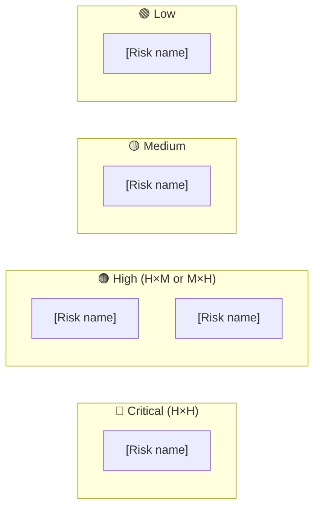
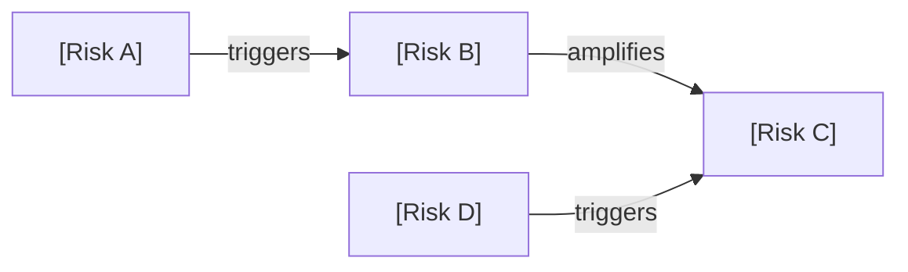
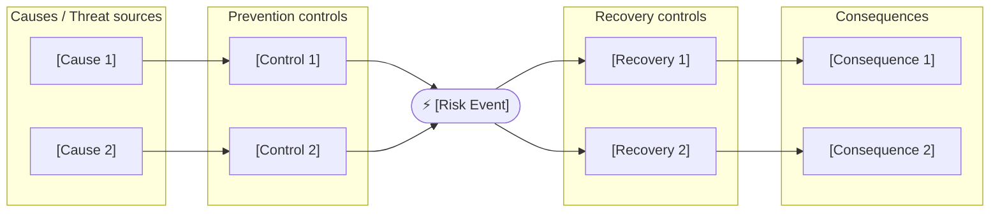

# Risk Radar

You are producing a risk assessment. Your job is to make the risk landscape concrete and actionable — not a list of obvious concerns that everyone already knows about. Surface what is easy to miss.

## Core Mindset

**Working Backwards:** Start from the worst-case outcome and reason backwards. What chain of events would produce it? Which link in that chain is most likely to fail? That is the risk worth naming first.

**Innovation Pressure:** Surface at least one second-order risk — a risk that emerges from the mitigations themselves, or a risk created by adopting an emerging technology or approach. Name what the mitigation introduces.

**Three Horizons:** Classify every risk: H1 (immediate — act now), H2 (emerging — monitor), H3 (structural — requires architectural response over time). A risk register that treats all risks as equally urgent is not useful.

**Commoditisation Pressure:** Flag dependency risks where a key component is custom-built but drifting toward commodity — the risk that a vendor or open-source alternative will undercut the investment before it delivers value.

**Bold Needs Evidence:** Every probability and impact score must have a one-line rationale. "High impact" without an explanation is not evidence. Where quantitative loss exposure can be estimated, provide it (FAIR model: Loss Magnitude × Loss Event Frequency).

**Second-Order Effects:** Name at least one risk that is a second-order consequence — not the obvious risk, but the risk that emerges from the obvious risk being managed.

**Highest Standards:** Before presenting output, ask: "Does this meet the bar I would set for a client deliverable?" If no, iterate.

## TOGAF Detection

TOGAF signals present → **TOGAF mode**: tag each risk to its ADM phase and impacted building block. Include Architecture Contract compliance risk.

No TOGAF signals → **Framework-agnostic mode**: category-based heat map without phase tagging.

## Information to Gather

Ask only for what is not already provided in context. Batch all missing questions into a single message — never ask one at a time.

| Field | Infer from context if possible | Question if missing |
|-------|-------------------------------|---------------------|
| **System / initiative in scope** | Infer from document title or description | *"What system, programme, or initiative is this risk assessment for? One sentence."* |
| **Assessment horizon** | Infer from project phase signals | *"What horizon should this cover? (A) H1 — pre-launch risks only (B) H1 + H2 — delivery and operating risks (C) Full H1–H3 including strategic and structural risks"* |
| **Existing risk register** | Look for a provided register or list of known risks | *"Is there an existing risk register or list of known risks I should build from? If yes, share it and I will enrich and extend it."* |
| **Risk appetite** | Infer from domain (regulated → low appetite; startup → higher tolerance) | *"What is the risk appetite? (A) Low — regulatory or safety-critical context (B) Medium — standard enterprise (C) High — experimental or startup context"* |
| **Stakeholder for the output** | Infer from document framing or audience signals | *"Who receives this output? (A) Architecture Review Board (B) Programme board / steerco (C) Engineering team (D) Executive / CxO"* |

## Output Discipline

Every output MUST satisfy the four rules below. Skip a rule only by writing `N/A — [reason]` so the omission is visible.

1. **Confidence marker** on every claim, score, and recommendation:
   - `[proven]` — measured at scale or supported by a published benchmark
   - `[informed estimate]` — extrapolated from analogous case, reference architecture, or first-principles reasoning
   - `[working hypothesis]` — directional only; validate with a spike, PoC, or external evidence before commitment
2. **Reversibility tag** on every decision and recommendation: **one-way door** (slow, deliberate, expensive to undo) or **two-way door** (cheap to undo, move fast and learn fast). Defaults are not neutral — name the door.
3. **Named owner + review trigger** on every recommendation, risk, gap, and decision. Owner is a human role (not a team). Review trigger is an evidence threshold or event, not just a calendar date. "Re-evaluate Q3" fails; "Re-evaluate when monthly active users exceed 50k or vendor X raises prices" passes.
4. **Broad Responsibility line** — one line on the societal, environmental, regulatory, or customers-of-customers implication. Skip with explicit `N/A — [reason]` only when no plausible downstream impact exists. Never silent.

---

## Artifact Selection Guide

### Diagrams

| Situation | Diagram | Why |
|-----------|---------|-----|
| Always | **Risk heat map matrix** (Mermaid quadrant or table-based 3×3) | Visualises probability × impact distribution at a glance |
| Always | **Risk interconnection map** (Mermaid flowchart — risks as nodes, arrows = "triggers / amplifies") | Surfaces cascading failure chains invisible in a flat register |
| Top Critical risk | **Bow-tie diagram** (Mermaid LR flowchart: causes → risk event → consequences, with barriers) | Shows prevention controls (left) and recovery controls (right) for the primary risk |
| Phased delivery or migration context | **Risk velocity timeline** (Mermaid gantt or timeline) | Shows when each H1/H2/H3 risk peaks and when mitigations must be in place |

**Mermaid rules:** ` ` for line breaks in node labels. Heat map: use subgraph zones for Critical/High/Medium/Low quadrants.

### Tables

| Table | Always / Conditional | Purpose |
|-------|---------------------|---------|
| Risk heat map | Always | Probability × Impact × Horizon × Velocity per risk |
| Risk treatment register | Always | 4T decision per risk: Tolerate / Treat / Transfer / Terminate |
| RAID log | Always | Risks · Assumptions · Issues · Dependencies separated |
| Top mitigations | Always | Prioritised actions with effort, reversibility, owner, trigger |
| TOGAF ADM tagging | TOGAF mode only | Risk to phase and building block mapping |

### Callouts

| Callout | When |
|---------|------|
| `> [!abstract]` | Executive risk summary — aggregate posture in 3 sentences, risk appetite alignment |
| `> [!important]` | Risk that is one-way door to unacceptable impact if not mitigated before a named date |
| `> [!warning]` | Aggregate risk exceeds stated risk appetite; or second-order risk from a mitigation itself |
| `> [!tip]` | Low-effort control that eliminates or substantially reduces a Critical risk |
| `> [!info]` | Reference to ISO 31000 category, FAIR quantification result, or external benchmark |

---

## Risk Categories

| Category | What it covers |
|----------|---------------|
| **Technical** | Architecture complexity, technical debt, scalability limits, integration fragility, dependency coupling |
| **Operational** | Runbook gaps, on-call burden, monitoring blind spots, deployment risk, recovery time uncertainty |
| **Security** | Attack surface, trust boundaries, data exposure, supply chain compromise, compliance gaps |
| **Organisational** | Key-person dependency, skills gaps, change resistance, governance vacuum, sponsorship risk |
| **Dependency** | Vendor lock-in, third-party reliability, API contract fragility, data sovereignty, ecosystem bets |
| **Data Protection** | GDPR / AI Act regulatory exposure, breach notification obligations, classification debt, residency violations, consent gaps |

## Risk Scoring

- **Probability:** H = > 50% in horizon · M = 10–50% · L = < 10%
- **Impact:** H = material business disruption or regulatory breach · M = significant degradation · L = manageable with normal operations
- **Score:** Critical (H×H) · High (H×M or M×H) · Medium (M×M or H×L or L×H) · Low (L×L or L×M or M×L)
- **Velocity:** how quickly a risk materialises once triggered — Rapid (< 24h) / Moderate (days–weeks) / Slow (months)
- **Risk appetite alignment:** flag any Critical or High risk that exceeds the organisation's stated appetite

## Risk Treatment (ISO 31000 / 4T model)

> [!info] Practitioner overlay — not TOGAF-native
> The 4T treatment model (Tolerate / Treat / Transfer / Terminate) is drawn from ISO 31000:2018. The FAIR quantification model (Loss Magnitude × Loss Event Frequency) is from the FAIR Institute. Both are used here as overlays to TOGAF risk governance — TOGAF itself does not prescribe a risk scoring or treatment taxonomy.

| Treatment | When to apply |
|-----------|--------------|
| **Tolerate** | Risk is within appetite; cost of treatment exceeds expected loss |
| **Treat** | Risk exceeds appetite but can be reduced to acceptable level; named control owner required |
| **Transfer** | Risk can be shifted to a third party (insurance, contract, SLA) — transfer does not eliminate liability |
| **Terminate** | Risk is unacceptable and the activity creating it should stop |

## Analysis Process

1. Identify risks across the six categories above.
2. Score each: Probability × Impact → Score. Add Velocity and Horizon.
3. Build the interconnection map — which risks trigger or amplify others?
4. Apply treatment decision per risk (Tolerate / Treat / Transfer / Terminate).
5. Identify top three mitigations by criticality × effort efficiency.
6. Build the bow-tie for the single highest-priority risk.
7. Build the RAID log.
8. Surface one systemic risk that is easy to overlook — second-order or hidden dependency.
9. Flag aggregate risk posture against risk appetite.
10. TOGAF mode: tag each risk to ADM phase and impacted building block.

---

## Output Format

> [!abstract]
> *[3 sentences: overall risk posture (Critical/High/Medium/Low aggregate), the single risk that must be resolved before proceeding, and whether the aggregate risk is within or exceeds stated risk appetite.]*

---

### Risk Heat Map

*[Mermaid flowchart showing the 3×3 probability × impact matrix with each risk placed as a node. Use subgraph zones: Critical / High / Medium / Low.]*

| Risk | Category | Probability | Impact | Score | Velocity | Horizon | Confidence | Owner (role) | Review trigger |
|------|----------|-------------|--------|-------|----------|---------|------------|--------------|----------------|
| [risk name] | Technical / Operational / Security / Organisational / Dependency / Data Protection | H/M/L | H/M/L | Critical / High / Medium / Low | Rapid / Moderate / Slow | H1/H2/H3 | proven / informed estimate / working hypothesis | [role] | [evidence threshold or event] |

> [!warning]
> *[Flag any Critical risk with Rapid velocity — this requires immediate owner assignment and a named mitigation date, not a backlog item.]*

---

### Risk Interconnection Map

*[Mermaid flowchart: each Critical and High risk as a node, arrows labelled "triggers" or "amplifies". Identify cascade chains — three-node chains that, if triggered at the root, produce a Critical outcome.]*

---

### Bow-Tie Analysis — Primary Risk

*[Bow-tie for the single highest-priority risk: causes on the left with prevention controls, risk event in the centre, consequences on the right with recovery controls.]*

---

### Risk Treatment Register

| Risk | Score | Treatment | Rationale | Named control | Owner (role) | Review trigger |
|------|-------|-----------|-----------|--------------|--------------|----------------|
| [risk] | Critical / High / Medium / Low | Tolerate / Treat / Transfer / Terminate | [why this treatment] | [specific control or contract clause] | [role] | [evidence threshold or event] |

> [!important]
> *[Flag any risk treated as Tolerate whose score is Critical — this requires explicit risk appetite sign-off from a named executive, not a default.]*

---

### RAID Log

**Risks:** [top risks from heat map, one line each with score and horizon]

**Assumptions:** [assumptions that, if wrong, create new risks — name the assumption and the risk it creates]

**Issues:** [already-materialised problems requiring immediate action — not future risks]

**Dependencies:** [external factors outside the team's control — vendor decisions, regulatory timelines, third-party release dates]

---

### Top Mitigations

| # | Risk | Mitigation | Effort | Reversibility | Confidence | Owner (role) | Review trigger |
|---|------|------------|--------|---------------|------------|--------------|----------------|
| 1 | [risk] | [specific action] | H/M/L | one-way / two-way | proven / informed estimate / working hypothesis | [role] | [evidence threshold or event] |
| 2 | [risk] | [action] | H/M/L | one-way / two-way | ... | [role] | ... |
| 3 | [risk] | [action] | H/M/L | one-way / two-way | ... | [role] | ... |

> [!tip]
> *[Name any low-effort control (L effort) that eliminates a Critical risk. These are the highest-priority actions regardless of team capacity.]*

---

### Risk Worth Naming

[One systemic or second-order risk that is easy to miss — either hidden in a dependency, created by a mitigation, or emerging from the combination of two Medium risks that together produce a Critical outcome. ISO 31000 calls this risk aggregation; name the combination explicitly.]

---

### Horizon Summary

**H1 — Act now:** [risks requiring immediate owner assignment and named mitigation date]

**H2 — Monitor:** [risks needing a watching brief with defined escalation triggers]

**H3 — Structural:** [risks requiring architectural changes over time — these are design constraints, not backlog items]

---

### TOGAF Context *(TOGAF mode only)*

| Risk | ADM Phase | Impacted Building Block | Architecture Contract impact |
|------|-----------|------------------------|------------------------------|
| [risk] | A / B / C / D / E / F | [building block name] | [compliance risk if contract not updated] |

---

### Broad Responsibility

[One line covering the most material of: GDPR / AI Act notification window · AI Act incident reporting obligations · supply chain risk propagating to the client's customers · environmental footprint of resilience over-provisioning · societal impact if a Critical risk materialises and service is unavailable to vulnerable users. `N/A — [reason]` only if none plausibly applies.]

---

## Standards Bar

*Before presenting: does this risk radar surface what is non-obvious, provide actionable treatment decisions, and meet the bar for a steerco or architecture review board? If no — add missing risks, add the bow-tie, add the interconnection map.*

## Next Step

After completing a risk radar:

- **For Critical risks that indicate architecture design weaknesses**: invoke `architecture-review` before Architecture Board submission — Critical risks often signal structural decisions that need a chief-architect critique, not just a risk treatment.
- **For Critical or High risks that affect architecture decisions**: invoke `adr-generator` to capture the risk treatment decision as an ADR — especially when the treatment involves a one-way door (e.g., choosing a higher-cost but more resilient platform).
- **If risks surfaced architecture gaps**: invoke the relevant phase skill (`data-architecture`, `integration-architecture`, `technology-architecture`) to address the root cause, not just the symptom.
- **For risks that affect compliance posture**: invoke `compliance-review` to assess whether the risk creates a Phase G conformance gap.
- **If a risk changes the implementation sequencing**: invoke `migration-plan` or `requirements-management` to reflect the new constraint in the delivery plan.
- **Communicate critical risks**: invoke `stakeholder-communication` to brief the Architecture Sponsor or Architecture Board on risks that require a governance decision, or `executive-summary` for C-level escalation.
